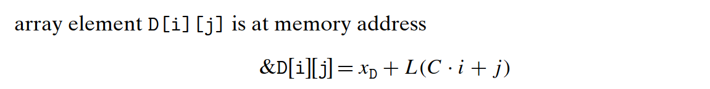

# Computer Systems
## A Tour of Computer Systems
  
Even though we made a substantial improvement to a major part of the system, our net speed up was significantly less than the speedup for the one part.
虽然我们对系统的一个主要部分做出了重大改进，但是获得的系统加速比却明显小于这部分的加速比。这就是 Amdahl 定律的主要观点——要想显著加速整个系统，必须提升全系统中相当大的部分的速度。  

整形数运算，总是遵循一个原则：小的往大的扩展。
从小到大：short -> unsigned short -> int -> unsigned int  

Float IEEE754 ：https://blog.csdn.net/K346K346/article/details/50487127

文件中必须含有一个 main 函数

CF    (unsigned) t < (unsigned) aUnsigned overflow \
ZF    (t == 0)Zero \
SF    (t < 0)Negative \
OF   (a<0==b<0)&&(t<0!=a<0)Signed overflow

Original and optimized code to compute the element i, k of matrix product for fixed-length arrays.The compiler performs these optimizations automatically.

**Understanding Pointers**
+ Every pointer has an associated type. The special void *type represents a generic pointer.
+ Every  pointer  has  a  value. This  value  is  an  address  of  some  object  of  the designated type. The specialNULL(0) value indicates that the pointer does not point anywhere.
+ Pointers are created with the ‘&’ operator.uses the leaq instruction to compute the expression value, since this instruction is designed to compute the addressof a memory reference.
+ Pointers are dereferenced with the ‘*’ operator. The result is a value having the type associated with the pointer.
+ Arrays and pointers are closely related. Array  referencing  (e.g.,a[3]) has the exact same effect as pointer arithmetic and dereferencing (e.g.,*(a+3)). 
+ Casting from one type of pointer to another changes its type but not its value.
+ Pointers can also point to functions.

