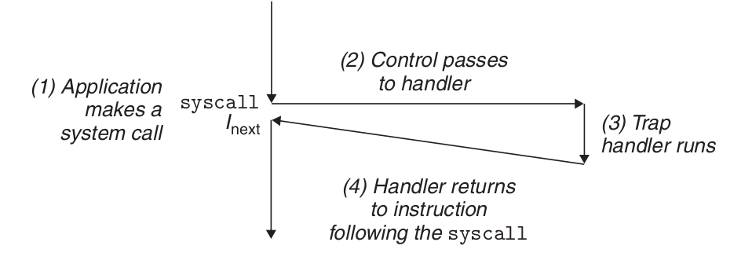
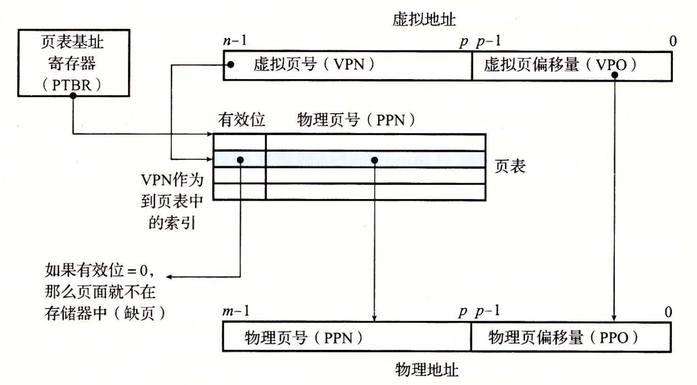
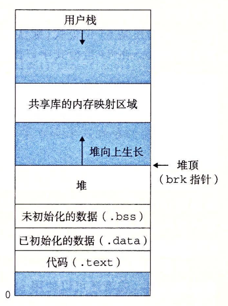

# Exceptional Control Flow
Exceptions are a form of exceptional control flow that are implemented partly
by the**hardware** and**partly by the operating system.**
\
An exception is an abrupt change in the control flow in response to some
change in the processor’s state.

Asynchronous exceptions are generated by events in I/O devices external to the processor. Synchronous exceptions are the direct product of the execution of an instruction.


When the operating system starts, a jump table called the exception table is allocated and initialized.


## Interrupt handling.

I/O I/O devices, such as network adapters, disk controllers, and timer chips, trigger an interrupt by signaling a pin on the processor chip and placing an exception number on the system bus that identifies the device causing the interrupt.


After the current instruction completes execution, the processor notices that the voltage at the interrupt pin has gone high, reads the exception number from the system bus, and then calls the appropriate interrupt handler. When the handler returns, it returns control to the next instruction (i.e., the one that would have followed the current instruction in the control flow if the interrupt had not occurred). The result is that the program continues to execute as if the interrupt had not occurred.

The remaining exception types (trap, fault, and termination) occur synchronously and are the result of executing the current instruction. We call this type of instruction a faulting instruction.

## Trap handling.

Traps are intentional exceptions that are the result of executing an instruction. Just like interrupt handlers, trap handlers return control to the next instruction. The most important use of traps is to provide a procedure-like interface between the user program and the kernel, called a system call.
User programs often need to request services from the kernel, such as reading a file (read), creating a new process (fork), loading a new program (execve), or terminating the current process (exit). To allow controlled access to these kernel services, the processor provides a special "syscall n" instruction that can be executed when a user program wants to request service n. Execution of the syscall instruction results in a trap to an exception handler that resolves the arguments and calls the appropriate kernel program.


From a programmer's point of view, system calls and normal function calls are the same. However, they are implemented very differently. Ordinary functions run in user mode, which restricts the types of instructions a function can execute, and they can only access the same stack as the calling function. System calls run in kernel mode, which allows system calls to execute privileged instructions and access the stack defined in the kernel.

## Fault handling.

The fault is caused by an error condition, which may be able to be corrected by the fault handler. When a fault occurs, the processor transfers control to the fault handler. If the handler is able to correct the error condition, it returns control to the instruction that caused the fault and thus re-executes it. Otherwise, the handler returns to the abort routine in the kernel, and the abort routine terminates the application that caused the fault.


## Abort handling.

Termination is the result of an unrecoverable fatal error, usually some hardware error such as a parity error that occurs when a DRAM or SRAM bit is corrupted. The termination handler never returns control to the application.


### Linux/x86-64 Exceptions in the system

The numbers 0 ∼ 31 correspond to exceptions defined by the Intel architects and are therefore the same for any x86-64 system. 32 ∼ 255 correspond to interrupts and traps defined by the operating system.

| Exception Number | Description | Exozone Class |
| :--- | :--- | :--- |
| 0 | division error | fault |
| 13 | General Protection Fault | Fault|
| 14 | Missing page | fault |
| 18 | Machine Check | Abort |
| 32 ~ 255 | OS Defined Exceptions | Interrupts or Traps |

### Linux/x86-64 failures and terminations

Division error (exception 0). An attempt to divide by zero resulted in a result that was too large for the target operand. Floating point exception (Floating exception)
General protection fault (Exception 13). An undefined area of virtual memory was referenced, or because the program attempted to write a read-only text segment. "Segmentation fault (Segmentation fault)"
Missing page (Exception 14). Will re-execute The handler maps a page of virtual memory on the appropriate disk to a page of physical memory and then re-executes this instruction that generated the fault.
Machine check (Exception 18) Occurs when a fatal hardware error is detected. Never returns control to the application.


### Linux/x86-64 System Calls

Linux Linux provides hundreds of system calls that can be used when an application wants to request a kernel service, including reading a file, writing a file, or creating a new process.

| number | name | description | number | name | description |
| ---: | :---: | :---: | :---: | :---: | :---|
| 0 | read | read the file | 33 | pause | hang the process until the signal arrives |
| 1 | write | write the file | 37 | alarm | schedule the transmission of the alarm signal |
| 2 | open | open the file | 39 | getpid | get the process ID |
| 3 | close | close the file | 57 | fork | create the process |
| 4 | stat | Get file information | 59 | execve | Execute a program |
| 9 | mmap | map memory pages to a file | 60 | exit | terminate a process |
| 12 | brk | reset the top of the heap | 61 | wait4 | wait for a process to terminate |
| 32 | dup2 | Copy a file descriptor | 62 | kill | Send a signal to a process |

C programs can call any system call directly with the syscall function.

On IA32, the Linux system call is called sys_call() via the int 0x80 interrupt, which accesses the interrupt vector table. It passes the system call number through eax; a series of other registers pass the parameters, stored in ebx, ecx, edx, esi, edi, ebp; and the return value is stored in eax.
The x86 64 architecture introduces a special instruction, syscall, which does not access the interrupt descriptor table and is much faster. It passes the system call number through rax; a series of other registers pass the parameters (6), stored in rdi, rsi, rdx, r10, r8, r9; the return value is stored in rax.

```shell
#include <unistd_32.h>
int main()
{
    write(1, "hello, world\n", 13);
    _exit(0);
}
```
```as
.section .data
string:
  .ascii "hello, world\n"
string_end:
  .equ len, string_end - string
.section .text
.globl main
main:
  # First, call write(1, "hello, world\n", 13)
  movq $1, %rax                 # write is system call 1
  movq $1, %rdi                 # Arg1: stdout has descriptor 1
  movq $string, %rsi            # Arg2: hello world string
  movq $len, %rdx               # Arg3: string length
  syscall                       # Make the system call

  # Next, call _exit(0)
  movq $60, %rax                # _exit is system call 60
  movq $0, %rdi                 # Arg1: exit status is 0
  syscall                       # Make the system call
```
**A process provides each program with its own private address space.**


The bottom portion of the address space is reserved for the user program, with
the usual code, data, heap, and stack segments. The code segment always begins at
address 0x400000. The top portion of the address space is reserved for the kernel
(the memory-resident part of the operating system). This part of the address space
contains the code, data, and stack that the kernel uses when it executes instructions
on behalf of the process (e.g., when the application program executes a system
call).

### Fork
Called once and returned twice.  
Concurrent execution.
Same but separate address space.
Shared files.


If a parent process terminates, the kernel arranges for the init process to become the adoptive parent of its orphaned processes. init has a PID of 1, is created by the kernel at system startup, does not terminate, and is the ancestor of all processes. If the parent process terminates without reclaiming its dead children, the kernel will schedule the init process to reclaim them. However, long-running programs, such as shells or servers, should always recycle their dead children. Even if the dead child processes are not running, they still consume system memory resources.

A process can wait for its child processes to terminate or stop by calling the waitpid function.

The waitpid function is a bit complicated. By default (when options=0), waitpid suspends the execution of the calling process until one of its child processes in the wait set terminates. If one of the processes in the wait set has terminated at the moment of the call, then waitpid returns immediately. In both cases, waitpid returns the PID of the terminated child process that caused waitpid to return. at this point, the terminated child process has been reclaimed and the kernel removes all traces of it from the system.

The membership of the wait collection is determined by the parameter pid.

- If Pid>0, then the wait collection is a single child process with a process ID equal to pid.
- If Pid=-1, then the wait collection is composed of all the children of the parent process.

The argv variable points to an array of pointers ending in null, each of which points to an argument string. By convention, argv[0] is the name of the executable target file.


The envp variable points to an array of pointers ending in null, each of which points to a string of environment variables, each of which is a name-value pair of the form "name=value".


At any given moment, the set of virtual pages is divided into three disjoint subsets.
- Unallocated: Pages that have not yet been allocated (or created) by the VM system. Unallocated blocks do not have any data associated with them, and therefore do not take up any disk space.
- Cached: Allocated pages that are currently cached in physical memory.
- Uncached: Allocated pages that are not cached in physical memory.

The SRAM cache represents the Ll, L2, and L3 caches located between the CPU and main memory, and the DRAM cache represents the virtual memory.
DRAM cache to represent the cache of the virtual memory system, which caches virtual pages in the main memory.


- Step 1: The processor generates a virtual address and transmits it to the MMU.
- Step 2: The MMU generates a PTE address and requests it from the cache/master.
- Step 3: The cache/main memory returns the PTE to the MMU.
- Step 4: The MMU constructs the physical address and transmits it to the cache/master.
- Step 5: The cache/home memory returns the requested data word to the processor.

- Steps 1 through 3: Same.
- Step 4: The valid bit in the PTE is zero, so the MMU triggers an exception, passing control from the CPU to the out-of-page exception handler in the OS kernel.
- Step 5: The out-of-page handler determines the sacrificial page in physical memory and swaps it out to disk if the page has been modified.
- Step 6: The out-of-page handler page calls in the new page and updates the PTE in memory.
- Step 7: The missing page handler returns to the original process and executes the instruction that caused the missing page again. the CPU resends the virtual address that caused the missing page to the MMU. since the virtual page is now cached in physical memory, it hits, and after the MMU performs the steps in Figure 9-13b, main memory returns the requested word to the processor.


Core i7 Address Translation.


Formatting of entries in Level 1, Level 2 or Level 3 page tables. Requires 4 KB alignment of the physical page table.

When P=1, the address field contains a 40-bit physical page number (PPN), the
Format of entries in the fourth level page table. Requires 4 KB alignment of physical pages.
! [img_29.png](img_29.png)
As the MMU translates each virtual address, it also updates the other two bits that will be used by the kernel's missing page handler. Each time a page is accessed, the MMU sets an A bit, called the reference bit. The kernel can use this reference bit to implement its page replacement algorithm. Each time a page is written to, the MMU sets the D bit, also known as the modify bit or dirty bit. The modify bit tells the kernel whether it must write back to the sacrificial page before copying the replacement page. The kernel can clear the reference or modification bit by calling a special kernel mode instruction.

How the Core i7 MMU uses a four-level page table to translate virtual addresses to physical addresses.


Virtual memory for 1 Linux process

An area (area) is a contiguous slice (chunk) of virtual memory that already exists (has been allocated), and these pages are associated in some way.
Code segments, data segments, heap, shared library segments, and user stacks are all different areas. Every virtual page that exists is kept in a certain area, while virtual pages that do not belong to a certain area do not exist and cannot be referenced by processes.
The kernel maintains a separate task structure (task_struct in the source code) for each process in the system. The elements in the task structure contain or point to all the information the kernel needs to run the process (e.g., the PID, a pointer to the user stack, the name of the executable target file, and the program counter).
An entry in the task structure points to mm_struct, which describes the current state of the virtual memory. The two fields of interest are pgd and mmap, where pgd points to the base address of the first-level page table (page global directory), and mmap points to a chain of vm_area_structs (area structures), where each vm_area_struct describes an area of the current virtual address space. When the kernel runs this process, it stores the pgd in the CR3 control register. \
vm_start: points to the start of this area. \
vm_end: points to the end of this region. \
vm_prot: describes the read and write permissions for all pages contained in this region. \
vm_flags: describes whether the pages in this region are shared with other processes or are private to this process (also describes some other information). \
vm_next: points to the next-region structure in the chain. \


Loading and running a.out requires the following steps.
1.**Remove the already existing user area.**Delete the existing region structure in the user part of the current process virtual address.
2.**Map private areas.**Create new area structures for the code, data, bss, and stack areas of the new program. All of these new areas are private, copy-on-write. The code and data areas are mapped to the .text and .stack areas in the a.out file. text and . The bss area is requested for binary zeros and is mapped to an anonymous file whose size is contained in a.out. The stack and heap regions are also requesting binary zeros and have an initial length of zero. Figure 9-31 summarizes the different mappings of private regions. 3.
3.**Mapping shared areas.**If the a.out program is linked to a shared object (or target), such as the standard C library libc.so, then these objects are dynamically linked to this program and then mapped into a shared area in the user's virtual address space.
4.**Set the program counter (PC). The last thing**execve does is set the program counter in the context of the current process to point to the entry point of the code area.

 

1.**explicit allocator**, which requires the application to explicitly free any allocated blocks. For example, the C standard library provides an explicit allocator called the malloc package. The new and delete operators in C++ are equivalent to malloc and free in C. 2.
2.**implicit allocator**, on the other hand, requires the allocator to detect when an allocated block is no longer in use by the program, and then release the block. An implicit allocator is also called a**garbage collector**, and the process of automatically releasing unused allocated blocks is called**garbage collection**. High-level languages such as Lisp, ML, and Java, for example, rely on garbage collection to release allocated blocks.

The malloc function returns a pointer to a block of memory at least size bytes in size, which is aligned for any data object types that may be contained within the block. In practice, the alignment depends on whether the compiled code is running in 32-bit mode (gcc -m32) or 64-bit mode (the default). In 32-bit mode, the address of the block returned by malloc is always a multiple of 8. In 64-bit mode, the address is always a multiple of 16.
The sbrk function expands and shrinks the heap by adding incr to the kernel's brk pointer. If it succeeds, it returns the old value of brk, otherwise it returns -1 and sets errno to ENOMEM. sbrk returns the current value of brk if incr is zero. Calling sbrk with a negative incr is legal and clever because the return value (the old value of brk) points to abs(incr) bytes up from the top of the new heap.
The program is freeing the allocated heap block by calling the free function.

 a: The program requests a 4-word block. malloc responds by cutting a 4-word block from the front of the free block and returning a pointer to the first word of the block.
 b: The program requests a 5-word block. malloc responds by allocating a 6-word block from the front of the free block. In this case, malloc fills the block with an extra word, in order to keep the free block to be double word boundary aligned.
 c: The program requests a 6-word block, and malloc cuts a 6-word block from the front of the free block.
 d: The program frees the 6-character block allocated in b. Note that after the call to free returns, the pointer p2 still points to the freed block. It is the responsibility of the application to not use p2 again until it is reinitialized by a new malloc call.
 e: The program requests a 2-character block. In this case, malloc allocates a portion of the block that was freed in the previous step and returns a pointer to this new block.

Explicit allocator constraints.
1.**Handle arbitrary sequences of requests.** An application can have an arbitrary sequence of allocation and release requests, as long as the constraint is satisfied: each release request must correspond to a currently allocated block that was obtained from a previous allocation request. Thus, the allocator cannot assume a sequence of allocation and release requests. For example, the allocator cannot assume that all allocation requests have matching release requests, or that there are matching allocation and free requests that are nested.
2.**Immediate response to requests.** Allocators must respond to allocation requests immediately. Therefore, the allocator is not allowed to rearrange or buffer requests to improve performance.
3.**Use only the heap.**In order for the allocator to be scalable, any non-scalar data structures used by the allocator must be stored in the heap.
4.**Align blocks (alignment requirements).**Allocators must align blocks so that they can hold any type of data object.
5.**Do not modify allocated blocks.**Allocators can only manipulate or change free blocks. In particular, once a block has been allocated, it is not allowed to be modified or moved. Therefore, techniques such as compression of allocated blocks are not allowed.

The format of a simple heap block
If we impose a double-word alignment constraint, then the block size is always a multiple of 8 and the lowest 3 bits of the block size are always zero. Therefore, we only need the 29 high bits of the memory size and free the remaining 3 bits to encode other information. In this case, we use the lowest bit (the allocated bit) to indicate whether the block is allocated or free. For example, suppose we have an allocated block with a size of 24 (0x18) bytes. Then its header will be

**0x00000018 | 0x1 = 0x00000019**

Similarly, a free block with a block size of 40 (0x28) bytes has the following header.

**0x00000028 | 0x0 = 0x00000028**

Following the header is the payload requested by the application when malloc is called. The payload is followed by a piece of unused padding, which can be of arbitrary size. Padding is needed for a number of reasons. For example, padding may be part of an allocator strategy to deal with external fragmentation. Or it may also be needed to meet alignment requirements.


Organize the heap with an implicit free link table. The shaded parts are allocated blocks. The unshaded part is the free block. The header is marked (size in bytes / allocated bits)
then the size of each block must be a multiple of a double word (8 bytes). Thus, resulting in a minimum block size of two words: one word for the header and another word to maintain alignment requirements. Even if the application requests only one byte, the allocator still needs to create a two-word block.
The advantage of an implicit free link table is its simplicity. The significant disadvantage is that the overhead of any operation, such as placing an allocated block, requires a search of the idle chain table, and the time required for that search is linearly related to the total number of allocated and idle blocks in the heap.

