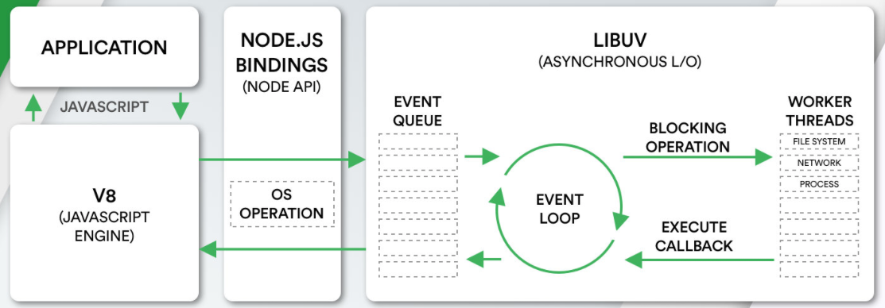
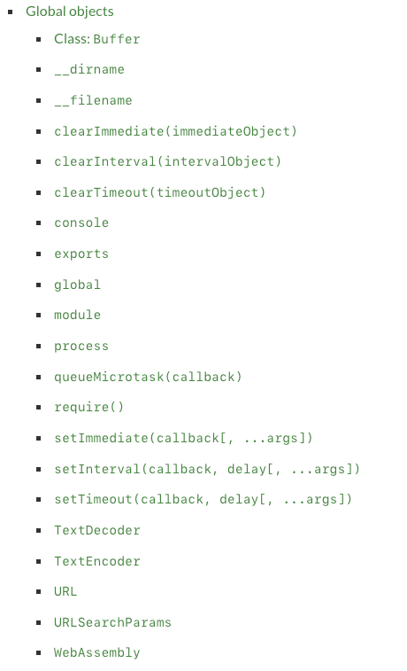
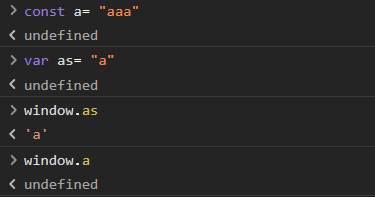
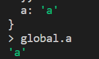
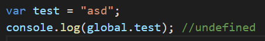

# Architecture

argc：argument counter
argv：argument vector (an array)

## global objects

### Special global objects

`__dirname、__filename、exports、module、require()` not available in cli

### Common global objects

- process `.argv .env` Operating environment, parameter information, etc.
- console
- Timer functions `setTimeout` `setInterval` `setImmediate` `process.nextTick`

JavaScript code executed in the browser, if we define a property in the top-level scope via var, it will be added to the window by default object.But in node, we define a variable by var, which is only a variable in the current module and is not put into the global.

 Top level var add to GO, const dont add to GO as an attribute.const is a module.
 REPL var a add to GO. In script is module. so don't add.

