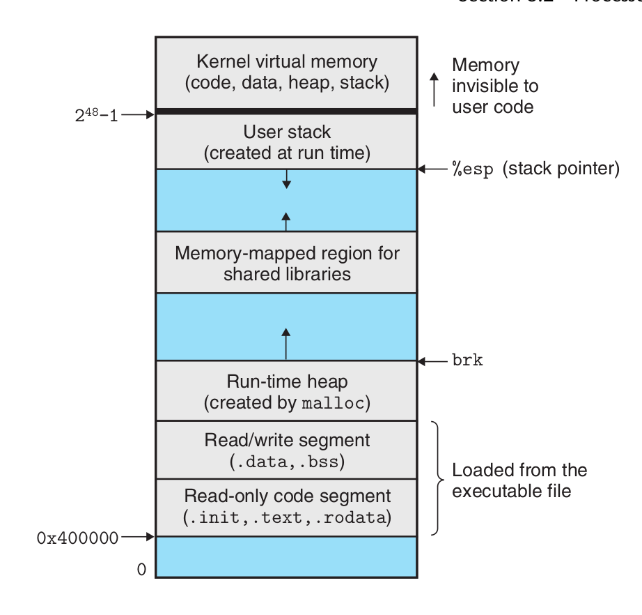

# Flux de contrôle exceptionnel
Les exceptions sont une forme de flux de contrôle exceptionnel qui sont mis en œuvre en partie par le matériel**** et**en partie par le système d'exploitation.** \ Une exception est un changement brusque dans le flux de contrôle en réponse à un certain changement dans l'état du processeur.

Les exceptions asynchrones sont générées par des événements dans les périphériques d'E/S externes au processeur. Les exceptions synchrones sont le produit direct de l'exécution d'une instruction.

 Lorsque le système d'exploitation démarre, une table de sauts appelée table d'exceptions est allouée et initialisée.


## Gestion des interruptions.

Les périphériques d'E/S/OI, tels que les adaptateurs réseau, les contrôleurs de disque et les puces de minuterie, déclenchent une interruption en signalant une broche sur la puce du processeur et en plaçant un numéro d'exception sur le bus système qui identifie le périphérique à l'origine de l'interruption.

 Une fois l'exécution de l'instruction en cours terminée, le processeur remarque que la tension au niveau de la broche d'interruption est élevée, lit le numéro d'exception sur le bus système, puis appelle le gestionnaire d'interruption approprié. Lorsque le gestionnaire revient, il rend le contrôle à l'instruction suivante (c'est-à-dire celle qui aurait suivi l'instruction en cours dans le flux de contrôle si l'interruption ne s'était pas produite). Le résultat est que le programme continue de s'exécuter comme si l'interruption ne s'était pas produite.

Les types d'exception restants (déroutement, erreur et terminaison) se produisent de manière synchrone et résultent de l'exécution de l'instruction en cours. Nous appelons ce type d'instruction une instruction fautive.

## Manipulation des pièges.

Les interruptions sont des exceptions intentionnelles résultant de l'exécution d'une instruction. Tout comme les gestionnaires d'interruptions, les gestionnaires d'interruptions rendent le contrôle à l'instruction suivante. L'utilisation la plus importante des interruptions consiste à fournir une interface de type procédure entre le programme utilisateur et le noyau, appelée appel système. Les programmes utilisateur ont souvent besoin de demander des services au noyau, tels que la lecture d'un fichier (read), la création d'un nouveau processus (fork), le chargement d'un nouveau programme (execve) ou l'arrêt du processus en cours (exit). Pour permettre un accès contrôlé à ces services du noyau, le processeur fournit une instruction spéciale "syscall n" qui peut être exécutée lorsqu'un programme utilisateur souhaite demander le service n. L'exécution de l'instruction syscall entraîne une interruption vers un gestionnaire d'exceptions qui résout les arguments et appelle le programme de noyau approprié.

 Du point de vue d'un programmeur, les appels système et les appels de fonction normaux sont les mêmes. Cependant, ils sont mis en œuvre très différemment. Les fonctions ordinaires s'exécutent en mode utilisateur, ce qui limite les types d'instructions qu'une fonction peut exécuter, et elles ne peuvent accéder qu'à la même pile que la fonction appelante. Les appels système s'exécutent en mode noyau, ce qui permet aux appels système d'exécuter des instructions privilégiées et d'accéder à la pile définie dans le noyau.

## Traitement des pannes.

L'erreur est causée par une condition d'erreur, qui peut être corrigée par le gestionnaire d'erreurs. Lorsqu'un défaut se produit, le processeur transfère le contrôle au gestionnaire de défauts. Si le gestionnaire est capable de corriger la condition d'erreur, il rend le contrôle à l'instruction qui a provoqué l'erreur et la réexécute ainsi. Sinon, le gestionnaire retourne à la routine d'abandon dans le noyau, et la routine d'abandon met fin à l'application qui a causé l'erreur. 

## Abandonner la manipulation.

L'arrêt est le résultat d'une erreur fatale irrécupérable, généralement une erreur matérielle telle qu'une erreur de parité qui se produit lorsqu'un bit DRAM ou SRAM est corrompu. Le gestionnaire de terminaison ne rend jamais le contrôle à l'application. 


### Exceptions Linux/x86-64 dans le système

Les nombres 0 ∼ 31 correspondent à des exceptions définies par les architectes d'Intel et sont donc les mêmes pour tout système x86-64. 32 ∼ 255 correspondent aux interruptions et traps définis par le système d'exploitation.

| Numéro d'exception | La description                                    | Classe Exozone          |
|:------------------ |:------------------------------------------------- |:----------------------- |
| 0                  | erreur de division                                | faute                   |
| 13                 | Défaut de protection générale                     | Faute                   |
| 14                 | Page manquante                                    | faute                   |
| 18                 | Vérification des machines                         | Avorter                 |
| 32 ~ 255           | Exceptions définies par le système d'exploitation | Interruptions ou pièges |

### Échecs et arrêts Linux/x86-64

Erreur de division (exception 0). Une tentative de division par zéro a donné un résultat trop grand pour l'opérande cible. Exception virgule flottante (Floating exception) Défaut de protection générale (Exception 13). Une zone indéfinie de mémoire virtuelle a été référencée ou parce que le programme a tenté d'écrire un segment de texte en lecture seule. "Défaut de segmentation (Défaut de segmentation)" Page manquante (Exception 14). Will re-execute Le gestionnaire mappe une page de mémoire virtuelle sur le disque approprié vers une page de mémoire physique, puis réexécute cette instruction qui a généré l'erreur. Machine check (Exception 18) Se produit lorsqu'une erreur matérielle fatale est détectée. Ne rend jamais le contrôle à l'application.


### Appels système Linux/x86-64

Linux Linux fournit des centaines d'appels système qui peuvent être utilisés lorsqu'une application souhaite demander un service du noyau, y compris la lecture d'un fichier, l'écriture d'un fichier ou la création d'un nouveau processus.

| numéro |     Nom     |              la description              | numéro |    Nom     | la description                                         |
| ------:|:-----------:|:----------------------------------------:|:------:|:----------:|:------------------------------------------------------ |
|      0 |    lire     |             lire le dossier              |   33   |   pause    | suspendre le processus jusqu'à ce que le signal arrive |
|      1 |   écrivez   |            écrire le fichier             |   37   |   alarme   | planifier la transmission du signal d'alarme           |
|      2 |   ouvrir    |            ouvrir le fichier             |   39   |   getpid   | obtenir l'ID du processus                              |
|      3 |   Fermer    |            fermer le dossier             |   57   | fourchette | créer le processus                                     |
|      4 | statistique | Obtenir des informations sur le fichier  |   59   |  exécuter  | Exécuter un programme                                  |
|      9 |    mmap     | mapper des pages de mémoire à un fichier |   60   |   sortir   | terminer un processus                                  |
|     12 |     brk     |       réinitialiser le haut du tas       |   61   | attendre4  | attendre qu'un processus se termine                    |
|     32 |    dup2     |     Copier un descripteur de fichier     |   62   |    tuer    | Envoyer un signal à un processus                       |

Les programmes C peuvent appeler n'importe quel appel système directement avec la fonction syscall.

Sur IA32, l'appel système Linux est appelé sys_call() via l'interruption int 0x80, qui accède à la table des vecteurs d'interruption. Il transmet le numéro d'appel système via eax ; une série d'autres registres transmettent les paramètres, stockés dans ebx, ecx, edx, esi, edi, ebp ; et la valeur de retour est stockée dans eax. L'architecture x86 64 introduit une instruction spéciale, syscall, qui n'accède pas à la table des descripteurs d'interruption et est beaucoup plus rapide. Il transmet le numéro d'appel système via rax ; une série d'autres registres transmettent les paramètres (6), stockés dans rdi, rsi, rdx, r10, r8, r9 ; la valeur de retour est stockée dans rax.

```shell
#include <unistd_32.h>
int main()
{
    write(1, "bonjour, monde\n", 13);
    _exit(0);
}
```
```as
.section .data
chaîne :
  .ascii "hello, world\n"
string_end :
  .equ len, string_end - chaîne
.section .text
.globl main
main :
  , world\n", 13)
  movq $1, %rax # write est l'appel système 1
  movq $1, %rdi # Arg1 : stdout a le descripteur 1
  movq $string, %rsi # Arg2 : hello world string
  movq $len, %rdx # Arg3 : longueur de la chaîne
  syscall # Effectuez l'appel système

  # Ensuite, appelez _exit(0)
  movq $60, %rax # _exit est l'appel système 60
  movq $0, %rdi # Arg1 : l'état de sortie est 0
  syscall # Make l'appel système
```
**Un processus fournit à chaque programme son propre espace d'adressage privé.**

 La partie inférieure de l'espace d'adressage est réservée au programme utilisateur, avec les segments habituels de code, de données, de tas et de pile. Le segment de code commence toujours à l'adresse 0x400000. La partie supérieure de l'espace d'adressage est réservée au noyau (la partie résidente en mémoire du système d'exploitation). Cette partie de l'espace d'adressage contient le code, les données et la pile que le noyau utilise lorsqu'il exécute les instructions pour le compte du processus (par exemple, lorsque le programme d'application exécute un appel système ).

### Fourchette
Appelé une fois et revenu deux fois.  
Exécution simultanée. Espace d'adressage identique mais séparé. Fichiers partagés. 

Si un processus parent se termine, le noyau s'arrange pour que le processus init devienne le parent adoptif de ses processus orphelins. init a un PID de 1, est créé par le noyau au démarrage du système, ne se termine pas et est l'ancêtre de tous les processus. Si le processus parent se termine sans récupérer ses enfants morts, le noyau planifiera le processus init pour les récupérer. Cependant, les programmes de longue durée, tels que les shells ou les serveurs, doivent toujours recycler leurs enfants morts. Même si les processus enfants morts ne sont pas en cours d'exécution, ils consomment toujours des ressources de mémoire système.

Un processus peut attendre que ses processus enfants se terminent ou s'arrêtent en appelant la fonction waitpid.

La fonction waitpid est un peu compliquée. Par défaut (lorsque options=0), waitpid suspend l'exécution du processus appelant jusqu'à ce que l'un de ses processus enfants dans le jeu d'attente se termine. Si l'un des processus du jeu d'attente s'est terminé au moment de l'appel, alors waitpid revient immédiatement. Dans les deux cas, waitpid renvoie le PID du processus enfant terminé qui a provoqué le retour de waitpid. à ce stade, le processus enfant terminé a été récupéré et le noyau en supprime toute trace du système.

L'appartenance à la collection d'attente est déterminée par le paramètre pid.

- Si Pid>0, alors la collection d'attente est un processus enfant unique avec un ID de processus égal à pid.
- Si Pid=-1, alors la collection d'attente est composée de tous les enfants du processus parent.

La variable argv pointe vers un tableau de pointeurs se terminant par null, chacun pointant vers une chaîne d'arguments. Par convention, argv[0] est le nom du fichier cible exécutable.

 La variable envp pointe vers un tableau de pointeurs se terminant par null, chacun pointant vers une chaîne de variables d'environnement, chacune étant une paire nom-valeur de la forme "nom=valeur".


A un instant donné, l'ensemble des pages virtuelles est divisé en trois sous-ensembles disjoints.
- Non alloué : pages qui n'ont pas encore été allouées (ou créées) par le système VM. Les blocs non alloués ne sont associés à aucune donnée et n'occupent donc pas d'espace disque.
- En cache : pages allouées qui sont actuellement mises en cache dans la mémoire physique.
- Non mis en cache : pages allouées qui ne sont pas mises en cache dans la mémoire physique.

Le cache SRAM représente les caches Ll, L2 et L3 situés entre le CPU et la mémoire principale, et le cache DRAM représente la mémoire virtuelle. Cache DRAM pour représenter le cache du système de mémoire virtuelle, qui met en cache les pages virtuelles dans la mémoire principale.


- Étape 1 : Le processeur génère une adresse virtuelle et la transmet à la MMU.
- Étape 2 : La MMU génère une adresse PTE et la demande au cache/maître.
- Étape 3 : Le cache/mémoire principale renvoie le PTE à la MMU.
- Étape 4 : La MMU construit l'adresse physique et la transmet au cache/maître.
- Étape 5 : L'antémémoire/mémoire de départ renvoie le mot de données demandé au processeur. 
- Étapes 1 à 3 : Idem.
- Étape 4 : Le bit valide dans le PTE est zéro, donc la MMU déclenche une exception, passant le contrôle du CPU au gestionnaire d'exception hors page dans le noyau du système d'exploitation.
- Étape 5 : Le gestionnaire hors page détermine la page sacrificielle dans la mémoire physique et la transfère sur le disque si la page a été modifiée.
- Étape 6 : La page du gestionnaire hors page appelle la nouvelle page et met à jour le PTE en mémoire.
- Étape 7 : Le gestionnaire de page manquante revient au processus d'origine et exécute à nouveau l'instruction qui a causé la page manquante. le CPU renvoie l'adresse virtuelle qui a causé la page manquante à la MMU. étant donné que la page virtuelle est maintenant mise en cache dans la mémoire physique, elle frappe et, une fois que la MMU a effectué les étapes de la figure 9-13b, la mémoire principale renvoie le mot demandé au processeur.


Traduction d'adresse Core i7. 

Mise en forme des entrées dans les tableaux de pages de niveau 1, niveau 2 ou niveau 3. Nécessite un alignement de 4 Ko de la table des pages physiques.  Lorsque P=1, le champ d'adresse contient un numéro de page physique (PPN) de 40 bits, le Format des entrées dans la table des pages de quatrième niveau. Nécessite un alignement de 4 Ko de pages physiques. ! [img_29.png](img_29.png) Lorsque la MMU traduit chaque adresse virtuelle, elle met également à jour les deux autres bits qui seront utilisés par le gestionnaire de pages manquantes du noyau. Chaque fois qu'une page est accédée, la MMU définit un bit A, appelé bit de référence. Le noyau peut utiliser ce bit de référence pour implémenter son algorithme de remplacement de page. Chaque fois qu'une page est écrite, la MMU définit le bit D, également appelé bit de modification ou bit sale. Le bit de modification indique au noyau s'il doit réécrire dans la page sacrificielle avant de copier la page de remplacement. Le noyau peut effacer le bit de référence ou de modification en appelant une instruction spéciale du mode noyau.

Comment le Core i7 MMU utilise une table de pages à quatre niveaux pour traduire les adresses virtuelles en adresses physiques. 

Mémoire virtuelle pour 1 processus Linux  Une zone (area) est une tranche contiguë (morceau) de mémoire virtuelle qui existe déjà (a été allouée) et ces pages sont associées d'une manière ou d'une autre. Les segments de code, les segments de données, le tas, les segments de bibliothèque partagée et les piles d'utilisateurs sont tous des domaines différents. Chaque page virtuelle qui existe est conservée dans une certaine zone, tandis que les pages virtuelles qui n'appartiennent pas à une certaine zone n'existent pas et ne peuvent pas être référencées par des processus. Le noyau maintient une structure de tâches distincte (task_struct dans le code source) pour chaque processus du système. Les éléments de la structure de tâche contiennent ou pointent vers toutes les informations dont le noyau a besoin pour exécuter le processus (par exemple, le PID, un pointeur vers la pile utilisateur, le nom du fichier cible exécutable et le compteur de programme). Une entrée dans la structure de la tâche pointe vers mm_struct, qui décrit l'état actuel de la mémoire virtuelle. Les deux champs d'intérêt sont pgd et mmap, où pgd pointe vers l'adresse de base de la table de pages de premier niveau (répertoire global de pages), et mmap pointe vers une chaîne de vm_area_structs (structures de zone), où chaque vm_area_struct décrit une zone de l'espace d'adressage virtuel actuel. Lorsque le noyau exécute ce processus, il stocke le pgd dans le registre de contrôle CR3. \ vm_start : pointe vers le début de cette zone. \ vm_end : pointe vers la fin de cette région. \ vm_prot : décrit les autorisations de lecture et d'écriture pour toutes les pages contenues dans cette région. \ vm_flags : décrit si les pages de cette région sont partagées avec d'autres processus ou sont privées pour ce processus (décrit également d'autres informations). \ vm_next : pointe vers la structure de région suivante dans la chaîne. \ 


Le chargement et l'exécution de a.out nécessitent les étapes suivantes. 1.**Supprimer la zone utilisateur déjà existante.**Supprimez la structure de région existante dans la partie utilisateur de l'adresse virtuelle du processus actuel. 2.**Cartographier les zones privées.**Créez de nouvelles structures de zone pour les zones de code, de données, de bss et de pile du nouveau programme. Toutes ces nouvelles zones sont privées, en copie sur écriture. Les zones de code et de données sont mappées sur les zones .text et .stack du fichier a.out. texte et. La zone bss est demandée pour les zéros binaires et est mappée sur un fichier anonyme dont la taille est contenue dans a.out. Les régions de pile et de tas demandent également des zéros binaires et ont une longueur initiale de zéro. La figure 9-31 résume les différents mappages de régions privées. 3. 3.**Cartographie des zones partagées.**Si le programme a.out est lié à un objet partagé (ou cible), comme la bibliothèque C standard libc.so, alors ces objets sont dynamiquement liés à ce programme puis mappés dans une zone partagée dans l'espace d'adressage virtuel de l'utilisateur . 4.**Réglez le compteur de programme (PC). La dernière chose que fait**execve est de définir le compteur de programme dans le contexte du processus en cours pour qu'il pointe vers le point d'entrée de la zone de code.

 

1.**alternateur explicite**, qui oblige l'application à libérer explicitement tous les blocs alloués. Par exemple, la bibliothèque standard C fournit un alternateur explicite appelé package malloc. Les opérateurs new et delete en C++ sont équivalents à malloc et free en C. 2. 2.**l'allocateur implicite**, d'autre part, exige que l'allocateur détecte quand un bloc alloué n'est plus utilisé par le programme, puis libère le bloc. Un alternateur implicite est également appelé**ramasse-miettes**, et le processus de libération automatique des blocs alloués inutilisés est appelé**ramasse-miettes**. Les langages de haut niveau tels que Lisp, ML et Java, par exemple, s'appuient sur la récupération de place pour libérer les blocs alloués.

La fonction malloc renvoie un pointeur vers un bloc de mémoire d'au moins taille octets, qui est aligné pour tous les types d'objets de données pouvant être contenus dans le bloc. En pratique, l'alignement dépend du fait que le code compilé s'exécute en mode 32 bits (gcc -m32) ou en mode 64 bits (valeur par défaut). En mode 32 bits, l'adresse du bloc renvoyée par malloc est toujours un multiple de 8. En mode 64 bits, l'adresse est toujours un multiple de 16. La fonction sbrk étend et réduit le tas en ajoutant incr au pointeur brk du noyau. S'il réussit, il renvoie l'ancienne valeur de brk, sinon il renvoie -1 et définit errno sur ENOMEM. sbrk renvoie la valeur actuelle de brk si incr vaut zéro. Appeler sbrk avec un incr négatif est légal et intelligent car la valeur de retour (l'ancienne valeur de brk) pointe vers abs(incr) octets à partir du haut du nouveau tas. Le programme libère le bloc de tas alloué en appelant la fonction free.  a : Le programme demande un bloc de 4 mots. malloc répond en coupant un bloc de 4 mots à l'avant du bloc libre et en renvoyant un pointeur sur le premier mot du bloc. b : Le programme demande un bloc de 5 mots. malloc répond en allouant un bloc de 6 mots à partir de l'avant du bloc libre. Dans ce cas, malloc remplit le bloc avec un mot supplémentaire, afin de garder le bloc libre aligné sur la limite du double mot. c : Le programme demande un bloc de 6 mots et malloc coupe un bloc de 6 mots à l'avant du bloc libre. d : Le programme libère le bloc de 6 caractères attribué en b. Notez qu'après le retour de l'appel à free, le pointeur p2 pointe toujours sur le bloc libéré. Il est de la responsabilité de l'application de ne plus utiliser p2 jusqu'à ce qu'il soit réinitialisé par un nouvel appel malloc. e : Le programme demande un bloc de 2 caractères. Dans ce cas, malloc alloue une partie du bloc libéré à l'étape précédente et renvoie un pointeur vers ce nouveau bloc.

Contraintes d'allocation explicites. 1.**Gérer des séquences arbitraires de requêtes.** Une application peut avoir une séquence arbitraire de demandes d'allocation et de libération, tant que la contrainte est satisfaite : chaque demande de libération doit correspondre à un bloc actuellement alloué qui a été obtenu à partir d'une demande d'allocation précédente. Ainsi, l'allocateur ne peut pas supposer une séquence de demandes d'allocation et de libération. Par exemple, l'allocateur ne peut pas supposer que toutes les demandes d'allocation ont des demandes de libération correspondantes, ou qu'il existe des demandes d'allocation et de libération correspondantes qui sont imbriquées. 2.**Réponse immédiate aux demandes.** Les allocataires doivent répondre immédiatement aux demandes d'allocation. Par conséquent, l'allocateur n'est pas autorisé à réorganiser ou mettre en mémoire tampon les demandes pour améliorer les performances. 3.**Utilisez uniquement le tas.**Pour que l'allocateur soit évolutif, toutes les structures de données non scalaires utilisées par l'allocateur doivent être stockées dans le tas. 4.**Aligner les blocs (exigences d'alignement).**Les répartiteurs doivent aligner les blocs afin qu'ils puissent contenir n'importe quel type d'objet de données. 5.**Ne modifiez pas les blocs alloués.**Les allocators ne peuvent manipuler ou modifier que des blocs libres. En particulier, une fois qu'un bloc a été alloué, il ne peut plus être modifié ou déplacé. Par conséquent, les techniques telles que la compression des blocs alloués ne sont pas autorisées.

Le format d'un bloc de tas simple Si nous imposons une contrainte d'alignement de mots doubles, alors la taille du bloc est toujours un multiple de 8 et les 3 bits les plus bas de la taille du bloc sont toujours nuls. Par conséquent, nous n'avons besoin que des 29 bits de poids fort de la taille de la mémoire et libérons les 3 bits restants pour encoder d'autres informations. Dans ce cas, nous utilisons le bit le plus bas (le bit alloué) pour indiquer si le bloc est alloué ou libre. Par exemple, supposons que nous ayons un bloc alloué d'une taille de 24 (0x18) octets. Ensuite, son en-tête sera

**0x00000018 | 0x1 = 0x00000019**

De même, un bloc libre avec une taille de bloc de 40 (0x28) octets a l'en-tête suivant.

**0x00000028 | 0x0 = 0x00000028**

Après l'en-tête se trouve la charge utile demandée par l'application lorsque malloc est appelé. La charge utile est suivie d'un morceau de remplissage inutilisé, qui peut être de taille arbitraire. Le rembourrage est nécessaire pour un certain nombre de raisons. Par exemple, le remplissage peut faire partie d'une stratégie d'allocation pour faire face à la fragmentation externe. Ou il peut également être nécessaire pour répondre aux exigences d'alignement.

 Organisez le tas avec une table de liens libres implicites. Les parties ombrées sont des blocs alloués. La partie non ombrée est le bloc libre. L'en-tête est marqué (taille en octets / bits alloués) puis la taille de chaque bloc doit être un multiple d'un mot double (8 octets). Ainsi, il en résulte une taille de bloc minimale de deux mots : un mot pour l'en-tête et un autre mot pour maintenir les exigences d'alignement. Même si l'application ne demande qu'un seul octet, l'allocateur doit toujours créer un bloc de deux mots. L'avantage d'une table de liens libres implicites est sa simplicité. L'inconvénient majeur est que la surcharge de toute opération, telle que le placement d'un bloc alloué, nécessite une recherche dans la table de chaîne inactive, et le temps requis pour cette recherche est linéairement lié au nombre total de blocs alloués et inactifs dans le tas.

