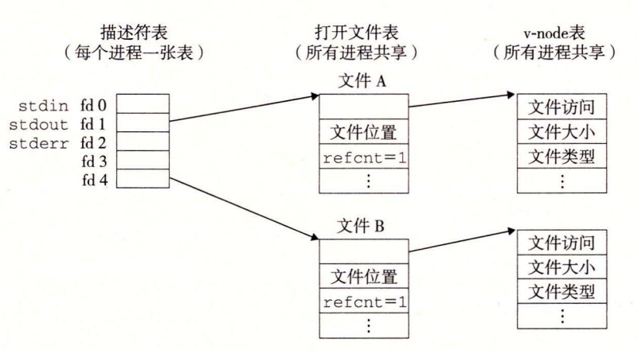
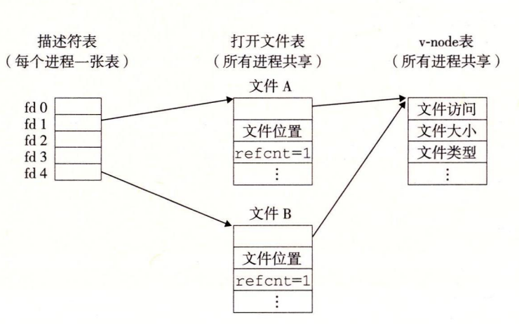
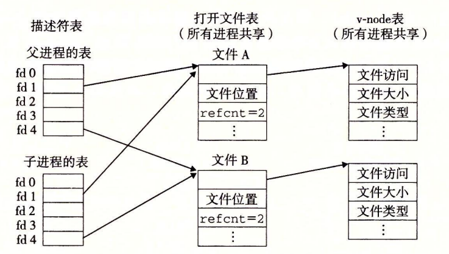

## fichier partagé
 符 1 和 的 件 的 件 两 的 件 的 件 的 件 的 件 的 件 的 件 的 件 的 的 件 的 也 的 的 文件 的 的 的 的 的 的 表同 的 一 一 一 发 发生 发 发 发 发生 这 种 发 发 发 发 的 的 的 文件, 所以 不同 的 读 可以 的 的 的 同 一 的 的 同 一 的 件 同 一 一 的 的 同 一 一 的 打开 同 一 一 的描述 的 副本 的 的 的 的 的 的 的 的 的 的 的 件 的 件 的 件 的 的 的 的 的 的 的 件 的 件 的 的 的 的 的 件 的 的 的 件 的符。

限制 1：在 输出 输出 之后 的 输入函数. 如果 中间 的有 插入 对 对 Fflush, Fsek, fStposé 的 的, 一个 输入 在 在 在 在 在 在 在 在 在 在 的 的 的 的 的 的 缓冲区. 后个函数 使用 Unix I / O lsek 函数 的 文件 位置. 限制 2 2：跟 在 如果 中间 的 输出 插入 对 中间 没有 插入 对 Fsek, fStposé 或者 rembobiner 的 调用, 一个 输出 输出 输出 输出 能 能 能输出输入函数之后，除非该输入函数遇到了一个文件结束。

