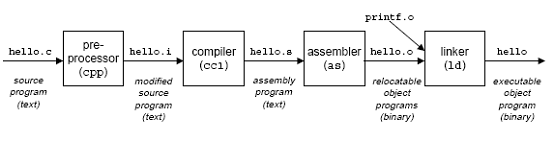
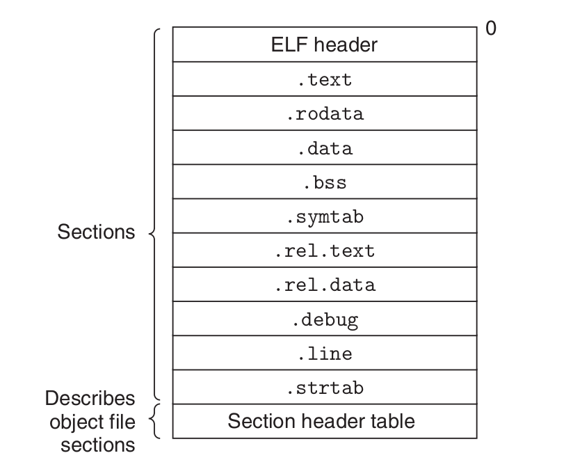
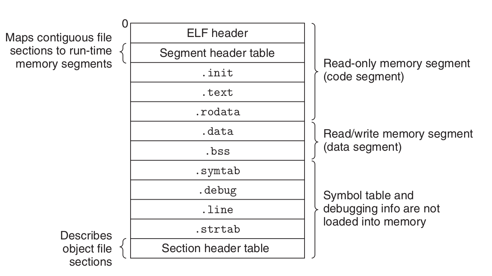

### Traduit le programme d'exemple d'un fichier source ASCII en un fichier objet exécutable.

1. Préprocesseur C : cpp [autres arguments] hello.c /tmp/main.i
2. Compilateur C : cc1 /tmp/hello.i -Og [autres arguments] -o /tmp/hello.s
3. assembleur : as [autres arguments] -o /tmp/hello.o /tmp/hello.s
4. programme de liaison : ld -o hello [fichiers d'objet système et arguments] /tmp/hello.o /libc.a/printf.o
5. programme exécutable : linux> ./hello


### Fichiers objet
Format exécutable et connectable (ELF). 
- .text Le code machine du programme compilé.
- .rodata **Données en lecture seule** telles que les chaînes de format dans les instructions printf et tables de sauts pour les instructions switch.
- .data Variables C globales et statiques initialisées. Les variables C locales sont maintenues à au moment de l'exécution sur la pile et n'apparaissent ni dans les sections .data ni .bss .
- .bss Variables C globales et statiques non initialisées, ainsi que toutes les variables globales ou statiques initialisées à zéro. Aucun espace n'a les mêmes adresses avec .comment.
- .symtab Une table de symboles avec des informations sur les fonctions et les variables globales qui sont définies et référencées dans le programme.
- .rel Informations de relocalisation
- .line Un mappage des numéros de ligne
- .strtab Une table de chaînes

- Fichier objet déplaçable. Contient du code binaire et des données sous une forme qui peut être combinée avec d'autres fichiers objets réadressables au moment de la compilation pour créer un fichier objet exécutable.

- Fichier objet exécutable. Contient du code binaire et des données sous une forme qui peut être copiée directement dans la mémoire et exécutée. 
- Fichier objet partagé. Un type spécial de fichier objet relocalisable qui peut être chargé en mémoire et lié dynamiquement, au moment du chargement ou de l'exécution.
#### Symboles
- Symboles globaux définis par le module m et pouvant être référencés par autres modules. OU référencé par le module m mais défini par un autre module .
- Symboles locaux définis et référencés exclusivement par le module m.
###### Comment les éditeurs de liens résolvent les noms de symboles en double
symboles forts : int i = 1 ; symboles faibles : int i ; int principal(i =1); int __attribut__((faible)) power2(int x);int power2(int x) __attribut__((faible));extern int __attribut__((faible)) global_var; Règle 1. Plusieurs symboles forts portant le même nom ne sont pas autorisés. Règle 2. Étant donné un symbole fort et plusieurs symboles faibles portant le même nom, choisit le symbole fort. Règle 3. Étant donné plusieurs symboles faibles portant le même nom, choisissez l'un des symboles faibles.

#### Déménagement
1. Déplacement des sections et des définitions de symboles. Dans cette étape, l'éditeur de liens fusionne toutes les sections du même type dans une nouvelle section agrégée du même type.

2. Déplacement des références de symboles dans les sections. Dans cette étape, l'éditeur de liens modifie chaque référence de symbole dans les corps des sections de code et de données afin qu'ils vers les adresses d'exécution correctes.

Les entrées de relocalisation pour le code sont placées dans .rel.text. Les entrées de relocalisation pour les données sont placées dans .rel.data.

```
/*main.c*/
void swap();
int buf[2] = {1, 2};
int main() {
    swap();
    retour 0 ;
}
/*swap.c*/
extern int buf [] ;
int *bufp0 = &buf[0] ;
entier *bufp1 ;
void swap() {
    int temp;
    bufp1 = &buf[1];
    temp =*bufp0;
    *bufp0 = *bufp1 ;
    *bufp1 = temp;
}
```

```
malaaa@malaaa-N8xxEP6> gcc -c swap.c -o swap.o//Fichier objet réadressable
malaaa@malaaa-N8xxEP6> gcc -c main.c -o main.o//Fichier objet réadressable
malaaa@malaaa- N8xxEP6> gcc -g swap.o main.o -o run//Fichier objet exécutable
malaaa@malaaa-N8xxEP6> readelf -s swap.o
malaaa@malaaa-N8xxEP6> readelf -s main.o
```
Résultat
```
swap.o
La table de symboles '.symtab' contient 14 entrées :
   Num : Valeur Taille Type Bind Vis Ndx Name
     0 : 0000000000000000 0 NOTYPE LOCAL DEFAULT UND 
     1 : 0000000000000000 0 FILE LOCAL DEFAULT ABS swap.c
     2 : 0000000000000000 0000000 0000000000000000 Section locale 1 
     3: 0000000000000000 0 Section Local 3 
     4: 0000000000000000 0 Section Local local 4 
     5: 0000000000000000 0 section locale 5 
     6: 0000000000000000 0 Section Local local 8 
     7: 0000000000000000 0 Section Local local 9 
     8: 000000000000000000 0 section locale 10 
     9: 0000000000000000 0 Section Local Par défaut 7 
    10: 0000000000000000 0 VOCAL GLOBAL 5 BUFP0
    11: 0000000000000000 0 NOTYPE GLOBAL DEFAULT UND BUF
    12: 0000000000000000 8 Objet Global Par défaut 4 BUFP1
    13: 0000000000000000 67 FUNC GLOBAL DEFAULT 1 échange
```
buf, 是 swap.o.symtable 的 条 目, extern 的 符号,**在 Main.O 中 定义!**, 们们 看到 一个 关于 全局 是 从 的 条 目, 它 从 .Data 中 偏移 为 0 处开始的一个 8 字节的已初始化目标. \ bufp0：是 swap.o.symtable 的 条 目, global 类型 符号, 在 Swap.o 中 定义, 们 看到 一个 关于关于 们 Bufpo 的 条条 它 是 从 .Data 中 偏移 为 0 处 的 一个8 的 已 初 始化 目标 目标 bufp1：是 swap.o.symtabl 的 条 目, global 的 符号, 在 Swap.o 中 定义, 它 的 8 字节 数据 目标 初 的 8 字节 数据 目标 初 的 8 字节 数据 (要求 8 字节),最终当这个模块被链接时它将作为一个.bss目标分配\ échange：是swap.o.symTable的条目, func类型的符号,在中定义swap.o,它是一个位于.text中偏移为零处的 67 字节的函数。 \ temp：不属于swap.o.symTable条目，int类型的符号，在swap.o中定义，局部变量位与栈位于栈位与栈
```
main.o
La table des symboles '.symtab' contient 13 entrées :
Num : Valeur Taille Type Bind Vis Ndx Nom
0 : 0000000000000000 0 NOTYPE LOCAL DEFAULT UND
1 : 0000000000000000 0 FILE LOCAL DEFAULT ABS main.c
2 : 0000000000000000 0 Section Local Local Par défaut 1
3: 0000000000000000 0 Section Local local

4: 0000000000000000 0 Section Local Local Par défaut 6
6: 0000000000000000 0 Section Local local 7
7: 0000000000000000 0 Section Local Local 8
8: 0000000000000000 0 section locale 5
9: 0000000000000000 8 Global d'objet Par défaut 3 buf
10: 0000000000000000 25 FUNC GLOBAL 1 MAIN
11: 0000000000000000 0 NOTYPEL GLOBAL DEFAULT UND _GLOBAL_OFFSET_TABLE_
12: 00000000000000 0 NOTYPE GLOBAL DEFAULT UND SWAP

```
buf 是已经初始化的全局变量，一个位于.data节中偏移位0的8字节目标。 \ main 位于.text节中偏移为0的25字字
###### entrées de relocalisation d'objdump
`objdump -D -r swap.o` -d just .text Résultat
```
swap.o: format de fichier elf64-x86-64


Désassemblage de la section .text:

0000000000000000 <swap> :
   0: f3 0f 1e fa endbr64 
   4: 55 push %rbp
   5: 48 89 e5 mov %rsp,%rbp
   8: 48 8d 05 00 00 00 00 lea 0x0(%rip),%rax # f <swap+0xf>
            b: R_X86_64_PC32 buf
   f: 48 89 05 00 00 00 00 mov %rax,0x0(%rip) # 16 <swap+0x16>
            12 : R_X86_64_PC32 bufp1-0x4
  16: 48 8b 05 00 00 00 00 mov 0x0(%rip),%rax # 1d <swap+0x1d>
            19: R_X86_64_PC32 bufp0-0x4
  1d: 8b 00 mov (%rax),%eax
  1f: 89 45 fc mov    %eax,-0x4(%rbp)
  22: 48 8b 15 00 00 00 00 mov 0x0(%rip),%rdx # 29 <swap+0x29>
            25: R_X86_64_PC32 bufp1-0x4
  29: 48 8b 05 00 00 00 00 mov 0x0(%rip),%rax # 30 <swap+0x30>
            2c: R_X86_64_PC32 bufp0-0x4
  30: 8b 12 mov (%rdx),%edx
  32: 89 10 mov    %edx,(%rax)
  34: 48 8b 05 00 00 00 00 mov 0x0(%rip),%rax # 3b <swap+0x3b>
            37: R_X86_64_PC32 bufp1-0x4
  3b: 8b 55 fc mov -0x4(%rbp),%edx
  3e: 89 10 mov    %edx ,(%rax)
  40 : 90 nop
  41 : 5d pop %rbp
  42 : c3 retq   

Démontage de la section .bss :

0000000000000000 <bufp1> :
...

Démontage de la section .data.rel :

0000000000000000 <bufp0> :
...
            0 : R_X86_64_64 buf

Démontage de section .comment :

0000000000000000 <.comment> :
   0 : 00 47 43 add    %al,0x43(%rdi)
   3 : 43 3a 20 rex.XB cmp (%r8),%spl
   6 : 28 55 62 sub    %dl,0x62(%rbp)
   9 : 75 6e jne 79 <swap+0x79>
   b : 74 75 je 82 <swap+0x82>
   d : 20 31 et    %dh,(%rcx)
   f : 30 2e xor    %ch,(%rsi)
  11 : 32 2e xor (%rsi),%ch
  13 : 30 2d 31 33 75 62 xor    %ch,0x62753331(%rip) # 6275334a <swap+0x6275334a>
  19 : 75 6e jne 89 <swap+0x89>
  1b : 74 75 je 92 <swap+0x92>
  1d : 31 29 xor    %ebp,(%rcx)
  1f : 20 31 et    %dh,(%rcx)
  21 : 30 2e xor    %ch,(%rsi)
  23 : 32 2e xor (%rsi),%ch
  25 : 30
   >%al,(%

)

 <de la section $0x0,%al
   2 : 00 00 ajouter    %al,(%rax)
   4 : 10 00 adc    %al,(%rax)
   6 : 00 00 ajouter    %al,(%rax)
   8 : 05 00 00 00 47 ajouter $0x47000000,%eax
   d : 4e 55 rex.WRX push %rbp
   f : 00 02 ajouter    %al,(%rdx)
  11 : 00 00 ajouter    %al,(%rax)
  13 : c0 04 00 00 rolb $0x0,(%rax,%rax,1)
  17: 00 03 ajouter    %al,(%rbx)
  19: 00 00 ajouter    %al,(%rax)
  1b : 00 00 ajouter    %al,(%rax)
  1d : 00 00 ajouter    %al,(%rax)
...

Démontage de la section .eh_frame :

0000000000000000 <.eh_frame> :
   0 : 14 00 adc $0x0,%al
   2 : 00 00 add    %al,(%rax)
   4 : 00 00 add    %al,(%rax)
   6 : 00 00 ajouter    %al,(%rax)
   8 : 01 7a 52 ajouter    %edi,0x52(%rdx)
   b : 00 01 ajouter    %al,(%rcx)
   d : 78 10 js 1f <. eh_frame+0x1f>
   f : 01 1b ajouter    %ebx,(%rbx)
  11 : 0c 07 ou $0x7,%al
  13 : 08 90 01 00 00 1c ou     %dl,0x1c000001(%rax)
  19 : 00 00 ajouter    %al,(%rax)
  1b : 00 1c 00 ajouter    %bl,(%rax,%rax,1)
  1e : 00 00 ajouter    %al,(%rax)
  20 : 00 00 ajouter    %al, (%rax)
            20 : R_X86_64_PC32 .text
  22 : 00 00 ajouter    %al,(%rax)
  24 : 43 00 00 rex.XB ajouter %al,(%r8)
  27 : 00 00 ajouter    %al,( %rax)
  29 : 45 0e rex.RB (mauvais) 
  2b : 10 86 02 43 0d 06 adc    %al,0x60d4302(%rsi)
  31 : 7a 0c jp 3f <swap+0x3f>
  33 : 07 (mauvais)  
  34 : 08 00 ou     %al,(%rax)
...
```
#### Fichiers objet exécutables
 Table d'en-tête de programme **Lecture seule**
#### Chargement de fichiers d'objets exécutables
Le chargeur **** copie le code et les données du fichier objet exécutable du disque dans la mémoire, puis exécute le programme en sautant à sa première instruction, ou point d'entrée. \ Le segment de code commence à l'adresse 0x400000, 对于 Linux 而, 0x400000 的 空间 默认 程序 的 作用. 起到 保护 程序 的 作用. 起到 保护 程序 安全 程序 程序 安全 操作 系统 保证 因此 大 限度 利用\ le segment de données.\ le tas.\ le réservé aux modules partagés.\ la pile utilisateur. en dessous de la plus grande adresse utilisateur légale (2 48 − 1) et croît vers le bas, vers des adresses mémoire plus petites.\ la partie kernel.memory-resident du système d'exploitation.


#### Liaison statique
- Symbol resolution.symbol : une fonction, une variable globale ou une variable statique (le modèle 'main(int i = 0)' est une instruction)
- Relocation.Les compilateurs et les assembleurs génèrent des sections de code et de données qui commencent à l'adresse 0.

#### Liaison dynamique
Une bibliothèque partagée __ est un module objet qui, au moment de l'exécution ou du chargement , peut être chargé à une adresse mémoire arbitraire et lié à un programme en mémoire . \ Les systèmes Linux sont indiqués par le suffixe .so. Les systèmes d'exploitation Microsoft font un usage intensif des bibliothèques partagées, qu'ils appellent DLL.

Les bibliothèques partagées sont « partagées » de deux manières différentes.
1. exactement un fichier .so pour une bibliothèque particulière. Le code et les données sont partagés par tous les fichiers objets exécutables qui référencent la bibliothèque,
2. La section .text en mémoire peut être partagée par différents processus en cours d'exécution. 

##### L'éditeur de liens dynamique termine ensuite la tâche de liaison en effectuant les déplacements suivants :
- Déplacer le texte et les données de libc.so dans un segment de mémoire
- Déplacer le texte et les données de libvector.so dans un autre segment de mémoire
- Déplacer toutes les références dans prog2l vers les symboles définis par libc.so et libvector.so

##### Le Dynamic Linking est une technique puissante et utile :
- Distribution de logiciels. utiliser des bibliothèques partagées pour distribuer les mises à jour logicielles.
- Construire des serveurs Web performants. générer du contenu dynamique en utilisant une approche plus efficace et sophistiquée basée sur la liaison dynamique . les requêtes ultérieures peuvent être traitées au prix d'un simple appel de fonction. fonctions existantes peuvent être mises à jour et de nouvelles fonctions peuvent être ajoutées au moment de l'exécution, sans arrêter le serveur.

#### Code indépendant de la position (PIC)

Le code qui peut être chargé sans nécessiter de déplacement est appelé code indépendant de la position (PIC). Les utilisateurs dirigent les systèmes de compilation GNU pour générer du code PIC avec l'option -fpic de gcc. Les bibliothèques partagées doivent toujours être compilées avec cette option.

Le génère également une relocalisation. record pour chaque entrée dans le GOT.  由于器 无法 的 的 的 的 的 的 的 的 的都 在 数据 节节 中 创建 一 函数函数 xxx @ plt, 然后 将 中调用 地址 替 换 代码 中调用 地址 替 所以 所以 通过 xxx @ xxx @ Plot 的 更更, 以及 指向 的 更. la table de liaison de procédure (PLT). Si un module objet appelle des fonctions définies dans des bibliothèques partagées, il possède alors ses propres GOT et PLT. Le GOT fait partie du segment de données. Le PLT fait partie du segment de code. `Étant donné que addcnt est défini par le module libvector.so, le compilateur peut utiliser la distance constante entre le segment de code et le segment de données pour générer une référence relative PC directe à addcnt, et ajouter une relocalisation pour permettre à l'éditeur de liens de construire ce module partagé Parse ce. Cependant, si addcnt est défini par un autre module partagé, un accès indirect via GOT est requis. Ici, le compilateur choisit la solution la plus générale, en utilisant GOT pour toutes les références.`\ `objdump -dx prog`
```

 <main>

%e201028 <z>
 78a : 48 8d 35 7f 08 20 00 lea 0x20087f(%rip),%rsi # 201010 <y>
 791 : 48 8d 3d 80 08 20 00 lea 0x200880(%rip),%rdi # 201018 <x>
 898 a3 fe ff ff callq 640 <addvec@plt>
 79d : 8b 0d 89 08 20 00 mov 0x200889(%rip),%ecx # 20102c <z+0x4>
 7a3 : 8b 15 7f 08 20 00 mov
 (%rip),%edx # <z>7a9 : 48 8d 35 a4 00 00 00 lea 0xa4(%rip),%rsi # 854 <_IO_stdin_used+0x4>
 7b0 : bf 01 00 00 00 mov $0x1,%edi
 7b5 : b8 00 00 00 00 mov $0x0 ,%eax
 7ba : e8 91 fe ff ff callq 650 <__printf_chk@plt>
 7bf : b8 00 00 00 00 mov $0x0,%eax
 7c4 : 48 83 c4 08 add $0x8,%rsp
 7c8 : c3 retq   
 7c9 : 0f 1f 80 00 00 00 00 nopl 0x0(%rax)
 ```
对 Addvevec 函数 和 和 和 PRINRF 函数 的 调用 转化 对 ADDVEC @ plt 和 __ __printf_chk @ plt 函数 的 调用, 这 两 函数 函数 是 在 .Plt 中 的, 而 .Plt 中 的 内容 如下 所
```
Démontage de la section .plt :

0000000000000630 <.plt> :
 630 : ff 35 82 09 20 00 pushq 0x200982(%rip) # 200fb8 <_GLOBAL_OFFSET_TABLE_+0x8>
 636 : ff 25 84 09 20 ) # 200fc0 <_global_offset_table_ + 0x10>
 63c: 0f 1f 40 00 NOPL 0x0 (% Rax)

0000000000000640 <addvec@plt>:
 640: FF 25 82 09 20 00 JMPQ * 0x200982 (% RIP) # 200fc8 <addvec>
 646: 68 00 00 00 00 pushq 0 $ 0x0
 64B: E9 E0 FF FF FF JMPQ 630 <.PLT>

000000000000650 <__PRINF_CHK @ PLT>:
 650: FF 25 7A 09 20 00 JMPQ * 0x20097A (% RIP) # 200fd0 <__printf_chk @ glibc_2. 3.4>
 656 : 68 01 00 00 00 pushq $0x1
 65b : e9 d0 ff ff ff jmpq 630 <.plt>
```
们 们 目标 的 的. 们 的 的. 们 的 的 的.中 对应 的 obtenez 中 保存 的 地址. 比如面 们们 调用 addvevec @ plt 函数 时 会 会行 0x640 的 JMPQ * 0x200982 (% RIP) 指令, 的 0x200982 就 是面 的 距离 常量, 用来 的 距离距离GOT 项, 这里 得到 访问 的 got 的 地址 为 0x200982 + 0x646 = 0x200fc8, 而 该 的 got 内容 所 `0x00200fc0 00000000 0000000000000000000000000000000000000000000000000000 0000000000 .....
`
```
000000000000000630
 <>FF 35 82 09 20 00 Poussette 0x200982 (% RIP) # 200fb8 <_global_offset_table_ + 0x8>
 636: FF 25 84 09 20 00 JMPQ * 0x200984 (% RIP) # 200fc0 <_global_offset_table_ + 0x10>
 63c : 0f 1f 40 00 nopl 0x0(%rax)
```
中 一 条条 是 将 地址 0x200982 + 0x636 = 0x200fb8 作为 参数 压入栈 转 转 0x200984 + 0x63c = 0x200fc0 处 们 们 们 们 们 们 们 们 们执 目标 的 值 可 的 的 值会 可 的 的 值会 可可 该 的 值会 修改 该 的 值会值会 到 该 的 值会 修改 该 的 的 值会值会值会到什么内存地址。那该函数是如何知道要获得哪个函数的地址，以及要将函数地址保存到哪个got顽保存到哪个got顽

我们观察可执行目标文件中以下共享库的函数

```
0000000000000640 <addvec@plt>:
 640: FF 25 82 09 20 00 JMPQ * 0x200982 (% RIP) # 200FC8 <addvec>
 646: 68 00 00 00 00 Poussette 0x0
 64B: E9 E0 FF FF FF JMPQ 630 <.PLT>

000000000000000650 <__printf_chk@plt> :
  650 : ff 25 7a 09 20>jmpq *
 (%rip) #
 <630 <.plt>
 ```
现 现 的 第一条 指令 的 的 的 obtient 的 的 下 一 条 的 地址, 当 当 当 一 一 一 一 一 条 到 下 一Rela.plt的索引
```
La section de relocalisation '.rela.plt' à l'offset 0x5e8 contient 2 entrées :
  Offset Info Type Sym. Valeur Sym. Nom + Addend
000000200fc8 000300000007 R_X86_64_JUMP_SLO 000000000000000 addvec + 0
000000200fd0 000500000007 R_X86_64_JUMP_SLO 000000000 __print@printfC40 __0 300000
```
其中, offset 的 地址, sym.name 就 函数 的 名字. 所以 动态链接 索 引值 数据组 以及 以及 其 定位 动态库函数 以及 以及 其 地址 保存哪个got项。

的 的 Addvevec 函数 的 内存 地址 保存 下 次 调用 调用 调用 调用 就 就 该 该 该 该 该 能 的 的 的 的 的 的 的 的 内存内存.

们 现 的 xxx @ 的 xxx @ 的 函数 的 的 的 的 的 的 的中 一 的 的 函数 会 的 的 函数 会 该 的 函数 该 该 的 的 的 函数 方法 方法 的 的 的 的 的 的 的 的 的 的 的 的 的 的 的 地址, 否则 否则 的 的 地址, 否则 否则由此防止可执行目标文件加载时需要对大量的共享库的地址进行重定位。

所 所 述 要 中 中 中 中 中 的 函数 时 执 行 Call XXX @ PLT, 访问 的 封装：, 然后 的 函数 的 的 的 项, 如果 Vous avez 项 赋值 的 xxx的 的 地址, 会 会 该 该 该 会 调用 调用[0] 调用 调用 定位 xxx定义 的, 编译 器 可以 利用 代码 段 和 数据 段 之间 不变 的 距离, 产生 对 addcnt 的 直接 PC 相对 引用, 并 增加 一个 重 定位, 让 链接 器 在 构造 这个 共享 模块 时 解析 它. 不过, 如果 addcnt是由另一个共享模块定义的,那么就需要通过GOT进行间接访问.在这里,编译器选择采用最通用的解决方案,为所有的引用使用GOT.  Étape 1. Au lieu d'appeler directement addvec, le programme appelle PLT[2], dont est l'entrée PLT pour addvec. \ Étape 2. La première instruction PLT fait un saut indirect à travers GOT[4]. Puisque chaque entrée GOT pointe initialement vers la deuxième instruction dans son entrée PLT correspondante, le saut indirect retransfère simplement le contrôle à l'instruction suivante dans[2] \ Étape 3. Après avoir poussé un ID pour addvec (0x1) sur la pile, PLT[2] saute à PLT[0]. \ Étape 4. PLT[0] pousse un argument pour l'éditeur de liens dynamique indirectement via GOT[1] , puis saute dans l'éditeur de liens dynamique indirectement via GOT[2]. L'éditeur de liens dynamique utilise les deux entrées de la pile pour déterminer l'emplacement d'exécution d'addvec, écrase GOT[4] avec cette adresse et passe le contrôle à addvec.  Étape 1. Le contrôle passe à PLT[2] comme précédemment.\ Étape 2. Cependant, cette fois, le saut indirect via GOT[4] transfère le contrôle directement à addvec.

#### Interposition de bibliothèque
l'interposition de bibliothèque, vous permet d'intercepter les appels aux fonctions de la bibliothèque partagée et d'exécuter votre propre code à la place.\ **idée de base :** étant donné une fonction cible sur laquelle interposer, vous créez une fonction wrapper dont le prototype est identique à la fonction cible. En utilisant un mécanisme d'interposition particulier, vous incitez ensuite le système à appeler la fonction wrapper au lieu de la fonction cible. La fonction enveloppe généralement exécute sa propre logique, puis appelle la fonction cible et renvoie sa valeur de retour à l'appelant.

L'interposition peut se produire au moment de la compilation, de la liaison ou de l'exécution lorsque le programme est chargé et exécuté. Exemple de programme int.c
```code/link/interpose/int.c
#include <stdio.h>
#include <malloc.h>

int main()
{
    int *p = malloc(32);
    libre(p);
    retour(0);
}
```
##### 1. Interposition au moment de la compilation

Fichier local de malloc.h
```code/link/interpose/malloc.h
#define malloc(taille) mymalloc(taille)
#define free(ptr) myfree(ptr)
```
然后 编译 编译.C 时, 使用 -I 编译 选项 预处理 使得 预处理 预处理 的 的 Malloc.h 的 MALLALLOC 混合 MYMALLALC 混合 MYMADRE 函数. 们 们 们 自己 实现 myMALLOC 和 MYMALLOC 函数, 其中 需要 调用 的 Malloc.h, 由于 Malloc.h 使用 #define 指令, 们们 后面 需要 Malloc 的 地方 被 MyMALLOC 替代. 而 mymalloc.c 代码： Fonctions wrapper dans mymalloc.c
```mymalloc.c
#ifdef COMPILETIME //编译选项是COMPILETIME ，这段代码才会编译进去
#include <stdio.h>
#include <malloc.h>

/* fonction wrapper malloc */
void *mymalloc(size_t size)
{
    void *ptr = malloc( Taille);
    printf("malloc(%d)=%p\n",
           (int)taille, ptr);
    points de retour ;
}

/* fonction wrapper gratuite */
void myfree(void *ptr)
{
    free(ptr);
    printf("libre(%p)\n", ptr);
    printf("COMPILETIME\n");
}
#endif
```
所以我们可以通过以下代码得到该函数的可重定位目标文件mymalloc.o
```shell
gcc -DCOMPILETIME -c mymalloc.c
```
然后在本地的malloc.h中给出包装函数的函数原型，即
```code/link/interpose/malloc.h
#define malloc(taille) mymalloc(taille)
#define free(ptr) myfree(ptr)

void *mymalloc(size_t size);
void myfree(void *ptr);
```
然后就可以通过以下命令行进行编译时打桩
```shell
gcc -I. -o intc int.c mymalloc.o
```
此时, 由于 -i. 编译 选项, 对于 Int.c 中 的 Malloc.h, 预处理 会 从 搜索 Malloc.h 文件, 而 本地 Malloc.h 文件 中, Malloc 和 gratuit 重函数 成mymalloc和myfree函数，而这两个函数在之前编译好的mymalloc.o可重定位目标文件中，此时就完成了编译时打桩。
```shell
malloc(32)=0x558ca12fc2a0
libre(0x558ca12fc2a0)
COMPILETIME
```
使用malloc的地方，都被替换成了mymalloc。
```int.i
void *mymalloc(taille_t taille);
void myfree(void *ptr);
```
##### 2. Interposition de temps de liaison

Linux 静态 链接器 也 使用 进 链接 为 __ __ __ __ __ 的 __ __ 的 的 __ __ 的 __ 的 的 引用 的 的 的 引用引用会替换成对__wrap_f函数的调用，而通过__real_f函数来调用原始函数f。 我们定义以下函数
```mymalloc.c
#ifdef LINKTIME
#include <stdio.h>

void *__real_malloc(size_t size);
void __real_free(void *ptr);

/* fonction wrapper malloc */
void *__wrap_malloc(size_t size)
{
    void *ptr = __real_malloc(size); /* Appel libc malloc */
    printf("malloc(%d) = %p\n", (int)size, ptr);
    points de retour ;
}

/* fonction wrapper libre */
void __wrap_free(void *ptr)
{
    __real_free(ptr); /* Appel libc free */
    printf("free(%p)\n", ptr);
    printf("LINKTIME\n");
}
#endif

```
同时进行编译
```shell
gcc -DLINKTIME -Wl,--wrap,malloc -Wl,--wrap,free -o intl int.c mymalloc.c
```
也可以分开编译
```shell
gcc -DLINKTIME -c mymalloc.c
gcc -c int.c
gcc -Wl,--wrap,malloc -Wl,--wrap,free -o intl int.o mymalloc.o
```
-WL, option 把 标志 标志 给器 .OPtion 中 的 每每个-Wl,--wrap,gratuit。
```shell
malloc(32)=0x558ca12fc2a0
libre(0x558ca12fc2a0)
LINKTIME
```
由, 利用器 的 打桩 机制, int.c 中 对 Malloc gratuit 函数 的 调用, 会 变成 __wrap_malloc 和 __wrap_free 的 调用. __ __real_malloc 将 被 解析 的 Malloc.

综上所述：想要在链接时打桩，意味着在对可重定位目标文件的符号进行解析时，进行替换。

##### 3. Interposition d'exécution

运 的 的 ld_preload 的 函数 的 ld_preload 环境 件 的LD_PRELOAD est à  ;
```mymalloc.c
#ifdef RUNTIME
#define _GNU_SOURCE
#include <stdio.h>
#include <stdlib.h>
#include <dlfcn.h>

/* fonction wrapper malloc */而__real_malloc将会被解析成真正的malloc。

void *malloc(size_t size)
{
    void *(*mallocp)(taille_t taille);
    caractères *erreur ;

    mallocp = dlsym(RTLD_NEXT, "malloc"); /* Récupère l'adresse de libc malloc */ 
    if ((error = dlerror()) != NULL) { 
        fputs(error, stderr);
        sortie(1);
    }
    car *ptr = mallocp(taille); /* Appel libc malloc */
// printf("malloc(%d) = %p\n", (int)size, ptr);
    points de retour ;
}

/* fonction wrapper libre */
void free(void *ptr)
{
    void (*freep)(void *) = NULL;
    caractères *erreur ;

    si (!ptr)
    retour ;

    librep = dlsym(RTLD_NEXT, "libre"); /* Récupère l'adresse de libc free */
    if ((error = dlerror()) != NULL) {
        fputs(error, stderr);
        sortie(1);
    }
    librep(ptr); /* Appel libc free */
    printf("free(%p)\n", ptr);
    printf("RUNTIME\n");
}
#endif
```
然后通过以下命令行将其编译成共享库
```shell
gcc -DRUNTIME -shared -fpic -o mymalloc.so mymalloc.c -ldl 
```
然后编译，在运行时指定环境变量LD_PRELOAD
```shell
gcc -o intr int.c
LD_PRELOAD="./mymalloc.so" ./intr 
```
此时行 到 Malloc 和 gratuit 函数 调用 调用 调用 调用 调用 调用 调用 的 的 的 定义, 而 的 共 享库, 而 myMALLOC.SO 中 定义 这 两 个 符号 个 个个 的 的 的 的 的 方式 的 的 的 方式 的 的 的 方式 的 方式 的 方式为 的 的 的 的为 中 获得 的 共 享库 中 获得：的 享库共 中 获得
```shell
"./mymalloc.so" ./intr 
libre(0x55a98bc572a0)
DURÉE D'EXÉCUTION

```
Gnu binutils 包 有 有 可以 可以 可以 可以 在 在 在 在 在 在 在 在 在 在 在 在个 平台. ar：创建 静态库, 删除, 列出 和 提取. cordes：一个 目标 的 字符串. bande：目标 目标 文件 中 删除 符号 信息. nm：列出 一个 目标 的 符号 中 的 符号. Taille：列出 目标 文件 中节 的 名字名字 大小. LOOTAGE：显示 一个 目标 文件 的完整, 包括 elf 中 的 所有 信息. 包含 Taille 和 nm 的 功能. objdump：二进制有 二进制有 二进制有 二进制 工件 件 件 大 的 作用 目标 它 大 的 作用 信息 .text 节中 的.二进制指令。 Linux 系统为操作共享库还提供了 LDD 程序： LDD 程出一个：文件在运行时所需时所需