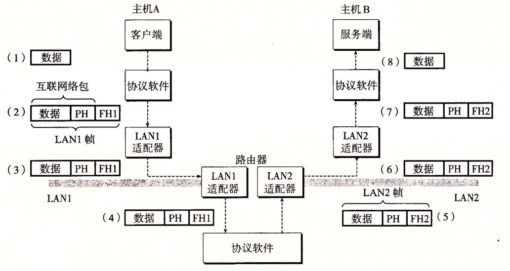
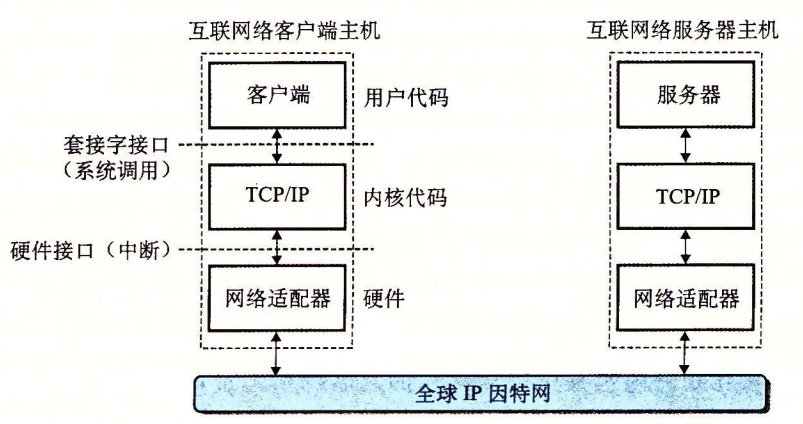
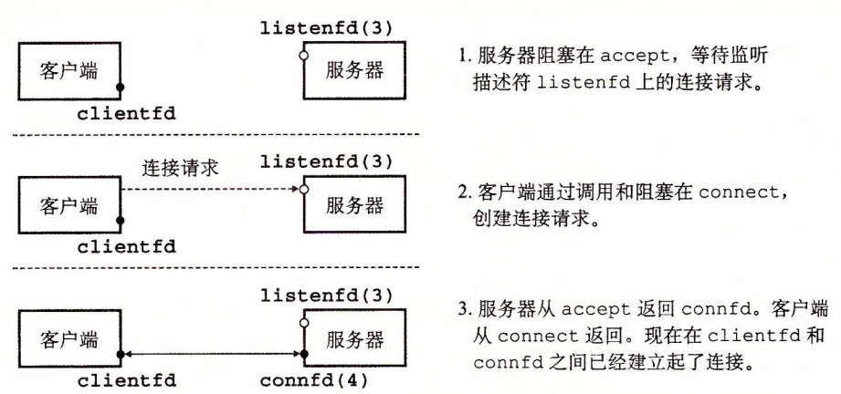

 数据是如何从一台主机传送到另一台主机的
1.  运行在主机 A 上的客户端进行一个系统调用，从客户端的虚拟地址空间复制数据到内核缓冲区
2.  主机 的 协议 的 的 一 一 一 一 一 一 一 一 了 的 的 的 的 的 的 的 的 的 的 的 的 的 的 的 的网络到器. 注意, LAN1 帧 的 效 的 的 的 的 的 的 的 的 的 的 的 的 的 的
3.  LAN1 适配器复制该帧到网络上。
4.  当此帧到达路由器时,路由器的 LAN1 适配器从电缆上读取它，并把它传送到协议软件.
5.  路由 的 的 的 的 的 的 的 的 的 的 的 的 的 的 的 的 的 的 的 的 的 的 的 索引 的 的 这 的 索引 的 的 的 索引 的 的 这 的 的 的 索引 的 索引 的 索引 的 的 索引 的 索引 的 索引 的 的 索引 的 的 索引 的 索引 的 的 的 的 索引 的B 的新的 LAN2 帧头，并把得到的帧传送到适配器。
6.  路由器的 LAN2 适配器复制该帧到网络上。
7.  当此帧到达主机 B 时，它的适配器从电缆上读到此帧，并将它传送到协议软件。
8.  最后 的 的 一 的 的 的 的 的 的 的 一 的 一 的 一 的 的 的 的 的 的 的 的 的 的 的 的时 协议

- Bind 函数 内 核 将 将 将 中 中 中 中 描述符 起来 起来 起来 起来 起来 起来 起来. 参数 ADDRLEN 就就 Taille de taille (sockaddr_in). 对于 Socket 和 Connecter, 最 的 方法 是 用 gettaddrinfo 来 为 Reli 提供
- écoutez
- Accepter 函数 客户 的 连接连接 请求 侦听 客户 的 的 的 的 并 一 的 的 套接字 中 并 一 一 的 的 套接字 地址, 并 一O 函数与客户端通信。

 在一 步 中, 服务器 调用 等待 请求 监听 监听 描述符 描述符 描述符 们 们 设定 为 为 描述符 下 一下, 描述 标准 文件 的. 在 第二 第二中, 客户 端调用 Connecter 函数, 发送 一个 连接 请求 到 送 第三 步 步 的 的 一 一个 的 已已 描述符 Connfd (们 假设 是 新 的 已 描述符 Connfd (们 假设 是 新 的 已已 描述符 Connfd (们 假设 是 新 的 已已 描述符 Connfd (们 假设 是 新 的 已已 描述符 Connfd (们 假设 是 新 的 已已 描述符 Connfd (们 假设 是 新 的 已 描述符 Connfd (们 假设 是 新 的 已 描述符 Connfd (们们 是 描述 的 的 已 描述符 Connfd (们 假设 是 新 的 已 描述符 Connfd (们 假设 是 描述 的 已 描述符 Connfd (们 假设 是 新 4), 在 Clientfd 和 connfd 之间 建立 连接 并且随后 返回 connfd 给 应用 程序. 客户 端 也 从 de connexion 返回, 在 这 一点 以后, 客户 端 和 服务器 就 可以 分别 通过 读和写 clientfd 和 connfd 来回 传送 数据 了.
