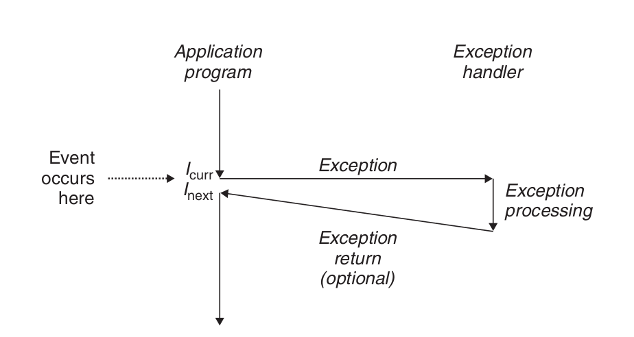
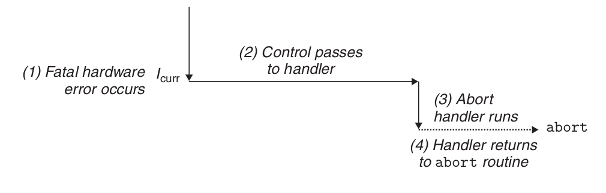
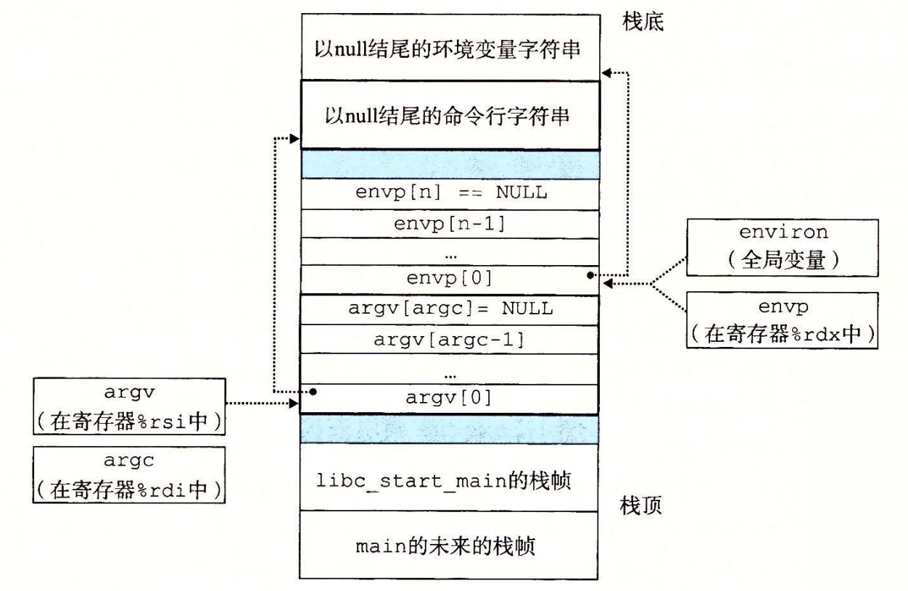
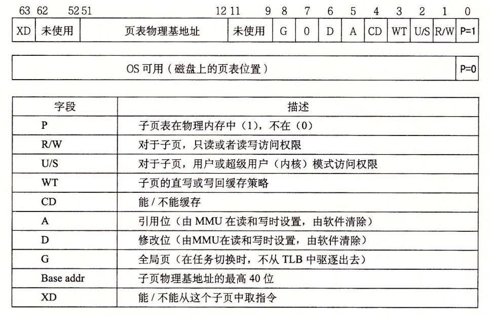
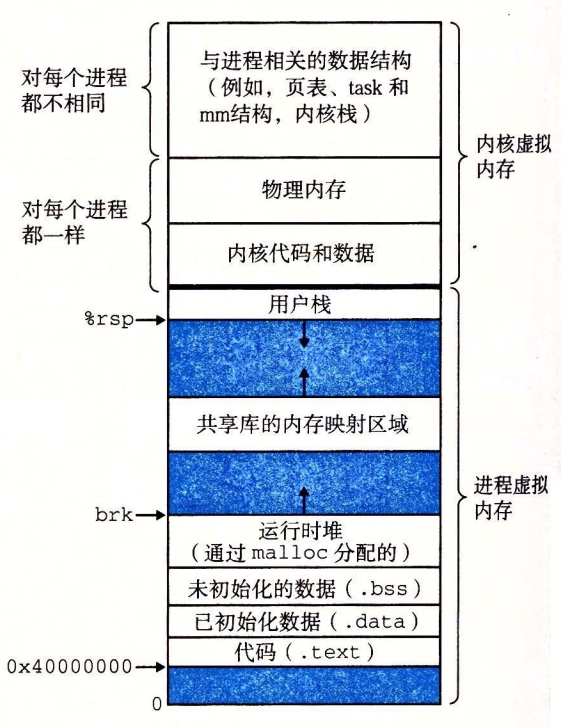
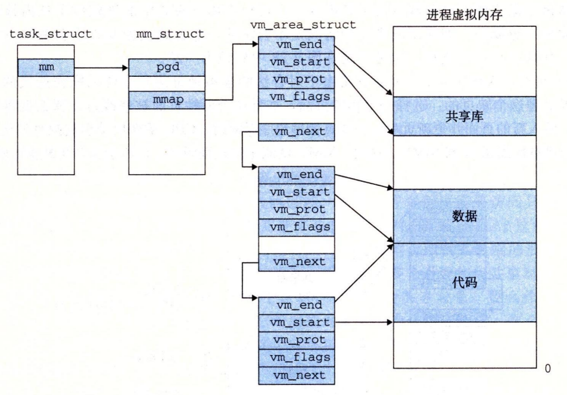
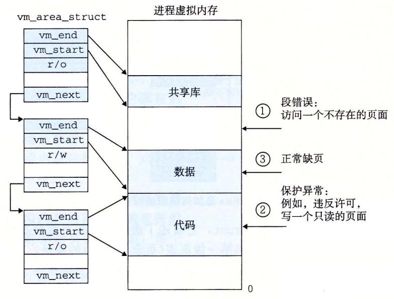
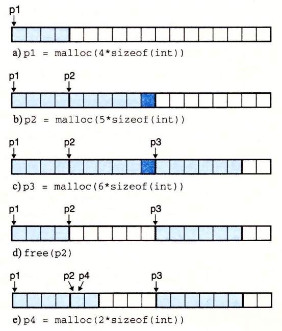
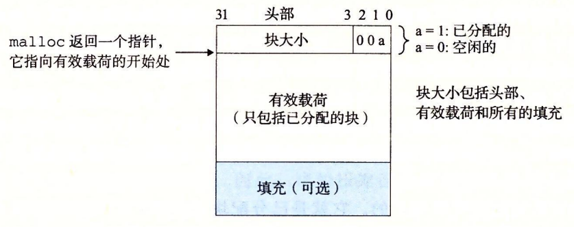

#Exceptional Control Flow
Exceptions are a form of exceptional control flow that are implemented partly
by the **hardware** and **partly by the operating system.**
\
An exception is an abrupt change in the control flow in response to some
change in the processor’s state.

异步异常时由处理器外部的I/O设备中的事件产生的。同步异常是执行一条指令的直接产物。


操作系统启动时，分配和初始化一张称为异常表的跳转表.


## Interrupt handling.
I/O 设备，例如网络适配器、磁盘控制器和定时器芯片，通过向处理器芯片上的一个引脚发信号，并将异常号放到系统总线上，来触发中断，这个异常号标识了引起中断的设备。

在当前指令完成执行之后，处理器注意到中断引脚的电压变高了，就从系统总线读取异常号，然后调用适当的中断处理程序。当处理程序返回时，它就将控制返回给下一条指令（也即如果没有发生中断，在控制流中会在当前指令之后的那条指令）。结果是程序继续执行，就好像没有发生过中断一样。
剩下的异常类型（陷阱、故障和终止）是同步发生的，是执行当前指令的结果。我们把这类指令叫做故障指令（faulting instruction）。

## Trap handling.
陷阱是有意的异常，是执行一条指令的结果。就像中断处理程序一样，陷阱处理程序将控制返回到下一条指令。陷阱最重要的用途是在用户程序和内核之间提供一个像过程一样的接口，叫做系统调用。
用户程序经常需要向内核请求服务，比如读一个文件（read）、创建一个新的进程（fork），加载一个新的程序（execve），或者终止当前进程（exit）。为了允许对这些内核服务的受控的访问，处理器提供了一条特殊的 “syscall n” 指令，当用户程序想要请求服务 n 时，可以执行这条指令。执行 syscall 指令会导致一个到异常处理程序的陷阱，这个处理程序解析参数，并调用适当的内核程序。


从程序员的角度来看，系统调用和普通的函数调用是一样的。然而，它们的实现非常不同。普通的函数运行在用户模式中，用户模式限制了函数可以执行的指令的类型，而且它们只能访问与调用函数相同的栈。系统调用运行在内核模式中，内核模式允许系统调用执行特权指令，并访问定义在内核中的栈。

## Fault handling.
故障由错误情况引起，它可能能够被故障处理程序修正。当故障发生时，处理器将控制转移给故障处理程序。如果处理程序能够修正这个错误情况，它就将控制返回到引起故障的指令，从而重新执行它。否则，处理程序返回到内核中的 abort 例程，abort 例程会终止引起故障的应用程序。


## Abort handling.
终止是不可恢复的致命错误造成的结果，通常是一些硬件错误，比如 DRAM 或者 SRAM 位被损坏时发生的奇偶错误。终止处理程序从不将控制返回给应用程序。



### Linux/x86-64 系统中的异常
0 ∼ 31 的号码对应的是由 Intel 架构师定义的异常，因此对任何 x86-64 系统都是一样的。32 ∼ 255 的号码对应的是操作系统定义的中断和陷阱。

| 异常号 | 描述 | 异常类别 |
| :--- | :--- | :--- |
| 0 | 除法错误 | 故障 |
| 13 | 一般保护故障 | 故障 |
| 14 | 缺页 | 故障 |
| 18 | 机器检查 | 终止 |
| 32 ~ 255 | 操作系统定义的异常 | 中断或陷阱 |


### Linux/x86-64 故障和终止
除法错误（异常 0）。试图除以零 结果对于目标操作数来说太大了.浮点异常（Floating exception）
一般保护故障（异常 13）。 引用了一个未定义的虚拟内存区域，或者因为程序试图写一个只读的文本段。“段故障（Segmentation fault）”
缺页（异常 14）. 会重新执行 处理程序将适当的磁盘上虚拟内存的一个页面映射到物理内存的一个页面，然后重新执行这条产生故障的指令。
机器检查（异常 18） 检测到致命的硬件错误时发生的。从不返回控制给应用程序。


### Linux/x86-64 System Calls

Linux 提供几百种系统调用，当应用程序想要请求内核服务时可以使用，包括读文件、写文件或是创建一个新进程。

| 编号 | 名字 | 描述 | 编号 | 名字 | 描述 |
| ---: | :---: | :--- | :---: | :---: | :--- |
| 0 | read | 读文件 | 33 | pause | 挂起进程直到信号到达 |
| 1 | write | 写文件 | 37 | alarm | 调度告警信号的传送 |
| 2 | open | 打开文件 | 39 | getpid | 获得进程ID |
| 3 | close | 关闭文件 | 57 | fork | 创建进程 |
| 4 | stat | 获得文件信息 | 59 | execve | 执行一个程序 |
| 9 | mmap | 将内存页映射到文件 | 60 | \_exit | 终止进程 |
| 12 | brk | 重置堆顶 | 61 | wait4 | 等待一个进程终止 |
| 32 | dup2 | 复制文件描述符 | 62 | kill | 发送信号到一个进程 |

C 程序用 syscall 函数可以直接调用任何系统调用。


在IA32上，Linux的系统调用是通过int 0x80中断，访问中断向量表，调用sys_call()。它通过eax传递系统调用号；其他一系列寄存器传递参数，分别存储在ebx，ecx，edx，esi，edi，ebp；返回值存储在eax。
x86 64体系结构引入了一条专用指令syscall。它不访问中断描述符表，速度更快。它通过rax传递系统调用号；其他一系列寄存器传递参数(6)，分别存储在rdi，rsi，rdx，r10，r8，r9；返回值存储在rax。

```shell
#include <unistd_32.h>
int main()
{
    write(1, "hello, world\n", 13);
    _exit(0);
}
```
```as
.section .data
string:
  .ascii "hello, world\n"
string_end:
  .equ len, string_end - string
.section .text
.globl main
main:
  # First, call write(1, "hello, world\n", 13)
  movq $1, %rax                 # write is system call 1
  movq $1, %rdi                 # Arg1: stdout has descriptor 1
  movq $string, %rsi            # Arg2: hello world string
  movq $len, %rdx               # Arg3: string length
  syscall                       # Make the system call

  # Next, call _exit(0)
  movq $60, %rax                # _exit is system call 60
  movq $0, %rdi                 # Arg1: exit status is 0
  syscall                       # Make the system call
```
**A process provides each program with its own private address space.**


The bottom portion of the address space is reserved for the user program, with
the usual code, data, heap, and stack segments. The code segment always begins at
address 0x400000. The top portion of the address space is reserved for the kernel
(the memory-resident part of the operating system). This part of the address space
contains the code, data, and stack that the kernel uses when it executes instructions
on behalf of the process (e.g., when the application program executes a system
call).

### Fork
调用一次，返回两次。  
并发执行。
相同但是独立的地址空间。
共享文件。


如果一个父进程终止了，内核会安排 init 进程成为它的孤儿进程的养父。init 进程的 PID 为 1，是在系统启动时由内核创建的，它不会终止，是所有进程的祖先。如果父进程没有回收它的僵死子进程就终止了，那么内核会安排 init 进程去回收它们。不过，长时间运行的程序，比如 shell 或者服务器，总是应该回收它们的僵死子进程。即使僵死子进程没有运行，它们仍然消耗系统的内存资源。

一个进程可以通过调用 waitpid 函数来等待它的子进程终止或者停止。

waitpid 函数有点复杂。默认情况下（当 options=0 时），waitpid 挂起调用进程的执行，直到它的等待集合（wait set）中的一个子进程终止。如果等待集合中的一个进程在刚调用的时刻就已经终止了，那么 waitpid 就立即返回。在这两种情况中，waitpid 返回导致 waitpid 返回的已终止子进程的 PID。此时，已终止的子进程已经被回收，内核会从系统中删除掉它的所有痕迹。

等待集合的成员是由参数 pid 来确定的：
- 如果 Pid>0，那么等待集合就是一个单独的子进程，它的进程 ID 等于 pid。
- 如果 Pid=-1，那么等待集合就是由父进程所有的子进程组成的。

argv 变量指向一个以 null 结尾的指针数组，其中每个指针都指向一个参数字符串。按照惯例，argv[0] 是可执行目标文件的名字。

envp 变量指向一个以 null 结尾的指针数组，其中每个指针指向一个环境变量字符串，每个串都是形如 “name=value” 的名字—值对。




在任意时刻，虚拟页面的集合都分为三个不相交的子集：
- 未分配的：VM 系统还未分配（或者创建）的页。未分配的块没有任何数据和它们相关联，因此也就不占用任何磁盘空间。
- 缓存的：当前已缓存在物理内存中的已分配页。
- 未缓存的：未缓存在物理内存中的已分配页。

SRAM 缓存来表示位于 CPU 和主存之间的 Ll、L2 和 L3 高速缓存，
DRAM 缓存来表示虚拟内存系统的缓存，它在主存中缓存虚拟页。


- 第 1 步：处理器生成一个虚拟地址，并把它传送给 MMU。
- 第 2 步：MMU 生成 PTE 地址，并从高速缓存/主存请求得到它。
- 第 3 步：高速缓存/主存向 MMU 返回 PTE。
- 第 4 步：MMU 构造物理地址，并把它传送给高速缓存/主存。
- 第 5 步：高速缓存/主存返回所请求的数据字给处理器。

- 第 1 步到第 3 步：相同。
- 第 4 步：PTE 中的有效位是零，所以 MMU 触发了一次异常，传递 CPU 中的控制到操作系统内核中的缺页异常处理程序。
- 第 5 步：缺页处理程序确定出物理内存中的牺牲页，如果这个页面已经被修改了，则把它换出到磁盘。
- 第 6 步：缺页处理程序页面调入新的页面，并更新内存中的 PTE。
- 第 7 步：缺页处理程序返回到原来的进程，再次执行导致缺页的指令。CPU 将引起缺页的虚拟地址重新发送给 MMU。因为虚拟页面现在缓存在物理内存中，所以就会命中，在 MMU 执行了图 9-13b 中的步骤之后，主存就会将所请求字返回给处理器。


Core i7 地址翻译：


第一级、第二级或第三级页表中条目的格式.要求物理页表 4 KB 对齐。

当P=1时，地址字段包含一个 40 位物理页号（PPN），
第四级页表中条目的格式。要求物理页 4 KB 对齐。

当 MMU 翻译每一个虚拟地址时，它还会更新另外两个内核缺页处理程序会用到的位。每次访问一个页时，MMU 都会设置 A 位，称为引用位（reference bit）。内核可以用这个引用位来实现它的页替换算法。每次对一个页进行了写之后，MMU 都会设置 D 位，又称修改位或脏位（dirty bit）。修改位告诉内核在复制替换页之前是否必须写回牺牲页。内核可以通过调用一条特殊的内核模式指令来清除引用位或修改位。

Core i7 MMU 如何使用四级的页表来将虚拟地址翻译成物理地址。


1个 Linux 进程的虚拟内存

一个区域（area）就是已经存在着的（已分配的）虚拟内存的连续片（chunk），这些页是以某种方式相关联的。
代码段、数据段、堆、共享库段，以及用户栈都是不同的区域。每个存在的虚拟页面都保存在某个区域中，而不属于某个区域的虚拟页是不存在的，并且不能被进程引用。
内核为系统中的每个进程维护一个单独的任务结构（源代码中的 task_struct），任务结构中的元素包含或者指向内核运行该进程所需要的所有信息（例如，PID、指向用户栈的指针、可执行目标文件的名字，以及程序计数器）。
任务结构中的一个条目指向 mm_struct，它描述了虚拟内存的当前状态。我们感兴趣的两个字段是 pgd 和 mmap，其中 pgd 指向第一级页表（页全局目录）的基址，而 mmap 指向一个 vm_area_structs（区域结构）的链表，其中每个 vm_area_structs 都描述了当前虚拟地址空间的一个区域。当内核运行这个进程时，就将 pgd 存放在 CR3 控制寄存器中。\
vm_start：指向这个区域的起始处。\
vm_end：指向这个区域的结束处。\
vm_prot：描述这个区域内包含的所有页的读写许可权限。\
vm_flags：描述这个区域内的页面是与其他进程共享的，还是这个进程私有的（还描述了其他一些信息）。\
vm_next：指向链表中下—区域结构。\




加载并运行 a.out 需要以下几个步骤：
1.  **删除已存在的用户区域。**删除当前进程虚拟地址的用户部分中的已存在的区域结构。
2.  **映射私有区域。**为新程序的代码、数据、bss 和栈区域创建新的区域结构。所有这些新的区域都是私有的、写时复制的。代码和数据区域被映射为 a.out 文件中的. text 和. data 区。bss 区域是请求二进制零的，映射到匿名文件，其大小包含在 a.out 中。栈和堆区域也是请求二进制零的，初始长度为零。图 9-31 概括了私有区域的不同映射。
3.  **映射共享区域。**如果 a.out 程序与共享对象（或目标）链接，比如标准 C 库 libc.so，那么这些对象都是动态链接到这个程序的，然后再映射到用户虚拟地址空间中的共享区域内。
4.  **设置程序计数器（PC）。**execve 做的最后一件事情就是设置当前进程上下文中的程序计数器，使之指向代码区域的入口点。

 
1.  **显式分配器**（explicit allocator），要求应用显式地释放任何已分配的块。例如，C 标准库提供一种叫做 malloc 程序包的显式分配器。C 程序通过调用 malloc 函数来. 分配一个块，并通过调用 free 函数来释放一个块。C++ 中的 new 和 delete 操作符与 C 中的 malloc 和 free 相当。
2.  **隐式分配器**（implicit allocator），另一方面，要求分配器检测一个已分配块何时不再被程序所使用，那么就释放这个块。隐式分配器也叫做**垃圾收集器**（garbage collector），而自动释放未使用的已分配的块的过程叫做**垃圾收集**（garbage collection）。例如，诸如 Lisp、ML 以及 Java 之类的高级语言就依赖垃圾收集来释放已分配的块。

malloc 函数返回一个指针，指向大小为至少 size 字节的内存块，这个块会为可能包含在这个块内的任何数据对象类型做对齐。实际中，对齐依赖于编译代码在 32 位模式（gcc -m32）还是 64 位模式（默认的）中运行。在 32 位模式中，malloc 返回的块的地址总是 8 的倍数。在 64 位模式中，该地址总是 16 的倍数。
sbrk 函数通过将内核的 brk 指针增加 incr 来扩展和收缩堆。如果成功，它就返回 brk 的旧值，否则，它就返回 -1，并将 errno 设置为 ENOMEM。如果 incr 为零，那么 sbrk 就返回 brk 的当前值。用一个为负的 incr 来调用 sbrk 是合法的，而且很巧妙，因为返回值（brk 的旧值）指向距新堆顶向上 abs(incr) 字节处。
程序是通过调用 free 函数来释放已分配的堆块。

 a：程序请求一个 4 字的块。malloc 的响应是：从空闲块的前部切出一个 4 字的块，并返回一个指向这个块的第一字的指针。
 b：程序请求一个 5 字的块。malloc 的响应是：从空闲块的前部分配一个 6 字的块。在本例中，malloc 在块里填充了一个额外的字，是为了保持空闲块是双字边界对齐的。
 c：程序请求一个 6 字的块，而 malloc 就从空闲块的前部切出一个 6 字的块。
 d：程序释放在 b 中分配的那个 6 字的块。注意，在调用 free 返回之后，指针 p2 仍然指向被释放了的块。应用有责任在它被一个新的 malloc 调用重新初始化之前，不再使用 p2。
 e：程序请求一个 2 字的块。在这种情况中，malloc 分配在前一步中被释放了的块的一部分，并返回一个指向这个新块的指针。

显式分配器约束条件：
1.  **处理任意请求序列。**一个应用可以有任意的分配请求和释放请求序列，只要满足约束条件：每个释放请求必须对应于一个当前已分配块，这个块是由一个以前的分配请求获得的。因此，分配器不可以假设分配和释放请求的顺序。例如，分配器不能假设所有的分配请求都有相匹配的释放请求，或者有相匹配的分配和空闲请求是嵌套的。
2.  **立即响应请求。**分配器必须立即响应分配请求。因此，不允许分配器为了提高性能重新排列或者缓冲请求。
3.  **只使用堆。**为了使分配器是可扩展的，分配器使用的任何非标量数据结构都必须保存在堆里。
4.  **对齐块（对齐要求）。**分配器必须对齐块，使得它们可以保存任何类型的数据对象。
5.  **不修改已分配的块。**分配器只能操作或者改变空闲块。特别是，一旦块被分配了，就不允许修改或者移动它了。因此，诸如压缩已分配块这样的技术是不允许使用的。

一个简单的堆块的格式
如果我们强加一个双字的对齐约束条件，那么块大小就总是 8 的倍数，且块大小的最低 3 位总是零。因此，我们只需要内存大小的 29 个高位，释放剩余的 3 位来编码其他信息。在这种情况中，我们用其中的最低位（已分配位）来指明这个块是已分配的还是空闲的。例如，假设我们有一个已分配的块，大小为 24（0x18）字节。那么它的头部将是

**0x00000018 | 0x1 = 0x00000019**

类似地，一个块大小为 40（0x28）字节的空闲块有如下的头部：

**0x00000028 | 0x0 = 0x00000028**

头部后面就是应用调用 malloc 时请求的有效载荷。有效载荷后面是一片不使用的填充块，其大小可以是任意的。需要填充有很多原因。比如，填充可能是分配器策略的一部分，用来对付外部碎片。或者也需要用它来满足对齐要求。


用隐式空闲链表来组织堆。阴影部分是已分配块。没有阴影的部分是空闲块。头部标记为（大小（字节）/ 已分配位）
，那么每个块的大小都必须是双字（8 字节）的倍数。因此，导致最小的块大小为两个字：一个字作头，另一个字维持对齐要求。即使应用只请求一字节，分配器也仍然需要创建一个两字的块。
隐式空闲链表的优点是简单。显著的缺点是任何操作的开销，例如放置分配的块，要求对空闲链表进行搜索，该搜索所需时间与堆中已分配块和空闲块的总数呈线性关系。

