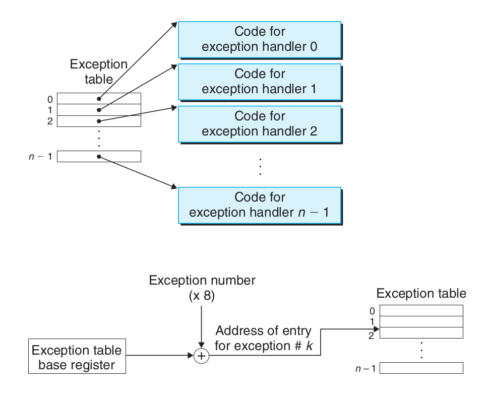
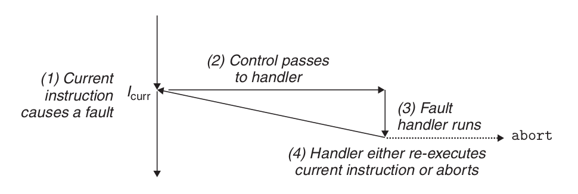
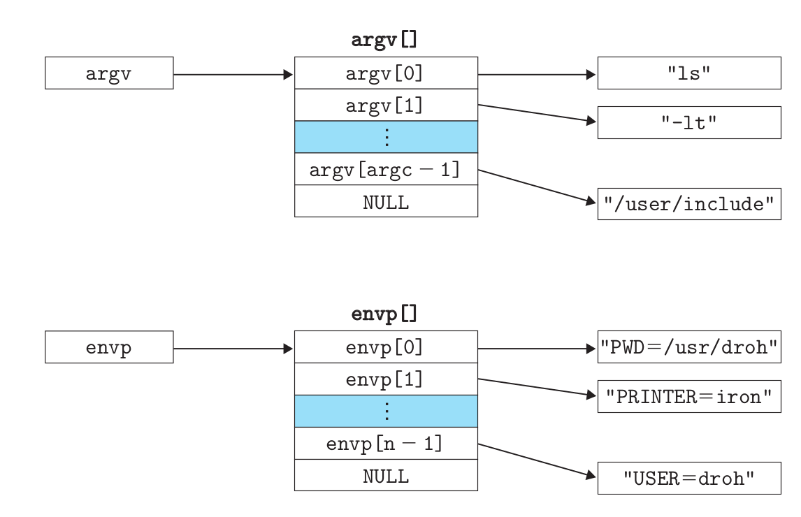
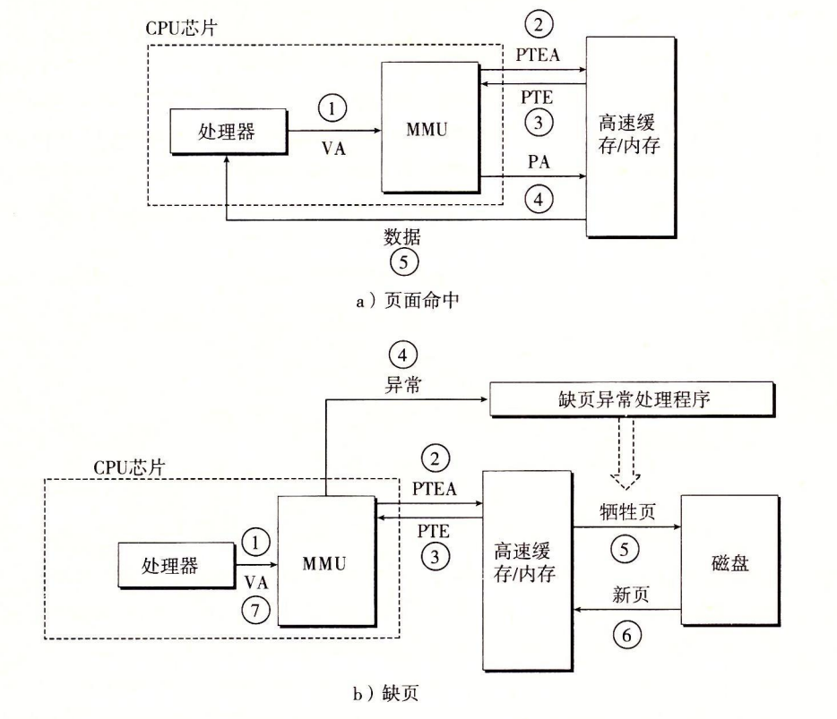
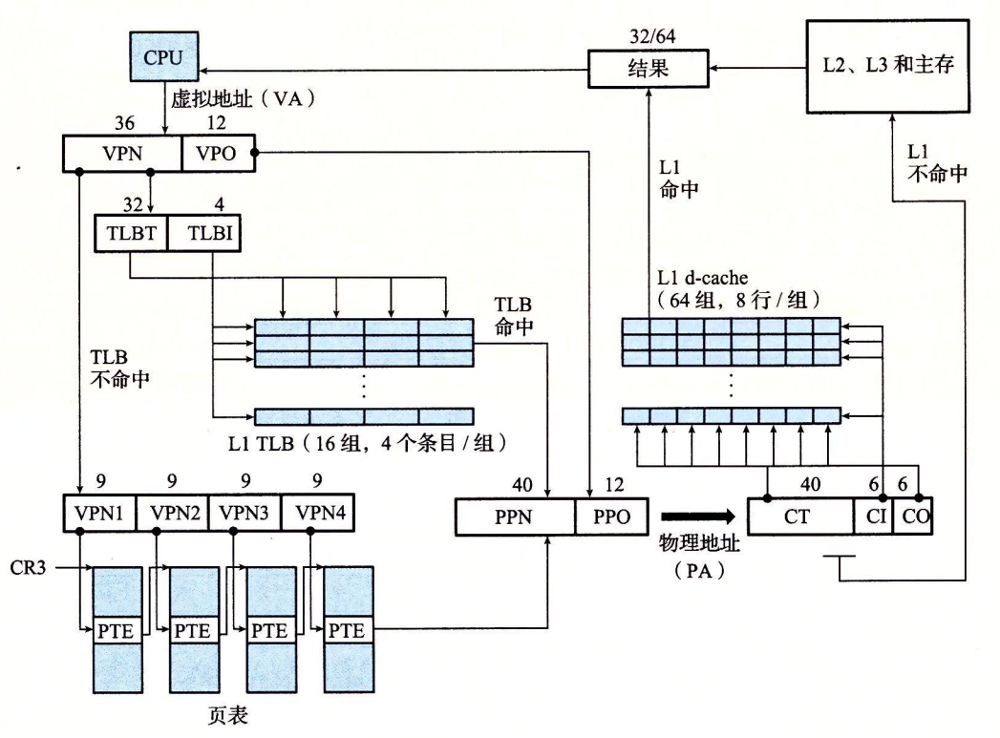
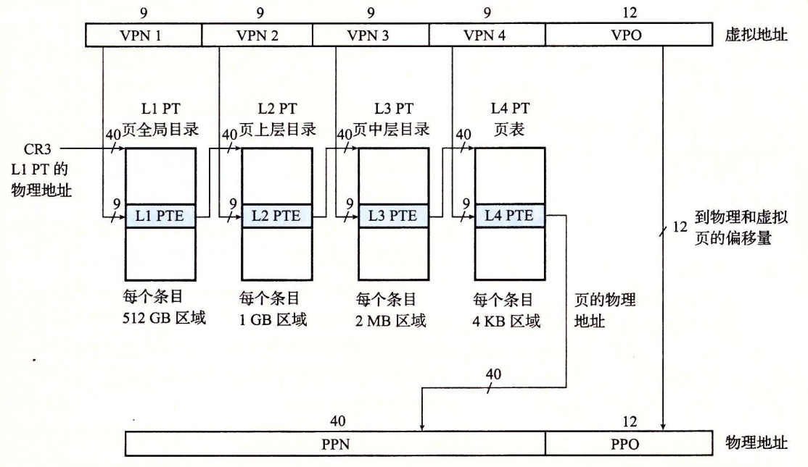
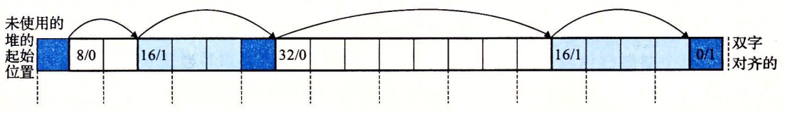

# 特殊控制流
异常是异常控制流的一种形式，部分由 硬件**和****由操作系统实现。** \ 异常是响应于处理器状态的某些变化而在控制流中发生的突然变化 。

异步异常是由处理器以外的 I/O 设备中的事件产生的。 同步例外是执行指令的直接结果。

 当操作系统启动时，将分配并初始化一个叫做异常表的跳转表。



## 中断处理。

I/O I/O 设备，如网络适配器、磁盘控制器和计时器芯片， 通过在处理器芯片上发出一个引脚并在系统总线上放置一个识别导致中断的设备的异常号码来触发中断。

 在当前指令完成执行后，处理器通知中断引脚的电压已经很高。 读取系统公共汽车的异常号码，然后调用适当的中断处理器。 当处理程序返回时，它将返回控制到下一个指令(即： 如果不发生中断，本来会遵循控制流指令的控制流量)。 其结果是，该方案继续执行，如同未发生中断一样。

其余的异常类型(陷阱、过失和终止)同步发生，并且是执行当前指令的结果。 我们将这种类型的指令称为错误指令。

## 陷阱处理。

陷阱是故意的例外，是执行指示的结果。 就像打断处理器，陷阱处理程序返回到下一个指令。 陷阱最重要的用途是提供用户程序和内核之间的一个类似程序的接口，称为系统调用。 用户程序通常需要从内核请求服务，例如读取文件(已读)， 创建一个新进程 (fork)，加载一个新程序 (execve)，或终止当前进程 (退出)。 允许控制访问这些内核服务， 处理器提供了一个特殊的“syscall n”指令，当用户程序想要请求服务时可以执行。 执行系统扫描指令会导致一个异常处理器陷阱，解析参数并调用适当的内核程序。

 从程序员的角度来看，系统调用和正常函数调用是相同的。 然而，它们的执行情况却非常不同。 在用户模式下运行的普通函数限制函数可以执行的指令类型， 他们只能访问与通话功能相同的堆栈。 内核模式中运行的系统调用，允许系统调用执行特权指令并访问内核定义的堆栈。

## 错误处理。

该过失是由错误条件造成的，该错误条件可以由过失处理器加以纠正。 当发生故障时，处理器将控制权转移到过失处理器。 如果处理器能够纠正错误状态, 它会将控制返回导致错误的指令, 从而重新执行它。 否则，处理程序返回内核中的中止程序，而中止程序终止了造成错误的应用程序。 

## 中止处理。

终止是无法恢复的致命错误的结果， 通常某些硬件错误，例如当一个 DRAM或 SRAM 位损坏时发生的对等错误。 终止处理程序永远不会返回对应用程序的控制。 


### Linux/x86-64 系统中的例外

数字0-1,相当于英特尔设计师定义的例外情况，因此对于任何x86-64系统来说是相同的。 32 S－255对应操作系统定义的中断和陷阱。

| 异常编号     | 描述       | 臭氧消耗类  |
|:-------- |:-------- |:------ |
| 0        | 分区错误     | 故障     |
| 13       | 通用保护故障   | 故障     |
| 14       | 缺少页面     | 故障     |
| 18       | 机器检查     | 中止     |
| 32 ~ 255 | OS 定义的例外 | 中断或陷阱： |

### Linux/x86-64 故障和终止

分区错误 (异常 0)。 试图将零分为零的结果对目标行动来说过于庞大。 浮点异常(浮动异常) 一般保护故障 (例外13)。 一个未定义的虚拟内存区域被引用，或因为程序试图写入一个只读文本部分。 "片断故障 (Segmentation default)" 丢失页面(Exception 14)。 将重新执行处理程序映射相应磁盘上的虚拟内存页面，然后重新执行生成错误的指令。 检测到致命硬件错误时，机器检查(例外18)。 永远不要返回应用程序控制。


### Linux/x86-64 系统调用

Linux Linux提供了数百个系统调用，当应用程序想要请求内核服务时可以使用 包括读取文件、写入文件或创建一个新过程。

| 数字 |  名称  |    描述     | 数字 |   名称   | 描述            |
| --:|:----:|:---------:|:--:|:------:|:------------- |
|  0 |  已读  |   读取文件    | 33 |   暂停   | 将进程挂起，直到信号收到时 |
|  1 |  写   |   写入文件    | 37 | alarm  | 安排报警信号的传送时间   |
|  2 |  打开  |   打开文件    | 39 | getpid | 获取进程 ID       |
|  3 |  关闭  |   关闭文件    | 57 |  fork  | 创建进程          |
|  4 |  统计  |  获取文件信息   | 59 | 正则表达式  | 执行一个程序        |
|  9 | mmap | 映射内存页面到文件 | 60 |   退出   | 终止进程          |
| 12 | 品牌座  |   重置堆顶部   | 61 |  等待4   | 等待进程结束        |
| 32 | dup2 |  复制文件描述符  | 62 |   击杀   | 发送信号到一个进程     |

C 程序可以直接使用 syscall 函数调用任何系统调用。

在 IA32, Linux 系统调用通过 int 0x80 中断称为sys_call() ，它可以访问中断矢量表。 它通过eax传送系统呼叫号码； 一系列其他登记册通过了存放在ebx、ecx、edx、esi、 edi、 ebp中的参数；返回值存储在eax中。 x86 64架构引入了一个特殊的指令，syscall，它无法访问中断的描述表，且速度更快。 它通过频率传输系统呼叫号码； 一系列其他登记册通过了存储在rdi、rsi、rdx、r10、r8、r9中的参数(6)；返回值储存在方根内。

```shell
#include <unistd_32.h>
int main()
Power
    write(1, "hello, world\n", 13);
    _exit(0);
}
```
```as
.section .data
string:
  .ascii "hello, world\n"
string_end:
  . qu len, string_end - 字符串
.section .text
. lobl main
main:
  # First, calls write(1, "hello, world\n", (13)
  movq $1, %rax # 写法是系统调用 1
  movq $1 %rdi # Arg1: stdout有描述符 1
  movq $string, %rsi # Arg2: hello world 字符串
  movq $len, %rdx # Arg3: 字符串长度
  syscall # 进行系统调用

  # 接下来， 调用 _exit(0)
  movq $60, %rax # _expis system calling 60
  movq $0, %rdi # Arg1: 退出状态是 0
  sysall # 进行系统调用
```
**一个过程为每个程序提供了自己的私人地址空间。**

 地址空间的底部部分保留给用户程序，包含 通常的代码、数据、热ap和堆栈片段。 代码段始于 地址 0x400000。 地址空间的顶部部分预留给内核 (操作系统的内存-驻地部分)。 地址空间的这一部分 包含代码、数据。 并堆栈，当内核代表进程执行指令 (e)。 .，当应用程序程序执行系统 调用)。

### Fork
拨打一次并返回两次。  
并发执行。 相同但分开的地址空间。 共享文件。 

如果父进程终止，内核将安排内联进程成为其孤儿进程的收养父母。 init 有一个 PID 为1，由内核在系统启动时创建，没有终止，是所有进程的祖先。 如果父进程终止而不恢复其已死亡的子女，内核将安排收回它们的进入。 然而，诸如炮弹或服务器等长期运行的程序总是应当回收其已死亡的孩子。 即使死亡的子进程没有运行，它们仍然消耗系统内存资源。

一个进程可以通过调用 waitpid 函数来等待其子进程结束或停止。

Waitpid 函数有点复杂。 默认情况下(当选项=0)，等待id暂停执行呼叫程序，直到其在等待设置中的一个子进程终止。 如果等待设置中的一个进程在通话时已经终止，然后立即等待返回。 在这两种情况下，等待id返回已终止的子进程的 PID 导致等待期返回. 此时此刻，终止的儿童进程已被恢复，内核已从系统中移除所有痕迹。

等待收藏的成员由参数pid决定。

- 如果Pid>0，则等待集合是一个单一的儿童过程，进程ID等于pid。
- 如果Pid=-1, 则等待收藏由父进程的所有子项目组成。

Argv变量指向一个以空结尾的指针数组，其中每个指向一个参数字符串。 根据惯例，argv[0] 是可执行目标文件的名称。

 Envp 变量指向以空结尾的指针数组。 其中每个都指向一串环境变量，每个变量都是“name=value”的名称对。


在任何时候，虚拟页面都被分成三个不同的子集。
- 未分配：尚未被虚拟机系统分配(或创建)的页面。 未分配的块没有任何与它们相关联的数据，因此不占用任何磁盘空间。
- 缓存：已分配的页面目前被缓存在物理内存中。
- 未缓存：分配的页面没有缓存于物理内存中。

SRAM 缓存表示CPU 和主内存之间的L、 L2 和 L3 缓存，DRAM 缓存表示虚拟内存。 DRAM 缓存表示虚拟内存系统的缓存，在主内存中缓存虚拟页面。


- 第 1 步：处理器生成一个虚拟地址并将其传送到MMU。
- 第 2 步：MMU 生成一个 PTE 地址，并且从缓存/主请求它。
- 第 3 步：缓存/主内存返回 PTE 到MMU。
- 第 4 步：MMU 构造物理地址并将其传送到缓存/主机。
- 第 5 步：缓存/家庭内存将请求的数据单词返回处理器。 
- 步骤1至3：对。
- 第 4 步：PTE 中的有效位为零，所以MMU会触发异常。 将控制从 CPU 传递到 OS 内核中页外异常处理器。
- 第5步：页外处理程序决定物理内存中的亵渎页面，并在页面被修改时将其交换到磁盘。
- 步骤6：新页面中的页外处理页面调用并在内存中更新 PTE
- 第 7 步：缺失的页面处理程序返回到原始进程并执行导致再次丢失页面的指令。 CPU 重置导致MMU缺失页面的虚拟地址。 因为虚拟页面现在被缓存在物理内存中，它被击中， 在MMU执行图9-13b步骤后，主内存将请求的词返回处理器。


核心i7地址翻译。 

1级、2级或3级页面表格中的条目格式化。 实际页面表需要 4 KB 对齐。  当P=1时，地址字段包含一个40位物理页号 (PPN)，第四级页面中条目的 格式。 物理页面需要 4 KB 对齐。 ! [img_29. ng](img_29.png) MMMU翻译每个虚拟地址。 它还更新其他两位将被内核丢失的页面处理器使用。 每次访问一个页面时，MMU会设置一个 A 点，称为参考位。 内核可以使用此参考位实现其页面替换算法。 每个页面被写入时，MMU会设置D位（也称为修改位或脏位）。 修改的位告诉内核它是否必须在复制替换页面之前将其写回神圣的页面。 内核可以通过调用特殊内核模式指令来清除引用或修改部分。

Core i7MMU如何使用四级页面表将虚拟地址转换为实际地址。 

Linux 进程  一个区域 (区域) 是一个已经存在的虚拟内存的毗连切片(区块) (已经分配)， 这些页面以某种方式相关联。 代码段、 数据段、 Heap、 共享库段和用户堆栈都是不同的区域。 每个存在的虚拟页面都保存在某个区域中。 不属于某一区域的虚拟页面不存在，无法被流程引用。 内核为系统中的每个进程保持一个单独的任务结构(源代码中的任务结构)。 任务结构中的元素包含或指向内核运行过程所需的所有信息(e)。 .、PID、用户堆栈的指针、可执行目标文件的名称和程序柜台)。 任务结构中的一条目指向了m_struct，它描述了虚拟内存的当前状态。 这两个感兴趣的领域是pgd 和 mmap，pgd 指向第一级页面表的基本地址(网页全球目录)， 并mmap 指向一个vm_area_structs链(区域结构)，其中每个vm_area_struct描述当前虚拟地址空间的一个区域。 当内核运行此进程时，它在 CR3 控制登记册中存储pgd。 \ vm_start: 指向此区域的起始点。 \ vm_end: 指向这个区域的末尾。 \ vm_prot: 描述该区域所有页面的读写权限。 \ vm_flags: 描述该区域的页面是否与其他进程共享或与此进程是私密的(也描述了一些其他信息)。 \ vm_nex: 指向链中的下一个区域结构。 \ 


装入并运行aout需要以下步骤。 1.**删除已存在的用户区域。**删除当前流程虚拟地址的用户部分中的现有区域结构。 2.**映射私有区域**为新程序的代码、数据、bss和堆栈区域创建新的区域结构。 所有这些新的领域都是私人的、书面的。 代码和数据区域映射到输出文件中的.text和.stack区域。 案文和 双进制零要求Bss区域，并映射到一个其大小包含在外面的匿名文件。 堆栈和堆栈区域也要求二进制零，初始长度为零。 图9-31概述了私人区域的不同制图。 3. 3.**映射共享区域。**如果aout程序连接到共享对象(或目标)，例如标准的C库libc。 o，然后这些对象被动态地连接到这个程序，然后被映射到用户虚拟地址空间中的共享区域。 4.**设置程序计数器 (PC)。 **最后一件事是在当前进程中设置程序计数器以指向代码区域的切入点。

 

1.**显式分配器**, 它要求应用程序明确释放任何已分配的方块。 例如，C标准库提供了一个叫做malloc软件包的明确分配器。 C+++中新的和删除的操作者等于malloc 和C2中的免费操作。 2.**默示分配器**需要分配器来检测分配区块是否不再被程序使用，然后释放该区块。 隐含分配器也叫做**垃圾收集器**， 和自动释放未使用的分配区块的过程叫做**垃圾收集** 例如，Lisp、ML和Java等高级语言依靠垃圾收集释放分配区块。

malloc函数返回指针到一个内存块，大小至少为大小字节。 它对齐可能包含在方块中的任何数据对象类型。 实际上，对齐取决于编译的代码是以32位模式(gcc -m32) 还是64位模式(默认) 在32位模式下，由恶意循环返回的方块地址总是8倍。 在64位模式下，地址总是16倍。 sbrk 函数通过在内核的品牌指针中添加孵化器来扩大和缩小。 如果它成功的话，它会返回旧的品牌值，否则它返回 -1，并将错误设置为 ENOMEMEM。 sbrk 返回当前品牌值，如果白色为零。 调用带负孵化器是合法和聪明的，因为返回值(旧品牌的值)指向从新品质顶部的潜逃(incr)字节。 该程序通过调用免费功能来释放分配的堆块。  a: 程序请求一个4字块。 malloc 响应，切断了自由方块前面的4个单词块，并返回一个指针到方块的第一个单词。 b：程序请求一个5字块。 通过从自由方块前面分配一个6个字块来响应malloc。 在这种情况下，恶意块填充了一个额外的词，以使自由块保持双字边界对齐。 c: 程序请求一个6字块, 而恶意地将一个6字块从自由块前面剪切。 d：程序将释放分配于b中的6个字符块。 请注意，在呼叫免费返回后，指针P2仍然指向已释放的方块。 应用程序有责任在通过新的恶意调用重新初始化之前不再使用 p2。 ︰ 程序请求一个两个字符块。 在这种情况下，恶意循环分配前一步骤释放的部分方块并返回一个指针到这个新方块。

明确分配器限制。 1.**处理任意的请求序列。** 应用程序可以有任意的分配和释放请求顺序。 只要满足了约束：每个释放请求必须对应于从先前分配请求中获得的当前分配区块。 因此，分配器不能按顺序分配和释放请求。 例如，分配器不能假定所有分配请求都有匹配的发布请求。 或者有匹配的分配和免费请求是嵌套的。 2.**对请求的即时响应** 分配器必须立即响应分配请求。 因此，分配器不允许为改进性能而重新排列或缓存请求。 3.**只使用Heap。**为了使分配器可以缩放，分配器使用的任何非缩放数据结构都必须存储在堆肥中。 4.**对齐方块(对齐要求)。**分配器必须对齐方块，以便他们可以持有任何类型的数据对象。 5.**不要修改分配的块。**分配器只能操纵或更改免费的块。 特别是，一个区块一旦分配完毕，不允许修改或移动。 因此，不允许诸如压缩所分配区块之类的方法。

简单的堆块 的格式。如果我们施加双字对齐约束， 然后，区块大小总是8倍，区块大小的最低3比特总是零。 因此，我们只需要29个高位的内存大小并释放剩余的3个位数来编码其他信息。 在这种情况下，我们使用最低位数(分配的位数)来表示该方块是分配的还是免费的。 例如，假定我们分配了一个大小为24 (0x18)字节的方块。 然后其头部将是

**0x00000018 | 0x1 = 0x00000019**

同样，一个面积为 40 (0x28) 字节的自由区块有以下标题。

**0x00000028 | 0x0 = 0x00000028**

跟随头部是调用malloc 时应用程序所要求的有效载荷。 有效载荷随后有一块未使用的填充，可以任意尺寸。 由于若干原因，需要填写填写。 例如，填充可能是处理外部碎片的分配器战略的一部分。 也可能需要这样做来满足调整的要求。

 使用隐含的免费链接表来组织堆。 阴影部分被分配到方块。 未阴影部分是自由块。 标题已标记(大小为字节/分配位) 然后每个块的大小必须是双词的倍数(8个字)。 因此导致最小区块尺寸为两个字：头部一个字，保持对齐要求的另一个字。 即使应用程序只请求一个字节，分配器仍然需要创建一个两个字块。 隐含自由链接表的优点是简单。 明显的缺点是，任何作业的间接费用，例如放置分配的区块，都需要搜索闲置链表。 而且搜索所需时间是线性的，与热器中分配和空闲方块的总数量有关。

