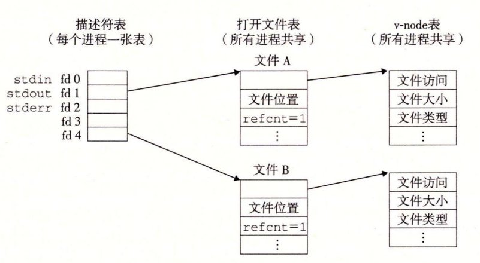
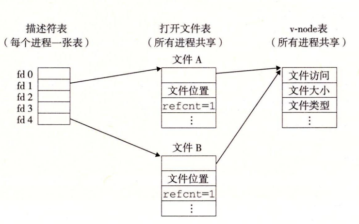

## 共享文件
 描述符 1 和 4 通过不同的打开文件表表项来引用两个不同的文件。这是一种典型的情况,没有共享文件,并且每个描述符对应一个不同的文件。  多个描述符也可以通过不同的文件表表项来引用同一个文件。例如,如果以同一个 filename 调用 open 函数两次,就会发生这种情况。关键思想是每个描述符都有它自己的文件位置,所以对不同描述符的读操作可以从文件的不同位置获取数据。 两个描述符通过两个打开文件表表项共享同一个磁盘文件  调用 fork 后的情况。子进程有一个父进程描述符表的副本。父子进程共享相同的打开文件表集合,因此共享相同的文件位置。一个很重要的结果就是,在内核删除相应文件表表项之前,父子进程必须都关闭了它们的描述符。

限制 1：跟在输出函数之后的输入函数。如果中间没有插入对 fflush、fseek、fsetpos 或者 rewind 的调用,一个输入函数不能跟随在一个输出函数之后。fflush 函数清空与流相关的缓冲区。后三个函数使用 Unix I/O lseek 函数来重置当前的文件位置。 限制 2：跟在输入函数之后的输出函数。如果中间没有插入对 fseek、fsetpos 或者 rewind 的调用,一个输出函数不能跟随在一个输入函数之后,除非该输入函数遇到了一个文件结束。

