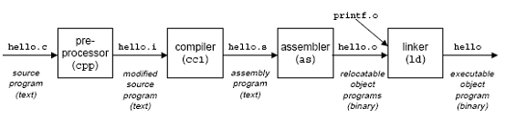
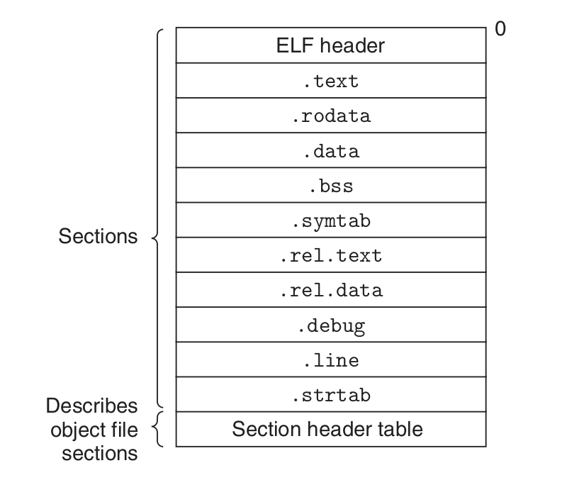
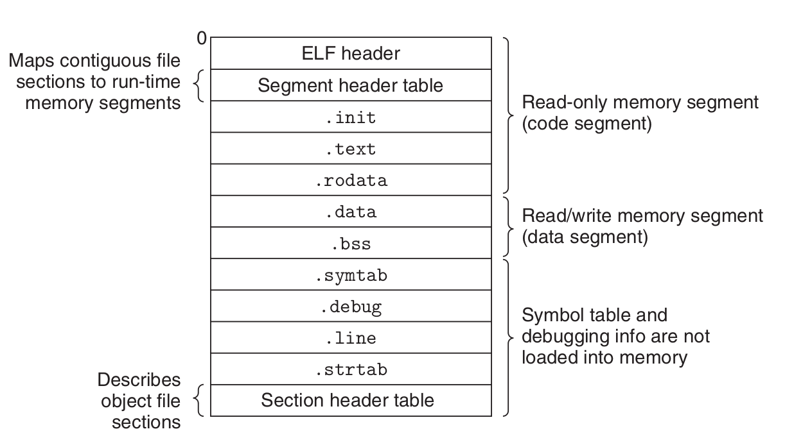
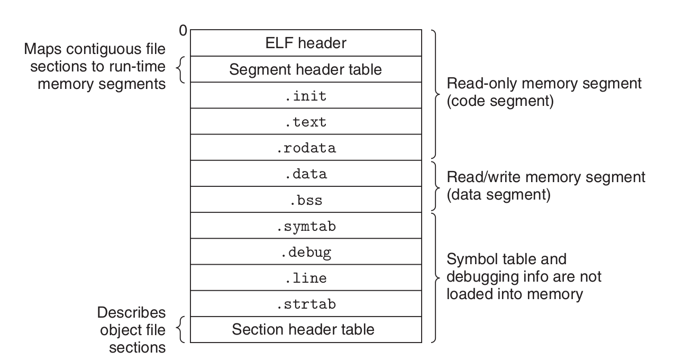
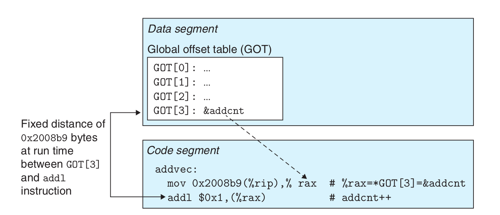

### 将 ASCII 源文件的示例程序转换为可执行对象文件。

1. C 预处理器：cpp [其他参数] hello.c /tmp/main.i
2. C 编译器： cc1 /tmp/hello.i -Og [其他参数] -o /tmp/hello.s
3. 装配符：作为[其他参数]-o /tmp/hello.o /tmp/hello.s
4. 链接程序：旧-o hello [system object files and args] /tmp/hello.o /libc.a/printf.o
5. 可执行程序：linux> ./hello


### 对象文件
可执行和可链接格式 (ELF) 。 
- .text编译程序的机器代码。
- .rodata **只读** 数据，如打印语句中的格式字符串，以及 跳转表表。
- .data 初始化了全局变量和静态C 变量。 本地的 C 变量在堆栈上运行时保持 ，不会出现在 .data 或 .bss 部分中。
- .bss 未初始化的全局和静态 C 变量，以及初始化为零的任何全局或静态 变量。 没有与.com相同的地址。
- .symtab A 符号表，包含程序中定义和引用的函数和全局变量 的信息。
- .rel重新定位信息
- .line A 映射行数
- .strtab 一个字符串表

- 可重新调整对象文件。 包含二进制代码和数据，可以在编译时与其他可转移对象文件合并创建可执行对象文件。

- 可执行对象文件。 包含二进制代码和数据格式，可以直接复制到内存并执行。 
- 共享对象文件。 一种特殊类型的可转移对象文件可以加载到内存并在加载时间或运行时间动态连接。
#### 符号
- 模块m 定义的全局符号，可以由 其他模块引用。 或由模块m 引用，但由其他模块 定义.
- 完全由模块m定义和引用的本地符号。
###### 链接如何解决重复的符号名称
强符号：int i = 1； 弱符号：int i； int main(i =1); int __属性__((weak)) power2(int x);int power2(int x) __属性__((weak));extern int __属性__((weak)) global_var; 规则 1。 不允许使用多个具有相同名称的强符号。 规则 2。 给定一个强符号和多个同名弱符号， 选择强符号。 规则 3。 给定多个具有相同名称的弱符号，选择 个弱符号中的任何一个。

#### 搬迁
1. 重定位节和符号定义。 在这一步中，链接器将所有 个相同类型的节合并为一个新的相同类型的聚合节。

2. 在部分内重新定位符号引用。 在此步骤中，链接器将代码和数据部分主体中的每个符号引用修改 ，以便它们指向正确的运行 地址。

代码的重定位条目放置在 .rel.text 中。 数据 的重定位条目放置在 .rel.data 中。

```
/*main.c*/
无效交换（）；
int buf[2] = {1, 2};
int main() {
    交换();
    返回0；
}
/*swap.c*/
extern int buf [] ;
int *bufp0 = &buf[0] ;
int *bufp1;
无效交换（） {
    int temp;
    bufp1 = &buf[1];
    温度 =*bufp0;
    *bufp0 = *bufp1;
    *bufp1 = 温度；
}
```

```
malaaa@malaaa-N8xxEP6> gcc -c swap.c -o swap.o//可重定位目标文件
malaaa@malaaa-N8xxEP6> gcc -c main.c -o main.o//可重定位目标文件
malaaa@malaaa- N8xxEP6> gcc -g swap.o main.o -o run//可执行目标文件
malaaa@malaaa-N8xxEP6> readelf -s swap.o
malaaa@malaaa-N8xxEP6> readelf -s main.o
```
结果
```
swap.o
符号表 '.symtab' 包含 14 个条目：
   Num：值大小类型绑定 Vis Ndx 名称
     0：0000000000000000 0 NOTYPE LOCAL DEFAULT UND 
     1：0000000000000000 0 FILE LOCAL DEFAULT ABS swap.c
     2：000000000000 POSION LOCION DEFAULTY 
     
     
     ：0000000000000000 0截面默认 
     件部分默认情况下，默认情况5 
 
     8个本地默认10个介绍全局默认5 BUFP0
    
     ：000000000000000000 0 ontype全局默认und buf 14 
    ：000000000000000000 0 ontoyps全局默认und buf
    12：000000000000000000 8目录全局默认为4 bufp1
    13： 0000000000000000 67 FUNC 全局默认值 1 交换
```
buf，是swap.o.symTable的条目，extern的，**在模块中定义的类型，我们看到一个！关于**定义的条目，它是从数据中查询为0处开始的一个 8 字节的已初始化目标。 \ buf0：是 swp.o.symTable 的条目，全局类型，我们在swap.o，看到一个关于开始定义 bufpO 的条目中的符号，它是从一个位置。 8 字节的已初始化目标 \bufp1：是swap.o.symTabl 的目录，全局类型的符号，在swap.o 中定义，它是一个未初始化的 8 字节目标要求（ 8 字节数据收录），当这个模块最终被链接时作为一个 .bs 目标配置 \ swap：的条目，函数类型的符号，在swap.o 中定义，它是一个 .text 中指向的\ temp 属于：目录，int类型的符号，在swap.o中定义，67属性不位于栈中管理。
```
main.o
符号表 '.symtab' 包含 13 个条目：
Num：值大小类型绑定 Vis Ndx 名称
0：0000000000000000 0 NOTYPE LOCAL DEFAULT UND
1：0000000000000000 0 FILE LOCAL DEFAULT ABS main.c
2：0000000000000章节本地默认4

：0000000000000000 0截面默认情况6

：0000000000000000 0 PLOCE DEFAULOY


：000000000000000000 0
全局默认
：0000000000000000 0
全球默认und _global_offset_table_1412

```
buf是本来的8个功能节目标，一个位于.data节中偏移位 。
###### objdump 重定位条目
`objdump -D -r swap.o` -d just .text 结果
```
swap.o: 文件格式 elf64-x86-64


反汇编部分 .text:

0000000000000000 <swap>:
   0: f3 0f 1e fa endbr64 
   4: 55 push %rbp
   5: 48 89 e5 mov %rsp,%rbp
   8: 48 8d 05 00 00 00 00 lea 0x0(%rip),%rax # f <swap+0xf>
            b: R_X86_64_PC32 buf
   f: 48 89 05 00 00 00 00 mov %rax,0x0(%rip) # 16 <swap+0x16>
            12 : R_X86_64_PC32 bufp1-0x4
  16: 48 8b 05 00 00 00 00 mov 0x0(%rip),%rax # 1d <swap+0x1d>
            19:
  bufp0-0x4
  1d: 8b 00 mov (%rax),%eax: 1 89 45 fc mov    %eax,-0x4(%rbp)
  22: 48 8b 15 00 00 00 00 mov 0x0(%rip),%rdx # 29 <swap+0x29>
            25: R_X86_64_PC32 bufp1-0x4
  29: 48 8b 05 00 00 00 00 mov 0x0(%rip),%rax #30 <swap+0x30>
            2c: R_X86_64_PC32 bufp0-0x4
  30: 8b 12 mov (%rdx),%edx
  32: 89 10 mov    %edx,(%rax)
  34: 48 8b 05 00 00 00 00 mov 0x0(%rip),%rax # 3b <swap+0x3b>
            37: R_X86_64_PC32 bufp1-0x4
  3b: 8b 55 fc mov -0x4(%rbp),%edx
  3e: 89 10 mov    %edx ,(%rax)
  40: 90 nop
  41: 5d pop %rbp
  42: c3 retq   

反汇编部分 .bss:

0000000000000000 <bufp1>:
...

.data.rel 部分的反汇编：

0000000000000000 <bufp0>:
...
            0: R_X86_64_64 buf

反汇编部分 .comment:

0000000000000000 <.comment>:
   0: 00 47 43 add    %al,0x43(%rdi)
   3: 43 3a 20 rex.XB cmp (%r8),%spl
   6: 28 55 62 sub    %dl,0x62(%rbp)
   9: 75 6e jne 79 <swap+0x79>
   b: 74 75 je 82 <swap+0x82>
   d: 20 31 和    %dh,(%rcx)
   f: 30 2e xor    %ch,(%rsi)
  11: 32 2e xor (%rsi),%ch
  13: 30 2d 31 33 75 62 xor    %ch,0x62753331(%rip) # 6275334a <swap+0x6275334a>
  19: 75 6e jne 89 <swap+0x89>
  1b: 74 75 je 92 <swap+0x92>
  1d: 31 29 xor    %ebp,(%rcx)
  1f: 20 31 和    %dh,(%rcx)
  21: 30 2e xor    %ch,(%rsi)
  23: 32 2e xor (%rsi),%ch
  25: 30 00 xor    %al,(%rax)

.note.gnu.property 部分的反汇编：

0000000000000000 <.note.gnu.property>:
   0: 04 00 添加$0x0,%al
   2: 00 00 add    %al,(%rax)
   4: 10 00 adc    %al,(%rax)
   6: 00 00 add    %al,(%rax)
   8: 05 00 00 00 47 添加 $0x47000000,%eax
   d: 4e 55 rex.WRX push %rbp
   f: 00 02 添加    %al,(%rdx)
  11: 00 00 添加    %al,(%rax)
  13: c0 04 00 00 rolb $0x0,(%rax,%rax,1)
  17: 00 03 添加    %al,(%rbx)
  19: 00 00 添加    %al,(%rax)
  1b: 00 00 添加    %al,(%rax)
  1d: 00 00 添加    %al,(%rax)
...

.eh_frame 部分的反汇编：

0000000000000000 <.eh_frame>:
   0: 14 00 adc $0x0,%al
   2: 00 00 add    %al,(%rax)
   4: 00 00 add    %al,(%rax)
   6: 00 00 添加    %al,(%rax)
   8: 01 7a 52 添加    %edi,0x52(%rdx)
   b: 00 01 添加    %al,(%rcx)
   d: 78 10 js 1f <。 eh_frame+0x1f>
   f: 01 1b 添加    %ebx,(%rbx)
  11: 0c 07 或 $0x7,%al
  13: 08 90 01 00 00 1c 或     %dl,0x1c000001(%rax)
  19: 00 00 添加    %al,(%rax)
  1b: 00 1c 00 添加    %bl,(%rax,%rax,1)
  1e: 00 00 添加    %al,(%rax)
  20: 00 00 添加    %al, (%rax)
            20: R_X86_64_PC32 .text
  22: 00 00 add    %al,(%rax)
  24: 43 00 00 rex.XB add %al,(%r8)
  27: 00 00 add    %al,( %rax)
  29: 45 0e rex.RB (坏) 
  2b: 10 86 02 43 0d 06 adc    %al,0x60d4302(%rsi)
  31: 7a 0c jp 3f <swap+0x3f>
  33: 07 (坏)  
  34: 08 00 或     %al,(%rax)
...
```
#### 可执行目标文件
 程序头表 **只读**
#### 加载可执行目标文件
**加载器** 将可执行目标文件中的代码和数据从磁盘复制到内存中，然后通过跳转到其第一条指令或 入口点来运行程序。 \ 代码段始于地址0x400000, 二维码二维码为 0x400000, 二维码二维码差。二维码二维码不会走动，二维码会自动到一个自动调用的自动调用窗口，二维码会自动调用，二维码会自动调用到一个自动调用窗口，二维码会自动调用到0X400000像素。 数据区块。 The heap.\ the reserved for shared modules。\ the user stack. 低于最大的合法用户地址(248 - 1) 并向下增长，以更小的内存地址。\ 内核.memory-resident part of the operational system.


#### 静态链接
- 符号分辨率。符号：函数、全局变量或静态变量(模型'main(int i = 0)是指令)
- 重新定位。编译者和装配者生成代码和数据部分 从地址0开始。

#### 动态链接
_共享库_ 是一个对象模块，可以在运行时间或加载时间 可以在任意的内存地址加载并链接到一个程序在 内存中。 \ Linux的系统由 .so 后缀表示. 微软操作系统大量使用共享图书馆，它们称作DLL

共用图书馆分两种不同方式。
1. 特定库只要有一个 .so 文件。 代码和数据由所有引用库的可执行对象文件共享，
2. .在内存中的文本部分可以由不同的运行流程共享。 

##### 动态链接然后通过执行以下迁移来完成链接任务：
- 将 libc.so 的文本和数据重置到某些内存段
- 将 libvector.so 的文本和数据重置到另一个内存部分
- 将方案21中的任何引用重置为 libc.so 和 libvector.so 定义的符号

##### 动态链接是一种强大和有用的技术：
- 分发软件。 使用共享库来分发软件更新。
- 构建高性能网络服务器。 生成动态 内容使用基于动态 链接的更有效和更复杂的方法。 其后的请求可以通过简单的函数调用来处理。 isting 函数可以更新，并且可以在运行时添加新的函数，不需要 停止服务器。

#### 位置-独立代码

不需要任何迁移就可以加载的代码称为位置- 独立代码 (PIC)。 用户直接使用 GNU 编译系统生成PIC 代码与 gcc 选项。 共享库必须始终使用 此选项编译。

链接器在目标文件中的数据新建一个数据节。得到 全局偏移表，GOT 包含对象模块引用的每个全局数据对象的一个 8 字节条目。编译器还生成一个重定位记录 GOT 中的每个条目。  个智能智能智能智能智能智能智能智能智能智能智能智能智能智能智能智能智能智能智能智能智能智能智能智能智能智能搜索。百万百万时智能智能智能智能智能智能智能智能智能智能智能智能智能智能智能智能智能智能智能智能智能智能智能差。百日百日百日百日百万分。百日百万分。百日百日百日值智能智能智能智能智能智能智能智能智能智能智能智能智能智能智能智能智能智能智能智能。百日百日百日百万智能智能智能智能智能智能智能智能 ot's receive,sertification significants, year gender year ye's stated catedies. the procedure linkable (PLT). f 对象模块调用在共享库中定义的任何函数，然后它有自己的GOT和PLT。 政府是数据部分的一部分。 PLT 是代码段的一部分。 `因为addcnt 是由 libvector 定义的。 o 模块， 编译器可以使用代码段和数据段之间的常量距离来生成一个 addcnt 的 PC 相对引用， 并添加一个迁移位置，让链接构建此共享模块解析它。 但是，如果addcnt 是由另一个共享模块定义的，那么需要通过 GOT 进行间接访问。 在这里，编译器选择最常见的解决方案，使用 GOT 获取所有引用。`\ `objdump -dx prog`
```
000000000000077a <main>:
 77a: 48 83 ec 08 sub $0x8,%rsp
 77e: b9 02 00 00 00 mov $0x2,%ecx
 783: 48 8d 15 9e 08 20 00 lea 0x20089e(%rip),%rd 201028 <z>
 78a: 48 8d 35 7f 08 20 00 lea 0x20087f(%rip),%rsi # 201010 <y>
 791: 48 8d 3d 80 08 20 00 lea 0x200880(%rip),%rdi <x>798
 : e a3 fe ff ff callq 640 <addvec@plt>
 79d: 8b 0d 89 08 20 00 mov 0x200889(%rip),%ecx # 20102c <z+0x4>
 7a3: 8b 15 7f 08 20 00 mov
 (%rip),%edx <z># 281 7a9: 48 8d 35 a4 00 00 00 lea 0xa4(%rip),%rsi # 854 <_IO_stdin_used+0x4>
 7b0: bf 01 00 00 00 mov $0x1,%edi
 7b5: b8 00 00 00 00 mov $0x0 ,%e轴
 7ba: e8 91 fe ff ff callq 650 <__printf_chk@plt>
 7bf: b8 00 00 00 00 mov $0x0,%e轴
 7c4: 48 83 c4 08 添加 $0x8,%rsp
 7c8: c3 retq   
 7c9: 0f 1f 80 00 00 00 00 nopl 0x0(%rax)
 ```
对addvec函数和对prinrf函数的调用转化为了对addvec@plt和对__printf_chk@plt函数的调用,这两个函数就是在.plt节中定义的,而.plt节中的内容如下所示
```
.plt 部分的反汇编：

0000000000000630 <.plt>：
 630：ff 35 82 09 20 00 pushq 0x200982(%rip) # 200fb8 <_GLOBAL_OFFSET_TABLE_+0x8>
 636:ff 40%ripq 09 09 20 ）＃200fc0 <_global_offset_table_ + 0x10>
 63c：0f 1f 40 00 nopl 0x0（％rax）

000000000000000640 11:12 640：Ff <addvec@plt>82 09
 00 JMPQ * 0x200982（％RIP）＃200fc8 <addvec>
 646：68 00 00 00 00>$ 0x0
 64B：
 E0 FF FF FF < <<>

3.4>
 656：68 01 00 00 00 pushq $0x1
 65b：e9 d0 ff ff ff jmpq 630 <.plt>
```
由于我们无论在内存什么位置加载该目标模块(包括共享目标模块),数据段与代码段的距离总是保持不变的。所以我们可以让处于代码段的plt函数通过距离常量来访问处于数据段中对应的got中保存的地址。 比如上面我们调用addvec@plt函数时,会执行0x640处的jmpq *0x200982(%rip)指令, 这里的0x200982就是上面所说的距离常量,用来指向特定的got项,这里可以得到访问的got项的地址为0x200982+0x646=0x200fc8,而该地址对应的got内容如下所示 `0x00200fc0 00000000 00000000 46060000 00000000 ........F.......` 根据小端法可以只为0x664,即跳转回到下一条指令,然后调用.plt函数
```
0000000000000630 <lt>:
 630: ff 35 82 0920 00 pusq 0x200982(%rip) # 200fb8 <_GLOBAL_OFFSET_TABLE_+0x8>
 636: ff 25 89 20 00 jmpq *0x200984(%rip) # 200fc0 <_GLOBAL_OFFSET_TABLE_+0x10>
 63c: 0f 1400 nopl 0x0(%rax)
```
其中第一条指令是将地址0x200982+0x636=0x200fb8作为参数压入栈中,而第二条指令是跳转到0x200984+0x63c=0x200fc0处保存的地址,我们通过上面可以看到,在未运行可执行目标文件时,该地址的值为0,而当运行了可执行目标文件时,该地址的值会修改到动态链接器中的_dl_runtime_resolve函数,来进行地址解析,查看共享库的addvec被加载到什么内存地址。那该函数是如何知道要获得哪个函数的地址,以及要将函数地址保存到哪个got项呢?

我们观察可执行目标文件中以下共享库的函数

```
0000000000000640 <addvec@plt>:
 640:   ff 25 82 09 20 00       jmpq   *0x200982(%rip)        # 200fc8 <addvec>
 646:   68 00 00 00 00          pushq  $0x0
 64b:   e9 e0 ff ff ff          jmpq   630 <.plt>

0000000000000650 <__printf_chk@plt>:
 650:   ff 25 7a 09 20 00       jmpq   *0x20097a(%rip)        # 200fd0 <__printf_chk@GLIBC_2.3.4>
 656:   68 01 00 00 00          pushq  $0x1
 65b:   e9 d0 ff ff ff          jmpq   630 <.plt>
 ```
可以发现每个函数的第一条指令是跳转到对应的got项,而对应的got项被初始化为下一条指令的地址,当got项没有被修改时,就自动跳转到下一条指令。而第二条指令在不同函数中是不同的,其实对应的是.rela.plt的索引
```
重置部分“.reen.plt”，偏移量为 0x5e8 含有两个条目：
  偏移信息类型Sym。 值Sym。 Name + Addend
000000200fc8  000300000007 R_X86_64_JUMP_SLO 0000000000000000 addvec + 0
000000200fd0  000500000007 R_X86_64_JUMP_SLO 0000000000000000 __printf_chk@GLIBC_2.3.4 + 0
```
其中,offset表示对应的got项的地址,Sym.Name就是函数的名字。所以动态链接器通过索引值和.rela.plt数据组就能确定要定位哪个动态库函数,以及将其内存地址保存到哪个got项。

当动态链接后的addvec函数的内存地址保存到对应的got项时,下次再调用addvec函数时,就能直接通过该got项直接获得addvec函数的内存地址。

我们可以发现,第一次调用共享库的函数时,对应的xxx@plt函数并不会跳转到正确的函数地址,而是调用动态链接器来获得函数的地址,然后将其保存到got项中,下一次再运行时,才会跳转到正确的函数地址,该方法称为延迟绑定(Lazy Binding),只有共享库的函数要用时,才会重定位它的地址,否则不会,由此防止可执行目标文件加载时需要对大量的共享库的地址进行重定位。

综上所述：当函数要访问共享库中的函数时,实现执行call xxx@plt,访问该函数的封装函数,然后该plt函数会访问对应的got项,如果got项被赋值为对应的xxx函数的地址,则会调用该函数,否则会调用.plt[0]中的动态链接器,来定位xxx函数的内存地址,然后将其保存到对应的got项中。 因为 addcnt 是由 libvector.so 模块定义的,编译器可以利用代码段和数据段之间不变的距离,产生对 addcnt 的直接 PC 相对引用,并增加一个重定位,让链接器在构造这个共享模块时解析它。不过,如果 addcnt 是由另一个共享模块定义的,那么就需要通过 GOT 进行间接访问。在这里,编译器选择采用最通用的解决方案,为所有的引用使用 GOT。  Step 1. 程序不是直接调用 addvec，而是调用 PLT[2]，其中 是 addvec 的 PLT 条目。 \ 步骤2。 第一个PLT 指令会间接跳过GOT[4]。 既然 每个政府入口最初都在其相应语法中指向第二个指令-- PLT 入口， 间接跳转只是控制了传输，返回到下一个 PLT[2] 中的指示。 \ 第 3 步 在将 ID 推送到添加程序(0x1) 后, PLT[2] 跳到 PLT[0]。 \ 步骤4。 PLT[0] 通过 GOT[1] 间接推送动态链接的参数，然后通过GOT[2] 间接跳转到动态链接中。 动态链接使用两个堆栈条目来确定运行- 添加维数器的时间位置， 用此地址覆盖GOT[4] 并将 控制权传递到addvec。  步骤1。 控制传递到PLT[2] 像以前一样。\ 步骤2。 然而，这一次间接跳转到 GOT[4] 的传输控制 直接添加向量。

#### 图书馆交叉定位
书库交接，允许您拦截共享书库函数的通话，并执行您自己的代码。 **基本想法：** 给出一些目标函数以便被调用。 你 创建一个原型和目标函数相同的包装器函数。 使用 个特定的互置机制，然后你就把系统调用 个包装器函数而不是目标函数。 包装器函数通常 执行自己的逻辑，然后调用目标函数并将返回值 传回呼叫器。

在编译时间、链接时间或运行时间 程序加载和执行时，可以进行交互。 示例程序
```code/link/interpose/int.c
#include <stdio.h>
#include <malloc.h>

int main()
密切相关,
    int *p = malloc(32);
    free(p);
    return(0);
}
```
##### 1. 编译时间

首先，可以定义一个本地的头文件malloc.h，如下我们所示的 本地malloc.h文件
```code/link/interpose/malloc.h
#define malloc(size) mymalloc(size)
#define free(ptr) myfree(ptr)
```
然后在编译int.c时,使用-I.编译选项,使得预处理器首先从本地查找malloc.h文件,由此就能将共享库的malloc和free函数替换成我们自己的mymalloc混合myfree函数。 而我们需要自己实现mymalloc和myfree函数,其中需要调用原始的malloc.h,由于malloc.h使用了#define指令,我们后面需要malloc的地方都会被mymalloc替代。 而mymalloc.c代码如下： Wrapper functions in mymalloc.c
```mymalloc.c
#ifdef COMPILETIME /编辑COMPILETIME ximum cette conditions description design
#include <stdio.h>
#include <malloc.h>

/* malloc wrapper function */
invate *mymalloc(size_t size)
}
    inver *ptr = malloc(size);
    打印("malloc(%d)=%p\n",
           (int)大小，ptr；
    return ptr;
}

/* 免费包装器函数 */
无效的 myfree(无效的 *ptr)
*
    free(ptr)；
    printf("free(%p)\n", ptr);
    printf("COMPILETIME\n");
}
#endif
```
所以我们可以通过以下代码得到该函数的可重定位目标文件mymalloc.o
```shell
gcc -DCOMPILETIME -c mymalloc.c
```
然后在本地的malloc.h中给出包装函数的函数原型,即
```code/link/interpose/malloc.h
#define malloc(size) mymalloc(size)
#define free(ptr) myfree(ptr)

void *mymalloc(size_t size);
void myfree(void *ptr);
```
然后就可以通过以下命令行进行编译时打桩
```shell
gcc -I. -o intc int.c mymalloc.o
```
此时,由于-I.编译选项,对于int.c中的malloc.h,预处理器会首先从本地搜索malloc.h文件,而在本地malloc.h文件中,对malloc和free函数重新包装成mymalloc和myfree函数,而这两个函数在之前编译好的mymalloc.o可重定位目标文件中,此时就完成了编译时打桩。
```shell
malloc(32)=0x558ca12fc2a0
free(0x558ca12fc2a0)
COMPILETIME
```
使用malloc的地方,都被替换成了mymalloc。
```int.i
void *mymalloc(size_t size);
void myfree(void *ptr);
```
##### 2. 链接时间间距

Linux静态链接器也支持使用--wrap f标志进行链接时打桩,此时会将符号f解析为__wrap_f,而将对__real_f符号的引用解析为f, 意味着原始对函数f的调用,还会替换成对__wrap_f函数的调用,而通过__real_f函数来调用原始函数f。 我们定义以下函数
```mymalloc.c
#ifdef LINKTIME
#include <stdio.h>

void *__real_malloc(size_t size);
void __real_free(void *ptr);

/* malloc 包装函数 */
void *__wrap_malloc(size_t size)
{
    void *ptr = __real_malloc(size); /* 调用 libc malloc */
    printf("malloc(%d) = %p\n", (int)size, ptr);
    返回指针；
}

/* 自由包装函数 */
void __wrap_free(void *ptr)
{
    __real_free(ptr); /* 调用 libc free */
    printf("free(%p)\n", ptr);
    printf("链接时间\n");
}
#endif

```
同时进行编译
```shell
gcc -DLINKTIME -Wl,--wrap,malloc -Wl,--wrap,free -o intl int.c mymalloc.c
```
也可以分开编译
```shell
gcc -DLINKTIME -c mymalloc.c
gcc -c int.c
gcc -Wl,--wrap,malloc -Wl,--wrap,free -o intl int.o mymalloc.o
```
-Wl,option 把标志 option 传递给链接器。option中的每个逗号都要替换为一个空格。所以 -Wl,--wrap,malloc 就把 --wrap malloc 传递给链接器,以类似的方式传递 -Wl,--wrap,free。
```shell
malloc(32)=0x558ca12fc2a0
free(0x558ca12fc2a0)
LINKTIME
```
由此,利用链接器的打桩机制, int.c中对malloc和free函数的调用,会变成对__wrap_malloc和__wrap_free函数的调用。而__real_malloc将会被解析成真正的malloc。

综上所述：想要在链接时打桩,意味着在对可重定位目标文件的符号进行解析时,进行替换。

##### 3. 运行时间切换

运行时进行打桩,意味着是对共享库的函数进行打桩,这里使用动态链接器提供的LD_PRELOAD环境变量,通过该变量设置共享库路径列表,执行可执行目标文件时,动态链接器就会先搜索LD_PRELOAD共享库。 定义以下函数
```mymalloc.c
#def RUNTIME

#include <stdio.h>
#include <stdlib.h>#include
 <dlfcn.h>/* malloc包装函数/而

*被解析成真正的malloc。

void *malloc(size_t size)
{
    无效 *(*mallocp)(size_t 大小);
    字符*错误；

    mallocp = dlsym（RTLD_NEXT，“malloc”）； /* 获取 libc malloc 的地址 */ 
    if ((error = dlerror()) != NULL) { 
        fputs(error, stderr);
        出口（1）；
    }
    字符 *ptr = mallocp(大小); /* 调用 libc malloc */
// printf("malloc(%d) = %p\n", (int)size, ptr);
    返回点；
}

/* 自由包装函数 */
void free(void *ptr)
{
    void (*freep)(void *) = NULL;
    字符 *错误；

    if (!ptr)
    返回；

    freep = dlsym（RTLD_NEXT，“免费”）； /* 获取 libc free 的地址 */
    if ((error = dlerror()) != NULL) {
        fputs(error, stderr);
        出口（1）；
    }
    freep(ptr); /* 调用 libc free */
    printf("free(%p)\n", ptr);
    printf("运行时间\n");
}
#endif
```
然后通过以下命令行将其编译成共享库
```shell
gcc -DRUNTIME -共享-fpic -o mymalloc.so mymalloc.c-ldl 
```
然后编译,在运行时指定环境变量LD_PRELOAD
```shell
gcc -o intr int.c
LD_PRELOAD="./mymalloc.so" ./intr 
```
此时运行到malloc和free函数时,就会调用动态链接器搜索该符号的定义,此时会先搜索LD_PRELOAD指定的共享库,而mymalloc.so中定义了这两个符号,所以就替换了这两个函数的具体实现。注意：如果想要调用原始的定义,就需要用运行动态链接的方式,通过指定dlsym的参数为RTLD_NEXT,来在后续的共享库中获得malloc的定义。
```shell
"./mymalloc.so" ./intr 
free(0x55a98bc572a0)
RUNTIME

```
GNU binutils 包尤其有帮助,而且可以运行在每个 Linux 平台上。 AR：创建静态库,插入、删除、列出和提取成员。 STRINGS：列出一个目标文件中所有可打印的字符串。 STRIP：从目标文件中删除符号表信息。 NM：列出一个目标文件的符号表中定义的符号。 SIZE：列出目标文件中节的名字和大小。 READELF：显示一个目标文件的完整结构,包括 ELF 头中编码的所有信息。包含 SIZE 和 NM 的功能。 OBJDUMP：所有二进制工具之母。能够显示一个目标文件中所有的信息。它最大的作用是反汇编 .text 节中的二进制指令。 Linux 系统为操作共享库还提供了 LDD 程序： LDD：列出一个可执行文件在运行时所需要的共享库。