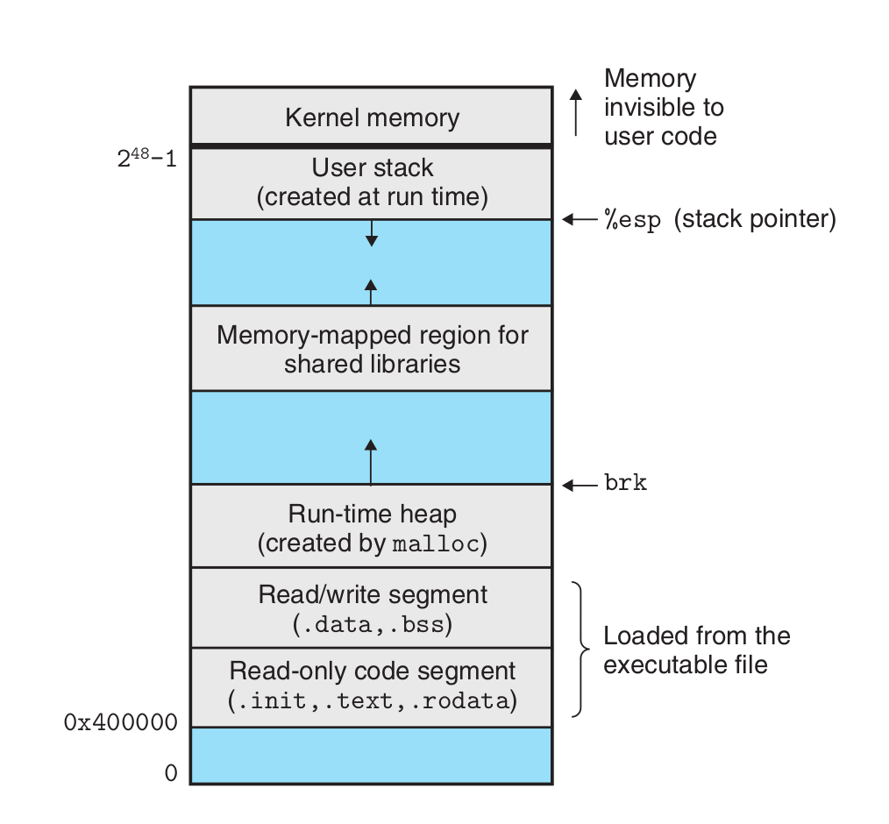
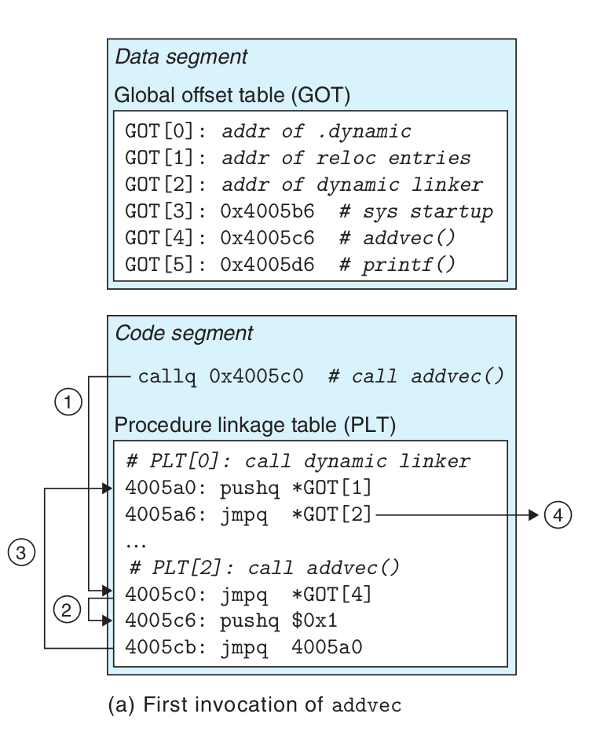
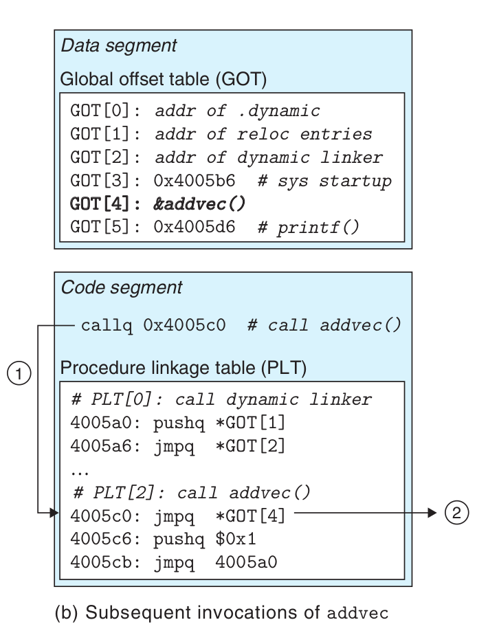

### Translates the example program from an ASCII source file into an executable object file.

1. C preprocessor: cpp [other arguments] hello.c /tmp/main.i
2. C compiler: cc1 /tmp/hello.i -Og [other arguments] -o /tmp/hello.s
3. assembler: as [other arguments] -o /tmp/hello.o /tmp/hello.s
4. linker program: ld -o hello [system object files and args] /tmp/hello.o /libc.a/printf.o
5. executable prog: linux> ./hello


### Object Files
Executable and Linkable Format(ELF).

- .text The machine code of the compiled program.
- .rodata **Read-only** data such as the format strings in printf statements, and
  jump tables for switch statements.
- .data Initialized global and static C variables. Local C variables are maintained
  at run time on the stack and do not appear in either the .data or .bss
  sections.
- .bss Uninitialized global and static C variables, along with any global or static
  variables that are initialized to zero. No space have same addresses with .comment.
- .symtab A symbol table with information about functions and global variables
  that are defined and referenced in the program.
- .rel Relocation information
- .line A mapping line numbers
- .strtab A string table

- Relocatable object file. Contains binary code and data in a form that can be combined with other relocatable object files at compile time to create an executable object file.

- Executable object file. Contains binary code and data in a form that can be copied directly into memory and executed.
  
- Shared object file. A special type of relocatable object file that can be loaded into memory and linked dynamically, at either load time or run time.
#### Symbols
- Global symbols defined by module m and that can be referenced by
  other modules. OR referenced by module m but defined by some other
  module.
- Local symbols that are defined and referenced exclusively by module m.
######  How Linkers Resolve Duplicate Symbol Names
strong symbols: int i = 1;
weak symbols: int i; int main(i =1); int __attribute__((weak)) power2(int x);int power2(int x) __attribute__((weak));extern int __attribute__((weak)) global_var;
Rule 1. Multiple strong symbols with the same name are not allowed.
Rule 2. Given a strong symbol and multiple weak symbols with the same name,
choose the strong symbol.
Rule 3. Given multiple weak symbols with the same name, choose any of the
weak symbols.

#### Relocation
1. Relocating sections and symbol definitions. In this step, the linker merges all
   sections of the same type into a new aggregate section of the same type.

2. Relocating symbol references within sections. In this step, the linker modifies
   every symbol reference in the bodies of the code and data sections so that
   they point to the correct run-time addresses.

Relocation entries for code are placed in .rel.text. Relocation entries for data
are placed in .rel.data.

```
/*main.c*/
void swap();
int buf[2] = {1, 2};
int main() {
    swap();
    return 0;
}
/*swap.c*/
extern int buf [] ;
int *bufp0 = &buf[0] ;
int *bufp1;
void swap() {
    int temp;
    bufp1 = &buf[1];
    temp =*bufp0;
    *bufp0 = *bufp1;
    *bufp1 = temp;
}
```

```
malaaa@malaaa-N8xxEP6> gcc -c swap.c -o swap.o//Relocatable object file
malaaa@malaaa-N8xxEP6> gcc -c main.c -o main.o//Relocatable object file
malaaa@malaaa-N8xxEP6> gcc -g swap.o main.o -o run//Executable object file
malaaa@malaaa-N8xxEP6> readelf -s swap.o
malaaa@malaaa-N8xxEP6> readelf -s main.o
```
Result
```
swap.o
Symbol table '.symtab' contains 14 entries:
   Num:    Value          Size Type    Bind   Vis      Ndx Name
     0: 0000000000000000     0 NOTYPE  LOCAL  DEFAULT  UND 
     1: 0000000000000000     0 FILE    LOCAL  DEFAULT  ABS swap.c
     2: 0000000000000000     0 SECTION LOCAL  DEFAULT    1 
     3: 0000000000000000     0 SECTION LOCAL  DEFAULT    3 
     4: 0000000000000000     0 SECTION LOCAL  DEFAULT    4 
     5: 0000000000000000     0 SECTION LOCAL  DEFAULT    5 
     6: 0000000000000000     0 SECTION LOCAL  DEFAULT    8 
     7: 0000000000000000     0 SECTION LOCAL  DEFAULT    9 
     8: 0000000000000000     0 SECTION LOCAL  DEFAULT   10 
     9: 0000000000000000     0 SECTION LOCAL  DEFAULT    7 
    10: 0000000000000000     8 OBJECT  GLOBAL DEFAULT    5 bufp0
    11: 0000000000000000     0 NOTYPE  GLOBAL DEFAULT  UND buf
    12: 0000000000000000     8 OBJECT  GLOBAL DEFAULT    4 bufp1
    13: 0000000000000000    67 FUNC    GLOBAL DEFAULT    1 swap
```
buf，是swap.o.symTable的条目，extern类型的符号，**在main.o模块中定义！**，我们看到一个关于全局符号 buf 定义的条目，它是从 .data 中偏移为 0 处开始的一个 8 字节的已初始化目标. \
bufp0：是swap.o.symTable的条目，global类型符号，在swap.o中定义，我们看到一个关于全局符号 bufpO 定义的条目，它是从 .data 中偏移为 0 处开始的一个 8 字节的已初始化目标 \ bufp1：是swap.o.symTabl的条目，global类型的符号，在swap.o中定义，它是一个未初始化的 8 字节数据目标（要求 8 字节对齐），最终当 这个模块被链接时它将作为一个 .bss 目标分配 \
swap：是swap.o.symTable的条目，func类型的符号，在swap.o中定义，它是一个位于 .text 中偏移为零处的 67 字节的函数。 \
temp：不属于swap.o.symTable条目，int类型的符号，在swap.o中定义，局部变量位于栈中管理。
```
main.o
Symbol table '.symtab' contains 13 entries:
Num:    Value          Size Type    Bind   Vis      Ndx Name
0: 0000000000000000     0 NOTYPE  LOCAL  DEFAULT  UND
1: 0000000000000000     0 FILE    LOCAL  DEFAULT  ABS main.c
2: 0000000000000000     0 SECTION LOCAL  DEFAULT    1
3: 0000000000000000     0 SECTION LOCAL  DEFAULT    3
4: 0000000000000000     0 SECTION LOCAL  DEFAULT    4
5: 0000000000000000     0 SECTION LOCAL  DEFAULT    6
6: 0000000000000000     0 SECTION LOCAL  DEFAULT    7
7: 0000000000000000     0 SECTION LOCAL  DEFAULT    8
8: 0000000000000000     0 SECTION LOCAL  DEFAULT    5
9: 0000000000000000     8 OBJECT  GLOBAL DEFAULT    3 buf
10: 0000000000000000    25 FUNC    GLOBAL DEFAULT    1 main
11: 0000000000000000     0 NOTYPE  GLOBAL DEFAULT  UND _GLOBAL_OFFSET_TABLE_
12: 0000000000000000     0 NOTYPE  GLOBAL DEFAULT  UND swap

```
buf 是已经初始化的全局变量，一个位于.data节中偏移位0的8字节目标。 \
main 位于.text节中偏移为0的25字节函数
###### objdump relocation entries
`objdump -D -r swap.o` -d just .text
Result
```
swap.o:     file format elf64-x86-64


Disassembly of section .text:

0000000000000000 <swap>:
   0:	f3 0f 1e fa          	endbr64 
   4:	55                   	push   %rbp
   5:	48 89 e5             	mov    %rsp,%rbp
   8:	48 8d 05 00 00 00 00 	lea    0x0(%rip),%rax        # f <swap+0xf>
			b: R_X86_64_PC32	buf
   f:	48 89 05 00 00 00 00 	mov    %rax,0x0(%rip)        # 16 <swap+0x16>
			12: R_X86_64_PC32	bufp1-0x4
  16:	48 8b 05 00 00 00 00 	mov    0x0(%rip),%rax        # 1d <swap+0x1d>
			19: R_X86_64_PC32	bufp0-0x4
  1d:	8b 00                	mov    (%rax),%eax
  1f:	89 45 fc             	mov    %eax,-0x4(%rbp)
  22:	48 8b 15 00 00 00 00 	mov    0x0(%rip),%rdx        # 29 <swap+0x29>
			25: R_X86_64_PC32	bufp1-0x4
  29:	48 8b 05 00 00 00 00 	mov    0x0(%rip),%rax        # 30 <swap+0x30>
			2c: R_X86_64_PC32	bufp0-0x4
  30:	8b 12                	mov    (%rdx),%edx
  32:	89 10                	mov    %edx,(%rax)
  34:	48 8b 05 00 00 00 00 	mov    0x0(%rip),%rax        # 3b <swap+0x3b>
			37: R_X86_64_PC32	bufp1-0x4
  3b:	8b 55 fc             	mov    -0x4(%rbp),%edx
  3e:	89 10                	mov    %edx,(%rax)
  40:	90                   	nop
  41:	5d                   	pop    %rbp
  42:	c3                   	retq   

Disassembly of section .bss:

0000000000000000 <bufp1>:
	...

Disassembly of section .data.rel:

0000000000000000 <bufp0>:
	...
			0: R_X86_64_64	buf

Disassembly of section .comment:

0000000000000000 <.comment>:
   0:	00 47 43             	add    %al,0x43(%rdi)
   3:	43 3a 20             	rex.XB cmp (%r8),%spl
   6:	28 55 62             	sub    %dl,0x62(%rbp)
   9:	75 6e                	jne    79 <swap+0x79>
   b:	74 75                	je     82 <swap+0x82>
   d:	20 31                	and    %dh,(%rcx)
   f:	30 2e                	xor    %ch,(%rsi)
  11:	32 2e                	xor    (%rsi),%ch
  13:	30 2d 31 33 75 62    	xor    %ch,0x62753331(%rip)        # 6275334a <swap+0x6275334a>
  19:	75 6e                	jne    89 <swap+0x89>
  1b:	74 75                	je     92 <swap+0x92>
  1d:	31 29                	xor    %ebp,(%rcx)
  1f:	20 31                	and    %dh,(%rcx)
  21:	30 2e                	xor    %ch,(%rsi)
  23:	32 2e                	xor    (%rsi),%ch
  25:	30 00                	xor    %al,(%rax)

Disassembly of section .note.gnu.property:

0000000000000000 <.note.gnu.property>:
   0:	04 00                	add    $0x0,%al
   2:	00 00                	add    %al,(%rax)
   4:	10 00                	adc    %al,(%rax)
   6:	00 00                	add    %al,(%rax)
   8:	05 00 00 00 47       	add    $0x47000000,%eax
   d:	4e 55                	rex.WRX push %rbp
   f:	00 02                	add    %al,(%rdx)
  11:	00 00                	add    %al,(%rax)
  13:	c0 04 00 00          	rolb   $0x0,(%rax,%rax,1)
  17:	00 03                	add    %al,(%rbx)
  19:	00 00                	add    %al,(%rax)
  1b:	00 00                	add    %al,(%rax)
  1d:	00 00                	add    %al,(%rax)
	...

Disassembly of section .eh_frame:

0000000000000000 <.eh_frame>:
   0:	14 00                	adc    $0x0,%al
   2:	00 00                	add    %al,(%rax)
   4:	00 00                	add    %al,(%rax)
   6:	00 00                	add    %al,(%rax)
   8:	01 7a 52             	add    %edi,0x52(%rdx)
   b:	00 01                	add    %al,(%rcx)
   d:	78 10                	js     1f <.eh_frame+0x1f>
   f:	01 1b                	add    %ebx,(%rbx)
  11:	0c 07                	or     $0x7,%al
  13:	08 90 01 00 00 1c    	or     %dl,0x1c000001(%rax)
  19:	00 00                	add    %al,(%rax)
  1b:	00 1c 00             	add    %bl,(%rax,%rax,1)
  1e:	00 00                	add    %al,(%rax)
  20:	00 00                	add    %al,(%rax)
			20: R_X86_64_PC32	.text
  22:	00 00                	add    %al,(%rax)
  24:	43 00 00             	rex.XB add %al,(%r8)
  27:	00 00                	add    %al,(%rax)
  29:	45 0e                	rex.RB (bad) 
  2b:	10 86 02 43 0d 06    	adc    %al,0x60d4302(%rsi)
  31:	7a 0c                	jp     3f <swap+0x3f>
  33:	07                   	(bad)  
  34:	08 00                	or     %al,(%rax)
	...
```
#### Executable Object Files

Program header table **Read only**
#### Loading Executable Object Files
The **loader** copies the code and data in the executable object file from disk into memory and then runs the program by jumping to its first instruction, or
entry point. \
the code segment starts at address 0x400000, 对于Linux而言，0X400000以下的空间默认不映射，从而起到保护程序安全的作用。对于windows而言，程序安全交由操作系统保证，因此最大限度利用资源，地址可以低到0X400000以下。  \
the data segment.\
the heap.\
the reserved for shared modules.\
the user stack. below the largest legal user address (2 48 − 1) and grows down, toward smaller memory addresses.\
the kernel.memory-resident part of the operating system.



#### Static Linking
- Symbol resolution.symbol: a function, a global variable, or a static variable (model 'main(int i = 0)' is instruction)
- Relocation.Compilers and assemblers generate code and data sections
  that start at address 0.

#### Dynamic Linking
A _shared library_ is an object module that, at either run time or load
time, can be loaded at an arbitrary memory address and linked with a program in
memory. \
Linux's systems are indicated by the .so suffix. Microsoft operating systems make heavy use of shared libraries, which they refer to as DLLs

Shared libraries are “shared” in two different ways.
1. exactly one .so file for a particular library. The code and data are shared by all executable object files that reference the library,
2. .text section in memory can be shared by different running processes.


##### The dynamic linker then finishes the linking task by performing the following relocations:
- Relocating the text and data of libc.so into some memory segment
- Relocating the text and data of libvector.so into another memory segment
- Relocating any references in prog2l to symbols defined by libc.so and libvector.so

##### Dynamic linking is a powerful and useful technique:
- Distributing software. use shared libraries to distribute software updates.
- Building high-performance Web servers. generate dynamic
  content using a more efficient and sophisticated approach based on dynamic
  linking. subsequent requests can be handled at the cost of a simple function call.xisting
  functions can be updated and new functions can be added at run time, without
  stopping the server.

#### Position-Independent Code (PIC)

Code that can be loaded without needing any relocations is known as position-
independent code (PIC). Users direct GNU compilation systems to generate PIC
code with the -fpic option to gcc. Shared libraries must always be compiled with
this option.

链接器在可执行目标文件中的数据段新建了一个数据节.got
Global Offset Table, The GOT contains an 8-byte entry for each global data object that is referenced by the object module.The compiler also generates a relocation record for each entry in the GOT.

由于链接器无法修改编译器产生的汇编代码，所以无法修改调用共享库的函数的call指令，所以链接器在可执行目标文件的代码段新建一个.plt节对所有引用了共享库中的函数都在该数据节中创建一个新函数xxx@plt，然后将代码中调用地址替换成call xxx@plt，所以就能通过函数xxx@plt来完成对.got的更新，以及指向正确的地址。
the procedure linkage table (PLT).If an object module calls any functions that are defined in shared libraries, then it has its own GOT and PLT. The GOT is part of the data segment. The PLT is part of the code segment.
`Because addcnt is defined by the libvector.so module, the compiler can use the constant distance between the code segment and the data segment to generate a direct PC relative reference to addcnt, and add a relocation to let the linker construct this shared module Parse it. However, if addcnt is defined by another shared module, then indirect access via GOT is required. Here, the compiler chooses the most general solution, using GOT for all references.`\
`objdump -dx prog`
```
000000000000077a <main>:
 77a:	48 83 ec 08          	sub    $0x8,%rsp
 77e:	b9 02 00 00 00       	mov    $0x2,%ecx
 783:	48 8d 15 9e 08 20 00 	lea    0x20089e(%rip),%rdx        # 201028 <z>
 78a:	48 8d 35 7f 08 20 00 	lea    0x20087f(%rip),%rsi        # 201010 <y>
 791:	48 8d 3d 80 08 20 00 	lea    0x200880(%rip),%rdi        # 201018 <x>
 798:	e8 a3 fe ff ff       	callq  640 <addvec@plt>
 79d:	8b 0d 89 08 20 00    	mov    0x200889(%rip),%ecx        # 20102c <z+0x4>
 7a3:	8b 15 7f 08 20 00    	mov    0x20087f(%rip),%edx        # 201028 <z>
 7a9:	48 8d 35 a4 00 00 00 	lea    0xa4(%rip),%rsi        # 854 <_IO_stdin_used+0x4>
 7b0:	bf 01 00 00 00       	mov    $0x1,%edi
 7b5:	b8 00 00 00 00       	mov    $0x0,%eax
 7ba:	e8 91 fe ff ff       	callq  650 <__printf_chk@plt>
 7bf:	b8 00 00 00 00       	mov    $0x0,%eax
 7c4:	48 83 c4 08          	add    $0x8,%rsp
 7c8:	c3                   	retq   
 7c9:	0f 1f 80 00 00 00 00 	nopl   0x0(%rax)
 ```
对addvec函数和对prinrf函数的调用转化为了对addvec@plt和对__printf_chk@plt函数的调用，这两个函数就是在.plt节中定义的，而.plt节中的内容如下所示
```
Disassembly of section .plt:

0000000000000630 <.plt>:
 630:	ff 35 82 09 20 00    	pushq  0x200982(%rip)        # 200fb8 <_GLOBAL_OFFSET_TABLE_+0x8>
 636:	ff 25 84 09 20 00    	jmpq   *0x200984(%rip)        # 200fc0 <_GLOBAL_OFFSET_TABLE_+0x10>
 63c:	0f 1f 40 00          	nopl   0x0(%rax)

0000000000000640 <addvec@plt>:
 640:	ff 25 82 09 20 00    	jmpq   *0x200982(%rip)        # 200fc8 <addvec>
 646:	68 00 00 00 00       	pushq  $0x0
 64b:	e9 e0 ff ff ff       	jmpq   630 <.plt>

0000000000000650 <__printf_chk@plt>:
 650:	ff 25 7a 09 20 00    	jmpq   *0x20097a(%rip)        # 200fd0 <__printf_chk@GLIBC_2.3.4>
 656:	68 01 00 00 00       	pushq  $0x1
 65b:	e9 d0 ff ff ff       	jmpq   630 <.plt>
```
由于我们无论在内存什么位置加载该目标模块（包括共享目标模块），数据段与代码段的距离总是保持不变的。所以我们可以让处于代码段的plt函数通过距离常量来访问处于数据段中对应的got中保存的地址。
比如上面我们调用addvec@plt函数时，会执行0x640处的jmpq *0x200982(%rip)指令， 这里的0x200982就是上面所说的距离常量，用来指向特定的got项，这里可以得到访问的got项的地址为0x200982+0x646=0x200fc8，而该地址对应的got内容如下所示
`0x00200fc0 00000000 00000000 46060000 00000000 ........F.......`
根据小端法可以只为0x664，即跳转回到下一条指令，然后调用.plt函数
```
0000000000000630 <.plt>:
 630:	ff 35 82 09 20 00    	pushq  0x200982(%rip)        # 200fb8 <_GLOBAL_OFFSET_TABLE_+0x8>
 636:	ff 25 84 09 20 00    	jmpq   *0x200984(%rip)        # 200fc0 <_GLOBAL_OFFSET_TABLE_+0x10>
 63c:	0f 1f 40 00          	nopl   0x0(%rax)
```
其中第一条指令是将地址0x200982+0x636=0x200fb8作为参数压入栈中，而第二条指令是跳转到0x200984+0x63c=0x200fc0处保存的地址，我们通过上面可以看到，在未运行可执行目标文件时，该地址的值为0，而当运行了可执行目标文件时，该地址的值会修改到动态链接器中的_dl_runtime_resolve函数，来进行地址解析，查看共享库的addvec被加载到什么内存地址。那该函数是如何知道要获得哪个函数的地址，以及要将函数地址保存到哪个got项呢？

我们观察可执行目标文件中以下共享库的函数

```
0000000000000640 <addvec@plt>:
 640:	ff 25 82 09 20 00    	jmpq   *0x200982(%rip)        # 200fc8 <addvec>
 646:	68 00 00 00 00       	pushq  $0x0
 64b:	e9 e0 ff ff ff       	jmpq   630 <.plt>

0000000000000650 <__printf_chk@plt>:
 650:	ff 25 7a 09 20 00    	jmpq   *0x20097a(%rip)        # 200fd0 <__printf_chk@GLIBC_2.3.4>
 656:	68 01 00 00 00       	pushq  $0x1
 65b:	e9 d0 ff ff ff       	jmpq   630 <.plt>
 ```
可以发现每个函数的第一条指令是跳转到对应的got项，而对应的got项被初始化为下一条指令的地址，当got项没有被修改时，就自动跳转到下一条指令。而第二条指令在不同函数中是不同的，其实对应的是.rela.plt的索引
```
Relocation section '.rela.plt' at offset 0x5e8 contains 2 entries:
  Offset          Info           Type           Sym. Value    Sym. Name + Addend
000000200fc8  000300000007 R_X86_64_JUMP_SLO 0000000000000000 addvec + 0
000000200fd0  000500000007 R_X86_64_JUMP_SLO 0000000000000000 __printf_chk@GLIBC_2.3.4 + 0
```
其中，offset表示对应的got项的地址，Sym.Name就是函数的名字。所以动态链接器通过索引值和.rela.plt数据组就能确定要定位哪个动态库函数，以及将其内存地址保存到哪个got项。

当动态链接后的addvec函数的内存地址保存到对应的got项时，下次再调用addvec函数时，就能直接通过该got项直接获得addvec函数的内存地址。

我们可以发现，第一次调用共享库的函数时，对应的xxx@plt函数并不会跳转到正确的函数地址，而是调用动态链接器来获得函数的地址，然后将其保存到got项中，下一次再运行时，才会跳转到正确的函数地址，该方法称为延迟绑定（Lazy Binding），只有共享库的函数要用时，才会重定位它的地址，否则不会，由此防止可执行目标文件加载时需要对大量的共享库的地址进行重定位。

综上所述：当函数要访问共享库中的函数时，实现执行call xxx@plt，访问该函数的封装函数，然后该plt函数会访问对应的got项，如果got项被赋值为对应的xxx函数的地址，则会调用该函数，否则会调用.plt[0]中的动态链接器，来定位xxx函数的内存地址，然后将其保存到对应的got项中。
因为 addcnt 是由 libvector.so 模块定义的，编译器可以利用代码段和数据段之间不变的距离，产生对 addcnt 的直接 PC 相对引用，并增加一个重定位，让链接器在构造这个共享模块时解析它。不过，如果 addcnt 是由另一个共享模块定义的，那么就需要通过 GOT 进行间接访问。在这里，编译器选择采用最通用的解决方案，为所有的引用使用 GOT。

Step 1. Instead of directly calling addvec, the program calls into PLT[2], which
is the PLT entry for addvec. \
Step 2. The first PLT instruction does an indirect jump through GOT[4]. Since
each GOT entry initially points to the second instruction in its correspond-
ing PLT entry, the indirect jump simply transfers control back to the next
instruction in PLT[2]. \
Step 3. After pushing an ID for addvec (0x1) onto the stack, PLT[2] jumps to
PLT[0]. \
Step 4. PLT[0] pushes an argument for the dynamic linker indirectly through
GOT[1] and then jumps into the dynamic linker indirectly through GOT[2].
The dynamic linker uses the two stack entries to determine the run-
time location of addvec, overwrites GOT[4] with this address, and passes
control to addvec.

Step 1. Control passes to PLT[2] as before.\
Step 2. However, this time the indirect jump through GOT[4] transfers control
directly to addvec.

#### Library Interpositioning
library interpositioning,allows you to intercept calls to shared library functions and execute your own code instead.\
**basic idea:** Given some target function to be interposed on, you
create a wrapper function whose prototype is identical to the target function. Using
some particular interpositioning mechanism, you then trick the system into calling
the wrapper function instead of the target function. The wrapper function typically
executes its own logic, then calls the target function and passes its return value
back to the caller.

Interpositioning can occur at compile time, link time, or run time as the
program is being loaded and executed.
Example program int.c
```code/link/interpose/int.c
#include <stdio.h>
#include <malloc.h>

int main()
{
    int *p = malloc(32);
    free(p);
    return(0);
}
```
##### 1. Compile-Time Interpositioning

首先，我们可以定义一个本地的头文件malloc.h，如下所示
Local malloc.h file
```code/link/interpose/malloc.h
#define malloc(size) mymalloc(size)
#define free(ptr) myfree(ptr)
```
然后在编译int.c时，使用-I.编译选项，使得预处理器首先从本地查找malloc.h文件，由此就能将共享库的malloc和free函数替换成我们自己的mymalloc混合myfree函数。
而我们需要自己实现mymalloc和myfree函数，其中需要调用原始的malloc.h，由于malloc.h使用了#define指令，我们后面需要malloc的地方都会被mymalloc替代。
而mymalloc.c代码如下：
Wrapper functions in mymalloc.c
```mymalloc.c
#ifdef COMPILETIME //编译选项是COMPILETIME ，这段代码才会编译进去
#include <stdio.h>
#include <malloc.h>

/* malloc wrapper function */
void *mymalloc(size_t size)
{
    void *ptr = malloc(size);
    printf("malloc(%d)=%p\n",
           (int)size, ptr);
    return ptr;
}

/* free wrapper function */
void myfree(void *ptr)
{
    free(ptr);
    printf("free(%p)\n", ptr);
    printf("COMPILETIME\n");
}
#endif
```
所以我们可以通过以下代码得到该函数的可重定位目标文件mymalloc.o 
```shell
gcc -DCOMPILETIME -c mymalloc.c
```
然后在本地的malloc.h中给出包装函数的函数原型，即
```code/link/interpose/malloc.h
#define malloc(size) mymalloc(size)
#define free(ptr) myfree(ptr)

void *mymalloc(size_t size);
void myfree(void *ptr);
```
然后就可以通过以下命令行进行编译时打桩
```shell
gcc -I. -o intc int.c mymalloc.o
```
此时，由于-I.编译选项，对于int.c中的malloc.h，预处理器会首先从本地搜索malloc.h文件，而在本地malloc.h文件中，对malloc和free函数重新包装成mymalloc和myfree函数，而这两个函数在之前编译好的mymalloc.o可重定位目标文件中，此时就完成了编译时打桩。
```shell
malloc(32)=0x558ca12fc2a0
free(0x558ca12fc2a0)
COMPILETIME
```
使用malloc的地方，都被替换成了mymalloc。
```int.i
void *mymalloc(size_t size);
void myfree(void *ptr);
```
##### 2. Link-Time Interpositioning

Linux静态链接器也支持使用--wrap f标志进行链接时打桩，此时会将符号f解析为__wrap_f，而将对__real_f符号的引用解析为f， 意味着原始对函数f的调用，还会替换成对__wrap_f函数的调用，而通过__real_f函数来调用原始函数f。
我们定义以下函数
```mymalloc.c
#ifdef LINKTIME
#include <stdio.h>

void *__real_malloc(size_t size);
void __real_free(void *ptr);

/* malloc wrapper function */
void *__wrap_malloc(size_t size)
{
    void *ptr = __real_malloc(size); /* Call libc malloc */
    printf("malloc(%d) = %p\n", (int)size, ptr);
    return ptr;
}

/* free wrapper function */
void __wrap_free(void *ptr)
{
    __real_free(ptr); /* Call libc free */
    printf("free(%p)\n", ptr);
    printf("LINKTIME\n");
}
#endif

```
同时进行编译
```shell
gcc -DLINKTIME -Wl,--wrap,malloc -Wl,--wrap,free -o intl int.c mymalloc.c
```
也可以分开编译
```shell
gcc -DLINKTIME -c mymalloc.c
gcc -c int.c
gcc -Wl,--wrap,malloc -Wl,--wrap,free -o intl int.o mymalloc.o
```
-Wl,option 把标志 option 传递给链接器。option中的每个逗号都要替换为一个空格。所以 -Wl,--wrap,malloc 就把 --wrap malloc 传递给链接器，以类似的方式传递 -Wl,--wrap,free。 
```shell
malloc(32)=0x558ca12fc2a0
free(0x558ca12fc2a0)
LINKTIME
```
由此，利用链接器的打桩机制, int.c中对malloc和free函数的调用，会变成对__wrap_malloc和__wrap_free函数的调用。而__real_malloc将会被解析成真正的malloc。

综上所述：想要在链接时打桩，意味着在对可重定位目标文件的符号进行解析时，进行替换。

##### 3. Run-Time Interpositioning

运行时进行打桩，意味着是对共享库的函数进行打桩，这里使用动态链接器提供的LD_PRELOAD环境变量，通过该变量设置共享库路径列表，执行可执行目标文件时，动态链接器就会先搜索LD_PRELOAD共享库。
定义以下函数
```mymalloc.c
#ifdef RUNTIME
#define _GNU_SOURCE
#include <stdio.h>
#include <stdlib.h>
#include <dlfcn.h>

/* malloc wrapper function */而__real_malloc将会被解析成真正的malloc。

void *malloc(size_t size)
{
    void *(*mallocp)(size_t size);
    char *error;

    mallocp = dlsym(RTLD_NEXT, "malloc"); /* Get address of libc   malloc */ 
    if ((error = dlerror()) != NULL) { 
        fputs(error, stderr);
        exit(1);
    }
    char *ptr = mallocp(size); /* Call libc malloc */
//  printf("malloc(%d) = %p\n", (int)size, ptr);
    return ptr;
}

/* free wrapper function */
void free(void *ptr)
{
    void (*freep)(void *) = NULL;
    char *error;

    if (!ptr)
    return;

    freep = dlsym(RTLD_NEXT, "free"); /* Get address of libc free */
    if ((error = dlerror()) != NULL) {
        fputs(error, stderr);
        exit(1);
    }
    freep(ptr); /* Call libc free */
    printf("free(%p)\n", ptr);
    printf("RUNTIME\n");
}
#endif
```
然后通过以下命令行将其编译成共享库
```shell
gcc -DRUNTIME -shared -fpic -o mymalloc.so mymalloc.c -ldl 
```
然后编译，在运行时指定环境变量LD_PRELOAD
```shell
gcc -o intr int.c
LD_PRELOAD="./mymalloc.so" ./intr 
```
此时运行到malloc和free函数时，就会调用动态链接器搜索该符号的定义，此时会先搜索LD_PRELOAD指定的共享库，而mymalloc.so中定义了这两个符号，所以就替换了这两个函数的具体实现。注意：如果想要调用原始的定义，就需要用运行动态链接的方式，通过指定dlsym的参数为RTLD_NEXT，来在后续的共享库中获得malloc的定义。 
```shell
"./mymalloc.so" ./intr 
free(0x55a98bc572a0)
RUNTIME

```
GNU binutils 包尤其有帮助，而且可以运行在每个 Linux 平台上。
AR：创建静态库，插入、删除、列出和提取成员。
STRINGS：列出一个目标文件中所有可打印的字符串。
STRIP：从目标文件中删除符号表信息。
NM：列出一个目标文件的符号表中定义的符号。
SIZE：列出目标文件中节的名字和大小。
READELF：显示一个目标文件的完整结构，包括 ELF 头中编码的所有信息。包含 SIZE 和 NM 的功能。
OBJDUMP：所有二进制工具之母。能够显示一个目标文件中所有的信息。它最大的作用是反汇编 .text 节中的二进制指令。
Linux 系统为操作共享库还提供了 LDD 程序：
LDD：列出一个可执行文件在运行时所需要的共享库。