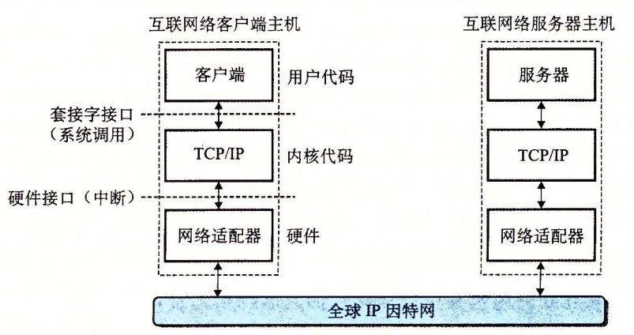

 数据是如何从一台主机传送到另一台主机的
1.  运行在主机 A 上的客户端进行一个系统调用,从客户端的虚拟地址空间复制数据到内核缓冲区中。
2.  主机 A 上的协议软件通过在数据前附加互联网络包头和 LAN1 帧头,创建了一个 LAN1 的帧。互联网络包头寻址到互联网络主机 B。LAN1 帧头寻址到路由器。然后它传送此帧到适配器。注意,LAN1 帧的有效载荷是一个互联网络包,而互联网络包的有效载荷是实际的用户数据。这种封装是基本的网络互联方法之一。
3.  LAN1 适配器复制该帧到网络上。
4.  当此帧到达路由器时,路由器的 LAN1 适配器从电缆上读取它,并把它传送到协议软件。
5.  路由器从互联网络包头中提取出目的互联网络地址,并用它作为路由表的索引,确定向哪里转发这个包,在本例中是 LAN2。路由器剥落旧的 LAN1 的帧头,加上寻址到主机 B 的新的 LAN2 帧头,并把得到的帧传送到适配器。
6.  路由器的 LAN2 适配器复制该帧到网络上。
7.  当此帧到达主机 B 时,它的适配器从电缆上读到此帧,并将它传送到协议软件。
8.  最后,主机 B 上的协议软件剥落包头和帧头。当服务器进行一个读取这些数据的系统调用时,协议软件最终将得到的数据复制到服务器的虚拟地址空间。

- bind 函数告诉内核将 addr 中的服务器套接字地址和套接字描述符 sockfd 联系起来。参数 addrlen 就是 sizeof(sockaddr_in)。对于 socket 和 connect,最好的方法是用 getaddrinfo 来为 bind 提供参数
- listen 函数将 sockfd 从一个主动套接字转化为一个监听套接字(listening socket),该套接字可以接受来自客户端的连接请求。
- accept 函数等待来自客户端的连接请求到达侦听描述符 listenfd,然后在 addr 中填写客户端的套接字地址,并返回一个已连接描述符(connected descriptor),这个描述符可被用来利用 Unix I/O 函数与客户端通信。

 在第一步中,服务器调用 accept,等待连接请求到达监听描述符,具体地我们设定为描述符 3。回忆一下,描述符 0 ~ 2 是预留给了标准文件的。 在第二步中,客户端调用 connect 函数,发送一个连接请求到 listenfd。第三步,accept 函数打开了一个新的已连接描述符 connfd(我们假设是描述符 4),在 clientfd 和 connfd 之间建立连接,并且随后返回 connfd 给应用程序。客户端也从 connect 返回,在这一点以后,客户端和服务器就可以分别通过读和写 clientfd 和 connfd 来回传送数据了。
